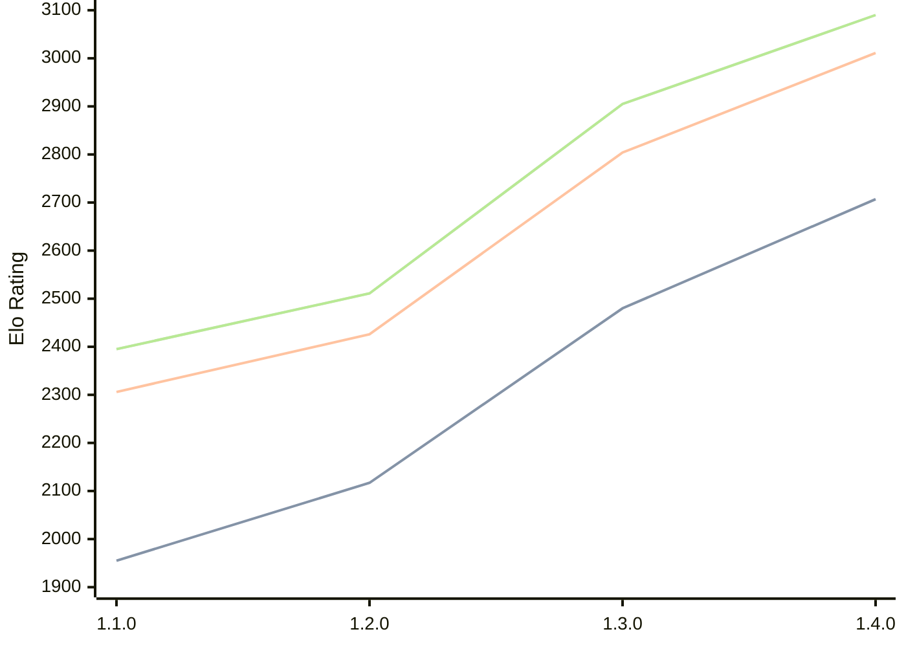

# Engine: Gyatso

Author: Gyatso Neesham

Home: https://github.com/GyatsoYT/GyatsoChess

## Elo Ratings

| Version | Published | STC 8.0+0.08s  | LTC 60.0+0.60s | VLTC 2m24s+1.12s | Comment |
| --- | --- | --- | --- | --- | --- |
| 1.4.0 | 2026-06-05 | 2707(+227) | 3011(+207) | 3090(+185) |  |
| 1.3.0 | 2026-03-30 | 2480(+363) | 2804(+378) | 2905(+394) |  |
| 1.2.0 | 2026-01-24 | 2117(+162) | 2426(+120) | 2511(+116) |  |
| 1.1.0 | 2026-01-09 | 1955(+new) | 2306(+new) | 2395(+new) |  |
| 1.0.0 | 2025-12-10 |  |  |  |  |
 | | | cElo (∆ prev) | cElo (∆ prev) | cElo (∆ prev) | 

<a href="https://github.com/computer-chess-index/cci/issues/new?template=submit-version.yml&title=[VERSION]+Gyatso+<version>&body=###%20Engine%20name%0AGyatso%0A%0A###%20Version%0A1.4.0" target="_blank">Submit new version</a>

 Test Conditions:

GUI/CLI: <a href=https://github.com/cutechess/cutechess target="_blank">Cute-Chess</a> 
Elo Calculation: <a href=https://www.remi-coulom.fr/Bayesian-Elo/ target="_blank">Bayesian-Elo</a> 
CPU: Intel(R) Core(TM) i5-7500T 2.70GHz 
Opening book: 8_moves_v3 
\* STC: 8.0+0.08s, LTC: 60.0+0.60s, VLTC: 2m24s+1.12s

 Lists:
Ratings: <a href=https://github.com/computer-chess-index/cci/blob/main/lists/CCIRatings.csv target="_blank">Complete list</a>

Generated: 2026-06-10 06:25:00

## Ratings Verlauf

⬛ STC (8.0+0.08s) &nbsp;&nbsp; 🟧 LTC (60.0+0.60s) &nbsp;&nbsp; 🟩 VLTC (2m24s+1.12s)

dark mode: 🟩STC (8.0+0.08s) 🟧LTC (60.0+0.60s) ⬜VLTC (2m24s+1.12s)

## Detailed Evaluation Results

| Version | Time Control | Elo  | Range +/- | Matches | Score | Average Opponent Elo | Draws |
| --- | --- | --- | --- | --- | --- | --- | --- |
| 1.4.0 | VLTC (2m24s+1.12s) | 3090 | 44 | 148 | 51% | 3082 | 47% |
| 1.4.0 | LTC (60.0+0.60s) | 3011 | 40 | 188 | 52% | 2994 | 40% |
| 1.4.0 | STC (8.0+0.08s) | 2707 | 48 | 136 | 51% | 2699 | 37% |
| --- | --- | --- | --- | --- | --- | --- | --- |
| 1.3.0 | VLTC (2m24s+1.12s) | 2905 | 25 | 492 | 47% | 2928 | 39% |
| 1.3.0 | LTC (60.0+0.60s) | 2804 | 30 | 358 | 50% | 2797 | 39% |
| 1.3.0 | STC (8.0+0.08s) | 2480 | 25 | 576 | 43% | 2539 | 28% |
| --- | --- | --- | --- | --- | --- | --- | --- |
| 1.2.0 | VLTC (2m24s+1.12s) | 2511 | 33 | 312 | 52% | 2491 | 24% |
| 1.2.0 | LTC (60.0+0.60s) | 2426 | 35 | 274 | 51% | 2414 | 27% |
| 1.2.0 | STC (8.0+0.08s) | 2117 | 33 | 328 | 52% | 2098 | 20% |
| --- | --- | --- | --- | --- | --- | --- | --- |
| 1.1.0 | VLTC (2m24s+1.12s) | 2395 | 45 | 172 | 49% | 2408 | 23% |
| 1.1.0 | LTC (60.0+0.60s) | 2306 | 43 | 208 | 50% | 2306 | 16% |
| 1.1.0 | STC (8.0+0.08s) | 1955 | 49 | 148 | 49% | 1970 | 20% |
| --- | --- | --- | --- | --- | --- | --- | --- |