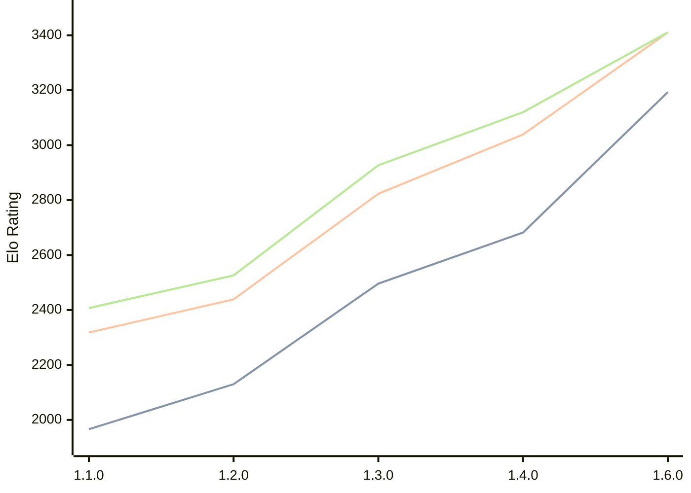

# Engine: Gyatso

Author: Gyatso Neesham

Home: https://github.com/GyatsoYT/GyatsoChess

## Elo Ratings

| Version | Published | STC 8.0+0.08s  | LTC 60.0+0.60s | VLTC 2m24s+1.12s | Comment |
| --- | --- | --- | --- | --- | --- |
| 1.6.0 | 2026-09-25 | 3193(+new) | 3410(+new) | 3411(+new) |  |
| 1.5.0 | 2026-08-02 |  |  |  |  |
| 1.4.0 | 2026-06-05 | 2682(+186) | 3039(+216) | 3120(+193) |  |
| 1.3.0 | 2026-03-30 | 2496(+366) | 2823(+384) | 2927(+401) |  |
| 1.2.0 | 2026-01-24 | 2130(+164) | 2439(+121) | 2526(+119) |  |
| 1.1.0 | 2026-01-09 | 1966(+new) | 2318(+new) | 2407(+new) |  |
| 1.0.0 | 2025-12-10 |  |  |  |  |
 | | | cElo (∆ prev) | cElo (∆ prev) | cElo (∆ prev) | 

<a href="https://github.com/computer-chess-index/cci/issues/new?template=submit-version.yml&title=[VERSION]+Gyatso+<version>&body=###%20Engine%20name%0AGyatso%0A%0A###%20Version%0A1.6.0" target="_blank">Submit new version</a>

 Test Conditions:

GUI/CLI: <a href=https://github.com/cutechess/cutechess target="_blank">Cute-Chess</a> 
Elo Calculation: <a href=https://www.remi-coulom.fr/Bayesian-Elo/ target="_blank">Bayesian-Elo</a> 
CPU: Intel(R) Core(TM) i5-7500T 2.70GHz 
Opening book: 8_moves_v3 
\* STC: 8.0+0.08s, LTC: 60.0+0.60s, VLTC: 2m24s+1.12s

 Lists:
Ratings: <a href=https://github.com/computer-chess-index/cci/blob/main/lists/CCIRatings.csv target="_blank">Complete list</a>

Generated: 2026-10-03 04:38:53

## Ratings Verlauf

```mermaid
%%{init: {"theme":"base","themeVariables":{"seriesColors:['#a3a3a3','#222221','#faa371']}}}%%
xychart-beta
  x-axis ["1.1.0", "1.2.0", "1.3.0", "1.4.0", "1.6.0"]
  y-axis "Elo Rating" 1900 --> 3500
  line "" [1966, 2130, 2496, 2682, 3193]
  line "STC (8.0+0.08s)" [1966, 2130, 2496, 2682, 3193]
  line "LTC (60.0+0.60s)" [2318, 2439, 2823, 3039, 3410]
  line "" [2407, 2526, 2927, 3120, 3411]
  line "VLTC (2m24s+1.12s)" [2407, 2526, 2927, 3120, 3411]
```

## Detailed Evaluation Results

| Version | Time Control | Elo  | Range +/- | Matches | Score | Average Opponent Elo | Draws |
| --- | --- | --- | --- | --- | --- | --- | --- |
| 1.6.0 | VLTC (2m24s+1.12s) | 3411 | 44 | 134 | 58% | 3345 | 73% |
| 1.6.0 | LTC (60.0+0.60s) | 3410 | 46 | 126 | 53% | 3374 | 60% |
| 1.6.0 | STC (8.0+0.08s) | 3193 | 33 | 252 | 47% | 3202 | 56% |
| --- | --- | --- | --- | --- | --- | --- | --- |
| 1.4.0 | VLTC (2m24s+1.12s) | 3120 | 27 | 408 | 50% | 3121 | 46% |
| 1.4.0 | LTC (60.0+0.60s) | 3039 | 27 | 404 | 51% | 3032 | 45% |
| 1.4.0 | STC (8.0+0.08s) | 2682 | 27 | 448 | 48% | 2703 | 31% |
| --- | --- | --- | --- | --- | --- | --- | --- |
| 1.3.0 | VLTC (2m24s+1.12s) | 2927 | 25 | 492 | 47% | 2950 | 39% |
| 1.3.0 | LTC (60.0+0.60s) | 2823 | 30 | 358 | 50% | 2816 | 39% |
| 1.3.0 | STC (8.0+0.08s) | 2496 | 25 | 576 | 43% | 2556 | 28% |
| --- | --- | --- | --- | --- | --- | --- | --- |
| 1.2.0 | VLTC (2m24s+1.12s) | 2526 | 33 | 312 | 52% | 2506 | 24% |
| 1.2.0 | LTC (60.0+0.60s) | 2439 | 35 | 274 | 51% | 2427 | 27% |
| 1.2.0 | STC (8.0+0.08s) | 2130 | 33 | 328 | 52% | 2113 | 20% |
| --- | --- | --- | --- | --- | --- | --- | --- |
| 1.1.0 | VLTC (2m24s+1.12s) | 2407 | 45 | 172 | 49% | 2422 | 23% |
| 1.1.0 | LTC (60.0+0.60s) | 2318 | 43 | 208 | 50% | 2318 | 16% |
| 1.1.0 | STC (8.0+0.08s) | 1966 | 49 | 148 | 49% | 1980 | 20% |
| --- | --- | --- | --- | --- | --- | --- | --- |