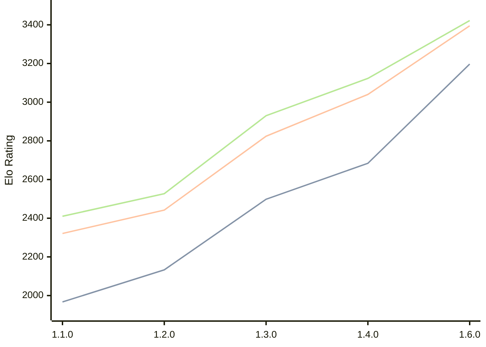

# Engine: Gyatso

Author: Gyatso Neesham

Home: https://github.com/GyatsoYT/GyatsoChess

## Elo Ratings E1

| Version | Published | STC 8.0+0.08s  | LTC 60.0+0.60s | VLTC 2m24s+1.12s | Comment |
| --- | --- | --- | --- | --- | --- |
| 1.4.0 | 2026-06-05 | 2557 | 2908 | 3039 |  |
 | | | cElo (∆ prev) | cElo (∆ prev) | cElo (∆ prev) | 

## Elo Ratings P1

| Version | Published | STC 8.0+0.08s  | LTC 60.0+0.60s | VLTC 2m24s+1.12s | Comment |
| --- | --- | --- | --- | --- | --- |
| 1.4.0 | 2026-06-05 | 2894 | 3159 | 3299 |  |
 | | | cElo (∆ prev) | cElo (∆ prev) | cElo (∆ prev) | 

## Elo Ratings T1

| Version | Published | STC 8.0+0.08s  | LTC 60.0+0.60s | VLTC 2m24s+1.12s | Comment |
| --- | --- | --- | --- | --- | --- |
| 1.6.0 | 2026-09-25 | 3197(+513) | 3395(+355) | 3422(+299) |  |
| 1.4.0 | 2026-06-05 | 2684(+186) | 3040(+216) | 3123(+193) |  |
| 1.3.0 | 2026-03-30 | 2498(+365) | 2824(+382) | 2930(+403) |  |
| 1.2.0 | 2026-01-24 | 2133(+166) | 2442(+121) | 2527(+117) |  |
| 1.1.0 | 2026-01-09 | 1967 | 2321 | 2410 |  |
 | | | cElo (∆ prev) | cElo (∆ prev) | cElo (∆ prev) | 

<a href="https://github.com/computer-chess-index/cci/issues/new?template=submit-version.yml&title=[VERSION]+Gyatso+<version>&body=###%20Engine%20name%0AGyatso%0A%0A###%20Version%0A1.6.0" target="_blank">Submit new version</a>

 Test Conditions:

GUI/CLI: <a href=https://github.com/cutechess/cutechess target="_blank">Cute-Chess</a> 
Elo Calculation: <a href=https://www.remi-coulom.fr/Bayesian-Elo/ target="_blank">Bayesian-Elo</a> 
CPU for P1: Intel(R) Core(TM) Ultra 7 265T (1.50 GHz) - P-Core 
CPU for E1: Intel(R) Core(TM) Ultra 7 265T (1.50 GHz) - E-Core 
CPU for T1: Intel(R) Core(TM) i5-7500T 2.70GHz 
Opening book: 8_moves_v3 
\* STC: 8.0+0.08s, LTC: 60.0+0.60s, VLTC: 2m24s+1.12s

 Lists:
Ratings: <a href=https://github.com/computer-chess-index/cci/blob/main/lists/CCIRatings.csv target="_blank">Complete list</a>

Generated: 2026-10-09 14:12:05

## Ratings Verlauf

```mermaid
%%{init: {"theme":"base","themeVariables":{"seriesColors:['#a3a3a3','#222221','#faa371']}}}%%
xychart-beta
  x-axis ["1.1.0", "1.2.0", "1.3.0", "1.4.0", "1.6.0"]
  y-axis "Elo Rating" 1900 --> 3500
  line "" [1967, 2133, 2498, 2684, 3197]
  line "STC (8.0+0.08s)" [1967, 2133, 2498, 2684, 3197]
  line "LTC (60.0+0.60s)" [2321, 2442, 2824, 3040, 3395]
  line "" [2410, 2527, 2930, 3123, 3422]
  line "VLTC (2m24s+1.12s)" [2410, 2527, 2930, 3123, 3422]
```

## Detailed Evaluation Results

| Version | Time Control | Elo  | Range +/- | Matches | Score | Average Opponent Elo | Draws |
| --- | --- | --- | --- | --- | --- | --- | --- |
| 1.6.0 | VLTC (2m24s+1.12s) | 3422 | 36 | 198 | 56% | 3372 | 74% |
| 1.6.0 | LTC (60.0+0.60s) | 3395 | 34 | 232 | 50% | 3386 | 64% |
| 1.6.0 | STC (8.0+0.08s) | 3197 | 30 | 304 | 48% | 3201 | 57% |
| --- | --- | --- | --- | --- | --- | --- | --- |
| 1.4.0 | VLTC (2m24s+1.12s) | 3123 | 27 | 408 | 50% | 3123 | 46% |
| 1.4.0 | VLTC (2m24s+1.12s) | 3299 | 41 | 164 | 48% | 3318 | 55% |
| 1.4.0 | VLTC (2m24s+1.12s) | 3039 | 33 | 260 | 49% | 3047 | 52% |
| 1.4.0 | LTC (60.0+0.60s) | 3159 | 39 | 210 | 51% | 3146 | 39% |
| 1.4.0 | LTC (60.0+0.60s) | 2908 | 32 | 278 | 45% | 2947 | 49% |
| 1.4.0 | LTC (60.0+0.60s) | 3040 | 27 | 404 | 51% | 3033 | 45% |
| 1.4.0 | STC (8.0+0.08s) | 2894 | 42 | 176 | 54% | 2862 | 36% |
| --- | --- | --- | --- | --- | --- | --- | --- |
| 1.4.0 | STC (8.0+0.08s) | 2557 | 37 | 244 | 45% | 2595 | 31% |
| --- | --- | --- | --- | --- | --- | --- | --- |
| 1.4.0 | STC (8.0+0.08s) | 2684 | 27 | 448 | 48% | 2704 | 31% |
| --- | --- | --- | --- | --- | --- | --- | --- |
| 1.3.0 | VLTC (2m24s+1.12s) | 2930 | 25 | 492 | 47% | 2952 | 39% |
| 1.3.0 | LTC (60.0+0.60s) | 2824 | 30 | 358 | 50% | 2819 | 39% |
| 1.3.0 | STC (8.0+0.08s) | 2498 | 25 | 576 | 43% | 2558 | 28% |
| --- | --- | --- | --- | --- | --- | --- | --- |
| 1.2.0 | VLTC (2m24s+1.12s) | 2527 | 33 | 312 | 52% | 2507 | 24% |
| 1.2.0 | LTC (60.0+0.60s) | 2442 | 35 | 274 | 51% | 2429 | 27% |
| 1.2.0 | STC (8.0+0.08s) | 2133 | 33 | 328 | 52% | 2114 | 20% |
| --- | --- | --- | --- | --- | --- | --- | --- |
| 1.1.0 | VLTC (2m24s+1.12s) | 2410 | 45 | 172 | 49% | 2425 | 23% |
| 1.1.0 | LTC (60.0+0.60s) | 2321 | 43 | 208 | 50% | 2321 | 16% |
| 1.1.0 | STC (8.0+0.08s) | 1967 | 49 | 148 | 49% | 1983 | 20% |
| --- | --- | --- | --- | --- | --- | --- | --- |