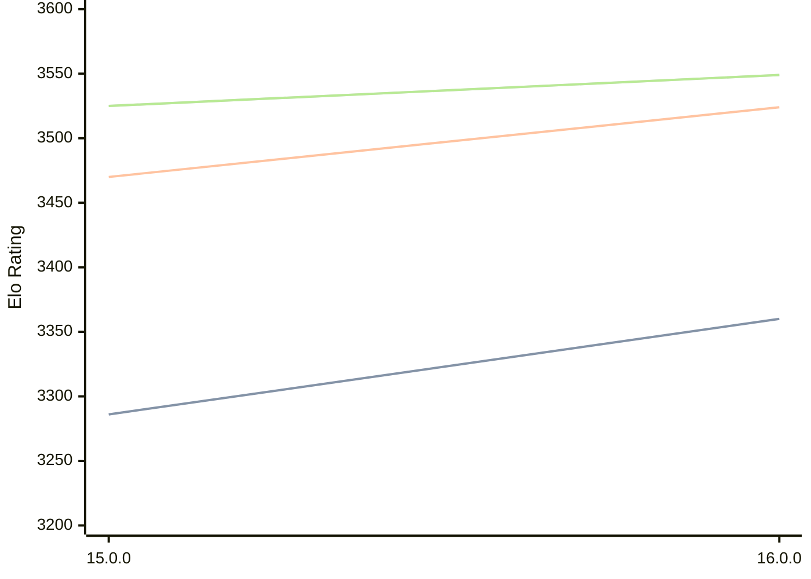

# Engine: Halogen

Author: Kieren Pearson

Home: https://github.com/KierenP/Halogen

## Elo Ratings

| Version | Published | STC 8.0+0.08s  | LTC 60.0+0.60s | VLTC 2m24s+1.12s | Comment |
| --- | --- | --- | --- | --- | --- |
| 16.0.0 | 2026-02-10 | 3360(+74) | 3524(+54) | 3549(+24) |  |
| 15.0.0 | 2025-09-01 | 3286 | 3470 | 3525 |  |
 | | | cElo (∆ prev) | cElo (∆ prev) | cElo (∆ prev) | 

<a href="https://github.com/computer-chess-index/cci/issues/new?template=submit-version.yml&title=[VERSION]+Halogen+<version>&body=###%20Engine%20name%0AHalogen%0A%0A###%20Version%0A16.0.0" target="_blank">Submit new version</a>

 Test Conditions:

GUI/CLI: <a href=https://github.com/cutechess/cutechess target="_blank">Cute-Chess</a> 
Elo Calculation: <a href=https://www.remi-coulom.fr/Bayesian-Elo/ target="_blank">Bayesian-Elo</a> 
CPU: Intel(R) Core(TM) i5-7500T 2.70GHz 
Opening book: 8_moves_v3 
\* STC: 8.0+0.08s, LTC: 60.0+0.60s, VLTC: 2m24s+1.12s

 Lists:
Ratings: <a href=https://github.com/computer-chess-index/cci/blob/main/lists/CCIRatings.csv target="_blank">Complete list</a>

Generated: 2026-08-25 06:25:48

## Ratings Verlauf

⬛ STC (8.0+0.08s) &nbsp;&nbsp; 🟧 LTC (60.0+0.60s) &nbsp;&nbsp; 🟩 VLTC (2m24s+1.12s)

dark mode: 🟩STC (8.0+0.08s) 🟧LTC (60.0+0.60s) ⬜VLTC (2m24s+1.12s)

## Detailed Evaluation Results

| Version | Time Control | Elo  | Range +/- | Matches | Score | Average Opponent Elo | Draws |
| --- | --- | --- | --- | --- | --- | --- | --- |
| 16.0.0 | VLTC (2m24s+1.12s) | 3549 | 21 | 514 | 50% | 3549 | 88% |
| 16.0.0 | LTC (60.0+0.60s) | 3524 | 21 | 520 | 50% | 3522 | 86% |
| 16.0.0 | STC (8.0+0.08s) | 3360 | 20 | 594 | 49% | 3363 | 75% |
| --- | --- | --- | --- | --- | --- | --- | --- |
| 15.0.0 | VLTC (2m24s+1.12s) | 3525 | 27 | 324 | 52% | 3507 | 83% |
| 15.0.0 | LTC (60.0+0.60s) | 3470 | 30 | 276 | 52% | 3451 | 79% |
| 15.0.0 | STC (8.0+0.08s) | 3286 | 32 | 256 | 54% | 3247 | 64% |
| --- | --- | --- | --- | --- | --- | --- | --- |