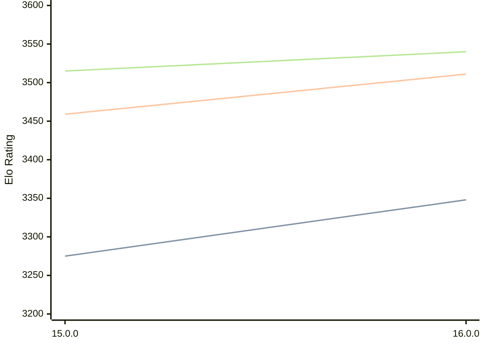

# Engine: Halogen

Author: Kieren Pearson

Home: https://github.com/KierenP/Halogen

## Elo Ratings

| Version | Published | STC 8.0+0.08s  | LTC 60.0+0.60s | VLTC 2m24s+1.12s | Comment |
| --- | --- | --- | --- | --- | --- |
| 16.0.0 | 2026-02-10 | 3348(+73) | 3511(+52) | 3540(+25) |  |
| 15.0.0 | 2025-09-01 | 3275(+new) | 3459(+new) | 3515(+new) |  |
| 14 | 2025-07-28 |  |  |  |  |
| 13 | 2025-06-24 |  |  |  |  |
| 12 | 2024-08-01 |  |  |  |  |
| 11 | 2022-10-09 |  |  |  |  |
| 10 | 2021-03-04 |  |  |  |  |
| 9 | 2020-12-18 |  |  |  |  |
| 8.1 | 2020-11-11 |  |  |  |  |
| 8 | 2020-10-27 |  |  |  |  |
| 7 | 2020-09-22 |  |  |  |  |
| 6 | 2020-08-12 |  |  |  |  |
| 5 | 2020-07-14 |  |  |  |  |
| 4 | 2020-06-22 |  |  |  |  |
| 3.0 | 2020-01-06 |  |  |  |  |
| 2.7 | 2019-12-11 |  |  |  |  |
| 2.6.2a | 2019-07-03 |  |  |  |  |
| 2.5 | 2019-06-27 |  |  |  |  |
| 2.4 | 2019-06-19 |  |  |  |  |
| 2.3 | 2019-06-08 |  |  |  |  |
 | | | cElo (∆ prev) | cElo (∆ prev) | cElo (∆ prev) | 

<a href="https://github.com/computer-chess-index/cci/issues/new?template=submit-version.yml&title=[VERSION]+Halogen+<version>&body=###%20Engine%20name%0AHalogen%0A%0A###%20Version%0A16.0.0" target="_blank">Submit new version</a>

 Test Conditions:

GUI/CLI: <a href=https://github.com/cutechess/cutechess target="_blank">Cute-Chess</a> 
Elo Calculation: <a href=https://www.remi-coulom.fr/Bayesian-Elo/ target="_blank">Bayesian-Elo</a> 
CPU: Intel(R) Core(TM) i5-7500T 2.70GHz 
Opening book: 8_moves_v3 
\* STC: 8.0+0.08s, LTC: 60.0+0.60s, VLTC: 2m24s+1.12s

 Lists:
Ratings: <a href=https://github.com/computer-chess-index/cci/blob/main/lists/CCIRatings.csv target="_blank">Complete list</a>

Generated: 2026-07-10 06:26:15

## Ratings Verlauf

## Ratings Verlauf

⬛ STC (8.0+0.08s) &nbsp;&nbsp; 🟧 LTC (60.0+0.60s) &nbsp;&nbsp; 🟩 VLTC (2m24s+1.12s)

dark mode: 🟩STC (8.0+0.08s) 🟧LTC (60.0+0.60s) ⬜VLTC (2m24s+1.12s)

## Detailed Evaluation Results

| Version | Time Control | Elo  | Range +/- | Matches | Score | Average Opponent Elo | Draws |
| --- | --- | --- | --- | --- | --- | --- | --- |
| 16.0.0 | VLTC (2m24s+1.12s) | 3540 | 23 | 446 | 50% | 3538 | 87% |
| 16.0.0 | LTC (60.0+0.60s) | 3511 | 22 | 464 | 50% | 3511 | 85% |
| 16.0.0 | STC (8.0+0.08s) | 3348 | 22 | 510 | 49% | 3352 | 75% |
| --- | --- | --- | --- | --- | --- | --- | --- |
| 15.0.0 | VLTC (2m24s+1.12s) | 3515 | 27 | 324 | 52% | 3498 | 83% |
| 15.0.0 | LTC (60.0+0.60s) | 3459 | 30 | 276 | 52% | 3440 | 79% |
| 15.0.0 | STC (8.0+0.08s) | 3275 | 32 | 256 | 54% | 3237 | 64% |
| --- | --- | --- | --- | --- | --- | --- | --- |