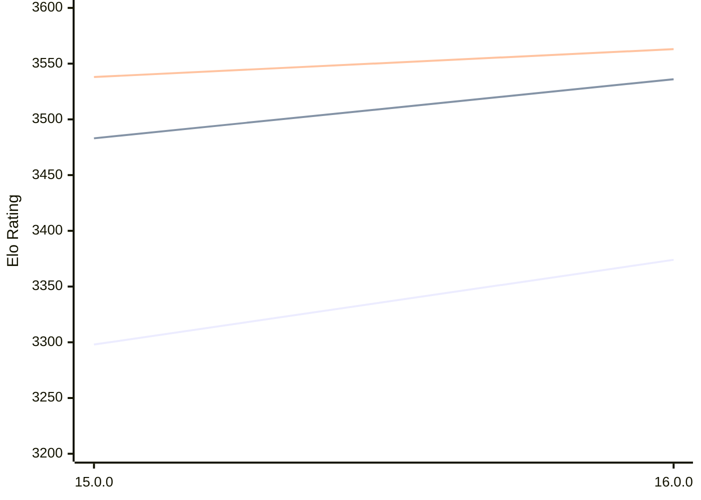

# Engine: Halogen

Author: Kieren Pearson

Home: https://github.com/KierenP/Halogen

## Elo Ratings E1 (Ultra 7 265T (1.50 GHz) - E-Core)

| Version | Published | STC 8.0+0.08s  | LTC 60.0+0.60s | VLTC 2m24s+1.12s | Comment |
| --- | --- | --- | --- | --- | --- |
| 16.0.0 | 2026-02-10 | 3371 | 3613 | 3660 |  |
 | | | cElo (∆ prev) | cElo (∆ prev) | cElo (∆ prev) | 

## Elo Ratings P1 (Ultra 7 265T (1.50 GHz) - P-Core)

| Version | Published | STC 8.0+0.08s  | LTC 60.0+0.60s | VLTC 2m24s+1.12s | Comment |
| --- | --- | --- | --- | --- | --- |
| 16.0.0 | 2026-02-10 | 3488 | 3672 | 3703 |  |
 | | | cElo (∆ prev) | cElo (∆ prev) | cElo (∆ prev) | 

## Elo Ratings T1 (i5-7500T 2.70GHz)

| Version | Published | STC 8.0+0.08s  | LTC 60.0+0.60s | VLTC 2m24s+1.12s | Comment |
| --- | --- | --- | --- | --- | --- |
| 16.0.0 | 2026-02-10 | 3374(+76) | 3536(+53) | 3563(+25) |  |
| 15.0.0 | 2025-09-01 | 3298 | 3483 | 3538 |  |
 | | | cElo (∆ prev) | cElo (∆ prev) | cElo (∆ prev) | 

<a href="https://github.com/computer-chess-index/cci/issues/new?template=submit-version.yml&title=[VERSION]+Halogen+<version>&body=###%20Engine%20name%0AHalogen%0A%0A###%20Version%0A16.0.0" target="_blank">Submit new version</a>

 Test Conditions:

GUI/CLI: <a href=https://github.com/cutechess/cutechess target="_blank">Cute-Chess</a> 
Elo Calculation: <a href=https://www.remi-coulom.fr/Bayesian-Elo/ target="_blank">Bayesian-Elo</a> 
CPU for P1: Intel(R) Core(TM) Ultra 7 265T (1.50 GHz) - P-Core 
CPU for E1: Intel(R) Core(TM) Ultra 7 265T (1.50 GHz) - E-Core 
CPU for T1: Intel(R) Core(TM) i5-7500T 2.70GHz 
Opening book: 8_moves_v3 
\* STC: 8.0+0.08s, LTC: 60.0+0.60s, VLTC: 2m24s+1.12s

 Lists:
Ratings: <a href=https://github.com/computer-chess-index/cci/blob/main/lists/CCIRatings.csv target="_blank">Complete list</a>

Generated: 2026-10-23 04:39:15

## Ratings Verlauf T1

```mermaid
%%{init: {"theme":"base","themeVariables":{"seriesColors:['#a3a3a3','#222221','#faa371']}}}%%
xychart-beta
  x-axis ["15.0.0", "16.0.0"]
  y-axis "Elo Rating" 3200 --> 3600
  line "T1: STC (8.0+0.08s)" [3298, 3374]
  line "T1: LTC (60.0+0.60s)" [3483, 3536]
  line "T1: VLTC (2m24s+1.12s)" [3538, 3563]
```

## Detailed Evaluation Results

| Version | Time Control | Variant | Elo  | Range +/- | Matches | Score | Average Opponent Elo | Draws |
| --- | --- |--- | --- | --- | --- | --- | --- | --- |
| 16.0.0 | VLTC (2m24s+1.12s) | T1 | 3563 | 21 | 538 | 50% | 3563 | 87% |
|  |  | P1 | 3703 | 35 | 228 | 62% | 3526 | 70% |
|  |  | E1 | 3660 | 30 | 296 | 61% | 3510 | 74% |
|  | LTC (60.0+0.60s) | T1 | 3536 | 20 | 556 | 50% | 3537 | 86% |
|  |  | P1 | 3672 | 44 | 136 | 59% | 3538 | 75% |
|  |  | E1 | 3613 | 36 | 214 | 59% | 3457 | 65% |
|  | STC (8.0+0.08s) | T1 | 3374 | 20 | 642 | 50% | 3376 | 75% |
|  |  | P1 | 3488 | 34 | 216 | 50% | 3490 | 75% |
|  |  | E1 | 3371 | 28 | 348 | 46% | 3402 | 59% |
| --- | --- |--- | --- | --- | --- | --- | --- | --- |
| 15.0.0 | VLTC (2m24s+1.12s) | T1 | 3538 | 27 | 324 | 52% | 3521 | 83% |
|  | LTC (60.0+0.60s) | T1 | 3483 | 30 | 276 | 52% | 3464 | 79% |
|  | STC (8.0+0.08s) | T1 | 3298 | 32 | 256 | 54% | 3259 | 64% |