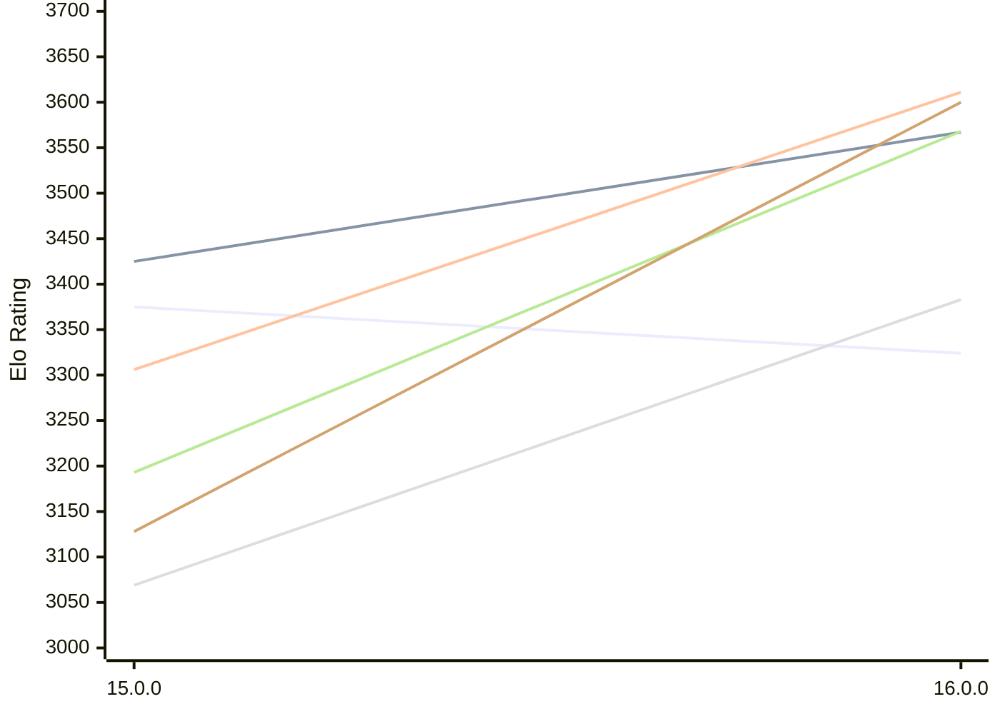
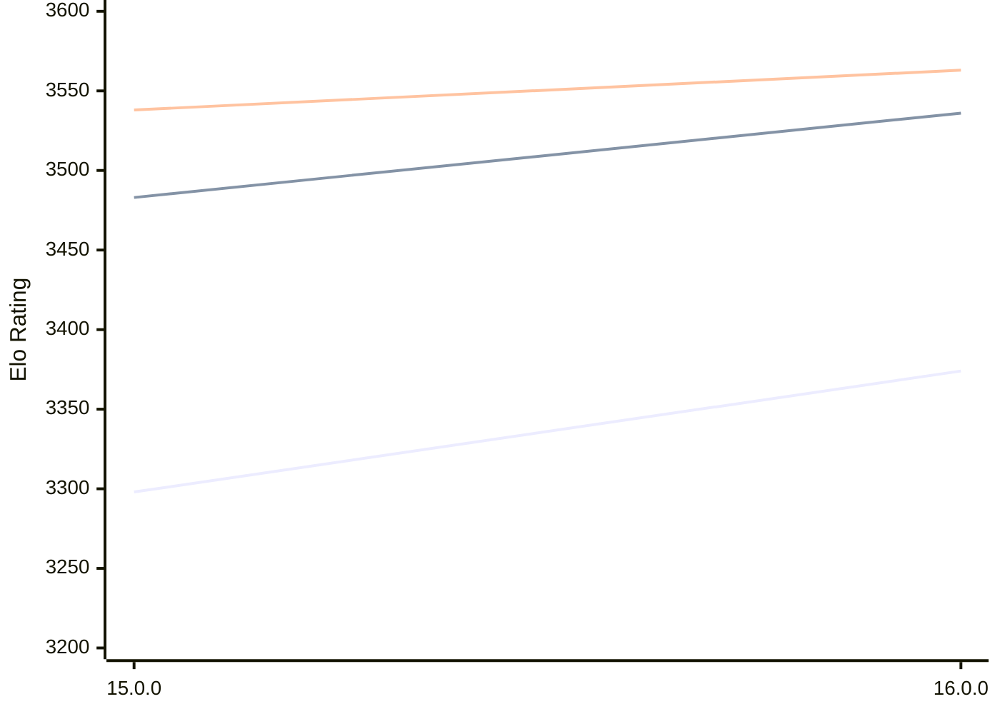

# Engine: Halogen

Author: Kieren Pearson

Home: https://github.com/KierenP/Halogen

## Elo Ratings E1 (Ultra 7 265T (1.50 GHz) - E-Core)

| Version | Published | STC 8.0+0.08s  | LTC 60.0+0.60s | VLTC 2m24s+1.12s | Comment |
| --- | --- | --- | --- | --- | --- |
| 16.0.0 | 2026-02-10 | 3324(-51) | 3567(+142) | 3611(+305) |  |
| 15.0.0 | 2025-09-01 | 3375 | 3425 | 3306 |  |
 | | | cElo (∆ prev) | cElo (∆ prev) | cElo (∆ prev) | 

## Elo Ratings P1 (Ultra 7 265T (1.50 GHz) - P-Core)

| Version | Published | STC 8.0+0.08s  | LTC 60.0+0.60s | VLTC 2m24s+1.12s | Comment |
| --- | --- | --- | --- | --- | --- |
| 16.0.0 | 2026-02-10 | 3383(+314) | 3568(+375) | 3600(+472) |  |
| 15.0.0 | 2025-09-01 | 3069 | 3193 | 3128 |  |
 | | | cElo (∆ prev) | cElo (∆ prev) | cElo (∆ prev) | 

## Elo Ratings T1 (i5-7500T 2.70GHz)

| Version | Published | STC 8.0+0.08s  | LTC 60.0+0.60s | VLTC 2m24s+1.12s | Comment |
| --- | --- | --- | --- | --- | --- |
| 16.0.0 | 2026-02-10 | 3374(+76) | 3536(+53) | 3563(+25) |  |
| 15.0.0 | 2025-09-01 | 3298 | 3483 | 3538 |  |
 | | | cElo (∆ prev) | cElo (∆ prev) | cElo (∆ prev) | 

<a href="https://github.com/computer-chess-index/cci/issues/new?template=submit-version.yml&title=[VERSION]+Halogen+<version>&body=###%20Engine%20name%0AHalogen%0A%0A###%20Version%0A16.0.0" target="_blank">Submit new version</a>

 Test Conditions:

GUI/CLI: <a href=https://github.com/cutechess/cutechess target="_blank">Cute-Chess</a> 
Elo Calculation: <a href=https://www.remi-coulom.fr/Bayesian-Elo/ target="_blank">Bayesian-Elo</a> 
CPU for P1: Intel(R) Core(TM) Ultra 7 265T (1.50 GHz) - P-Core 
CPU for E1: Intel(R) Core(TM) Ultra 7 265T (1.50 GHz) - E-Core 
CPU for T1: Intel(R) Core(TM) i5-7500T 2.70GHz 
Opening book: 8_moves_v3 
\* STC: 8.0+0.08s, LTC: 60.0+0.60s, VLTC: 2m24s+1.12s

 Lists:
Ratings: <a href=https://github.com/computer-chess-index/cci/blob/main/lists/CCIRatings.csv target="_blank">Complete list</a>

Generated: 2026-11-13 05:38:52

## Ratings Verlauf E1 / P1

```mermaid
%%{init: {"theme":"base","themeVariables":{"seriesColors:['#a3a3a3','#222221','#faa371']}}}%%
xychart-beta
  x-axis ["15.0.0", "16.0.0"]
  y-axis "Elo Rating" 3000 --> 3700
  line "E1: STC (8.0+0.08s)" [3375, 3324]
  line "E1: LTC (60.0+0.60s)" [3425, 3567]
  line "E1: VLTC (2m24s+1.12s)" [3306, 3611]
  line "P1: STC (8.0+0.08s)" [3069, 3383]
  line "P1: LTC (60.0+0.60s)" [3193, 3568]
  line "P1: VLTC (2m24s+1.12s)" [3128, 3600]
```

## Ratings Verlauf T1

```mermaid
%%{init: {"theme":"base","themeVariables":{"seriesColors:['#a3a3a3','#222221','#faa371']}}}%%
xychart-beta
  x-axis ["15.0.0", "16.0.0"]
  y-axis "Elo Rating" 3200 --> 3600
  line "T1: STC (8.0+0.08s)" [3298, 3374]
  line "T1: LTC (60.0+0.60s)" [3483, 3536]
  line "T1: VLTC (2m24s+1.12s)" [3538, 3563]
```

## Detailed Evaluation Results

| Version | Time Control | Variant | Elo  | Range +/- | Matches | Score | Average Opponent Elo | Draws |
| --- | --- |--- | --- | --- | --- | --- | --- | --- |
| 16.0.0 | VLTC (2m24s+1.12s) | T1 | 3563 | 21 | 538 | 50% | 3563 | 87% |
|  |  | P1 | 3600 | 33 | 252 | 61% | 3443 | 72% |
|  |  | E1 | 3611 | 28 | 332 | 60% | 3479 | 75% |
|  | LTC (60.0+0.60s) | P1 | 3568 | 39 | 164 | 57% | 3463 | 77% |
|  |  | E1 | 3567 | 32 | 266 | 57% | 3444 | 67% |
|  |  | T1 | 3536 | 20 | 556 | 50% | 3537 | 86% |
|  | STC (8.0+0.08s) | P1 | 3383 | 32 | 244 | 49% | 3387 | 75% |
|  |  | E1 | 3324 | 26 | 392 | 46% | 3351 | 60% |
|  |  | T1 | 3374 | 20 | 642 | 50% | 3376 | 75% |
| --- | --- |--- | --- | --- | --- | --- | --- | --- |
| 15.0.0 | VLTC (2m24s+1.12s) | E1 | 3306 | 183 | 8 | 69% | 3110 | 63% |
|  |  | T1 | 3538 | 27 | 324 | 52% | 3521 | 83% |
|  |  | P1 | 3128 | 144 | 12 | 58% | 3019 | 67% |
|  | LTC (60.0+0.60s) | E1 | 3425 | 140 | 24 | 83% | 2569 | 33% |
|  |  | T1 | 3483 | 30 | 276 | 52% | 3464 | 79% |
|  |  | P1 | 3193 | 149 | 16 | 81% | 2807 | 38% |
|  | STC (8.0+0.08s) | T1 | 3298 | 32 | 256 | 54% | 3259 | 64% |
|  |  | P1 | 3069 | 148 | 12 | 58% | 2955 | 50% |
|  |  | E1 | 3375 | 147 | 28 | 89% | 2674 | 21% |