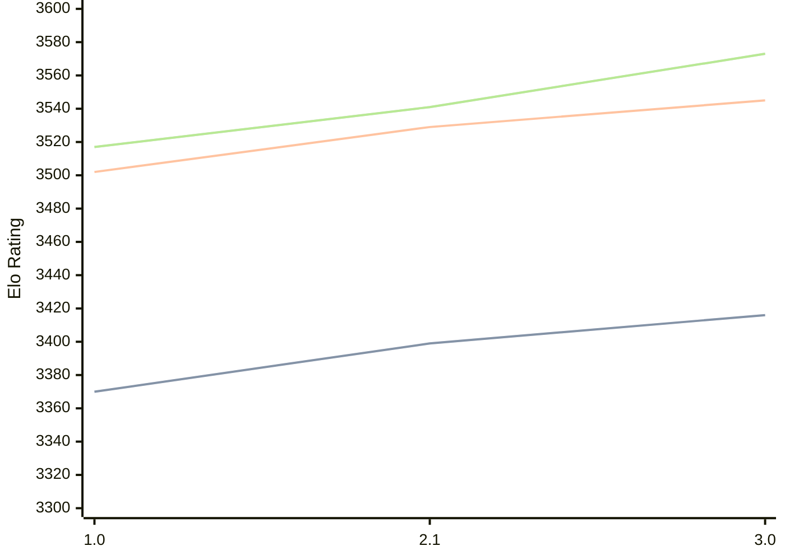

# Engine: Hobbes

Author: Dan Kelsey

Home: https://github.com/kelseyde/hobbes-chess-engine

## Elo Ratings

| Version | Published | STC 8.0+0.08s  | LTC 60.0+0.60s | VLTC 2m24s+1.12s | Comment |
| --- | --- | --- | --- | --- | --- |
| 3.0 | 2026-07-22 | 3416(+17) | 3545(+16) | 3573(+32) |  |
| 2.1 | 2026-05-26 | 3399(+29) | 3529(+27) | 3541(+24) |  |
| 1.0 | 2026-03-05 | 3370 | 3502 | 3517 |  |
 | | | cElo (∆ prev) | cElo (∆ prev) | cElo (∆ prev) | 

<a href="https://github.com/computer-chess-index/cci/issues/new?template=submit-version.yml&title=[VERSION]+Hobbes+<version>&body=###%20Engine%20name%0AHobbes%0A%0A###%20Version%0A3.0" target="_blank">Submit new version</a>

 Test Conditions:

GUI/CLI: <a href=https://github.com/cutechess/cutechess target="_blank">Cute-Chess</a> 
Elo Calculation: <a href=https://www.remi-coulom.fr/Bayesian-Elo/ target="_blank">Bayesian-Elo</a> 
CPU: Intel(R) Core(TM) i5-7500T 2.70GHz 
Opening book: 8_moves_v3 
\* STC: 8.0+0.08s, LTC: 60.0+0.60s, VLTC: 2m24s+1.12s

 Lists:
Ratings: <a href=https://github.com/computer-chess-index/cci/blob/main/lists/CCIRatings.csv target="_blank">Complete list</a>

Generated: 2026-08-23 06:25:27

## Ratings Verlauf

⬛ STC (8.0+0.08s) &nbsp;&nbsp; 🟧 LTC (60.0+0.60s) &nbsp;&nbsp; 🟩 VLTC (2m24s+1.12s)

dark mode: 🟩STC (8.0+0.08s) 🟧LTC (60.0+0.60s) ⬜VLTC (2m24s+1.12s)

## Detailed Evaluation Results

| Version | Time Control | Elo  | Range +/- | Matches | Score | Average Opponent Elo | Draws |
| --- | --- | --- | --- | --- | --- | --- | --- |
| 3.0 | VLTC (2m24s+1.12s) | 3573 | 31 | 240 | 51% | 3567 | 89% |
| 3.0 | LTC (60.0+0.60s) | 3545 | 29 | 270 | 50% | 3546 | 89% |
| 3.0 | STC (8.0+0.08s) | 3416 | 29 | 294 | 49% | 3418 | 75% |
| --- | --- | --- | --- | --- | --- | --- | --- |
| 2.1 | VLTC (2m24s+1.12s) | 3541 | 31 | 232 | 51% | 3534 | 90% |
| 2.1 | LTC (60.0+0.60s) | 3529 | 30 | 260 | 52% | 3515 | 88% |
| 2.1 | STC (8.0+0.08s) | 3399 | 28 | 296 | 52% | 3386 | 80% |
| --- | --- | --- | --- | --- | --- | --- | --- |
| 1.0 | VLTC (2m24s+1.12s) | 3517 | 25 | 378 | 51% | 3507 | 90% |
| 1.0 | LTC (60.0+0.60s) | 3502 | 26 | 350 | 51% | 3491 | 87% |
| 1.0 | STC (8.0+0.08s) | 3370 | 23 | 484 | 53% | 3339 | 73% |
| --- | --- | --- | --- | --- | --- | --- | --- |