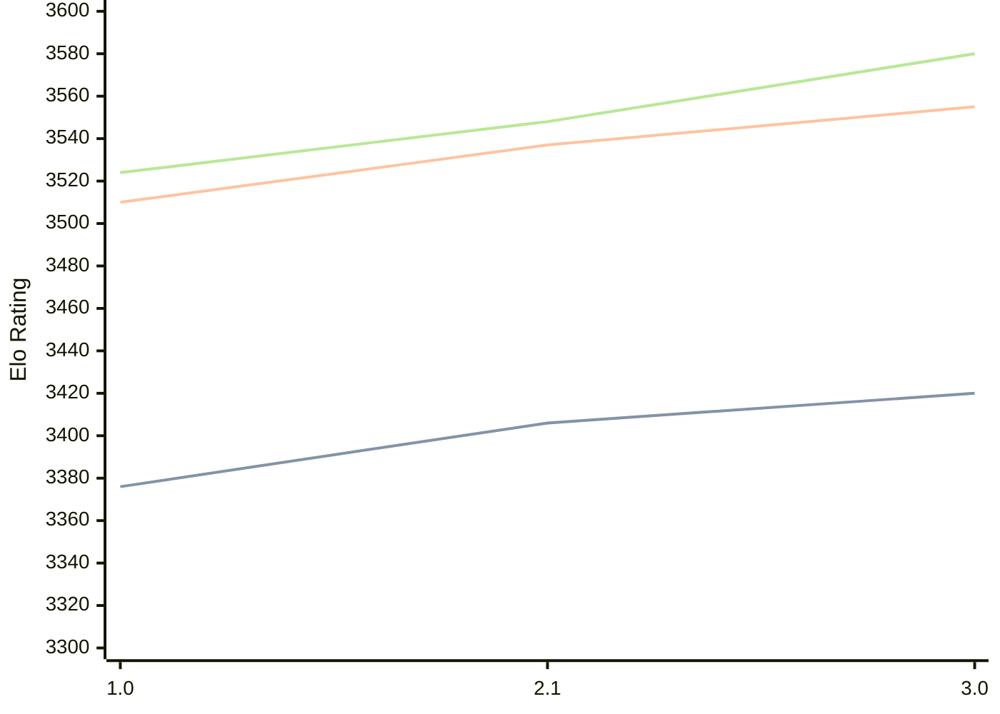

# Engine: Hobbes

Author: Dan Kelsey

Home: https://github.com/kelseyde/hobbes-chess-engine

## Elo Ratings

| Version | Published | STC 8.0+0.08s  | LTC 60.0+0.60s | VLTC 2m24s+1.12s | Comment |
| --- | --- | --- | --- | --- | --- |
| 3.0 | 2026-07-22 | 3420(+14) | 3555(+18) | 3580(+32) |  |
| 2.1 | 2026-05-26 | 3406(+30) | 3537(+27) | 3548(+24) |  |
| 1.0 | 2026-03-05 | 3376 | 3510 | 3524 |  |
 | | | cElo (∆ prev) | cElo (∆ prev) | cElo (∆ prev) | 

<a href="https://github.com/computer-chess-index/cci/issues/new?template=submit-version.yml&title=[VERSION]+Hobbes+<version>&body=###%20Engine%20name%0AHobbes%0A%0A###%20Version%0A3.0" target="_blank">Submit new version</a>

 Test Conditions:

GUI/CLI: <a href=https://github.com/cutechess/cutechess target="_blank">Cute-Chess</a> 
Elo Calculation: <a href=https://www.remi-coulom.fr/Bayesian-Elo/ target="_blank">Bayesian-Elo</a> 
CPU: Intel(R) Core(TM) i5-7500T 2.70GHz 
Opening book: 8_moves_v3 
\* STC: 8.0+0.08s, LTC: 60.0+0.60s, VLTC: 2m24s+1.12s

 Lists:
Ratings: <a href=https://github.com/computer-chess-index/cci/blob/main/lists/CCIRatings.csv target="_blank">Complete list</a>

Generated: 2026-09-13 04:38:38

## Ratings Verlauf

## Detailed Evaluation Results

| Version | Time Control | Elo  | Range +/- | Matches | Score | Average Opponent Elo | Draws |
| --- | --- | --- | --- | --- | --- | --- | --- |
| 3.0 | VLTC (2m24s+1.12s) | 3580 | 29 | 272 | 51% | 3569 | 88% |
| 3.0 | LTC (60.0+0.60s) | 3555 | 27 | 318 | 50% | 3552 | 90% |
| 3.0 | STC (8.0+0.08s) | 3420 | 27 | 338 | 49% | 3425 | 76% |
| --- | --- | --- | --- | --- | --- | --- | --- |
| 2.1 | VLTC (2m24s+1.12s) | 3548 | 31 | 232 | 51% | 3542 | 90% |
| 2.1 | LTC (60.0+0.60s) | 3537 | 30 | 260 | 52% | 3524 | 88% |
| 2.1 | STC (8.0+0.08s) | 3406 | 28 | 296 | 52% | 3393 | 80% |
| --- | --- | --- | --- | --- | --- | --- | --- |
| 1.0 | VLTC (2m24s+1.12s) | 3524 | 25 | 378 | 51% | 3514 | 90% |
| 1.0 | LTC (60.0+0.60s) | 3510 | 26 | 350 | 51% | 3498 | 87% |
| 1.0 | STC (8.0+0.08s) | 3376 | 23 | 484 | 53% | 3345 | 73% |
| --- | --- | --- | --- | --- | --- | --- | --- |