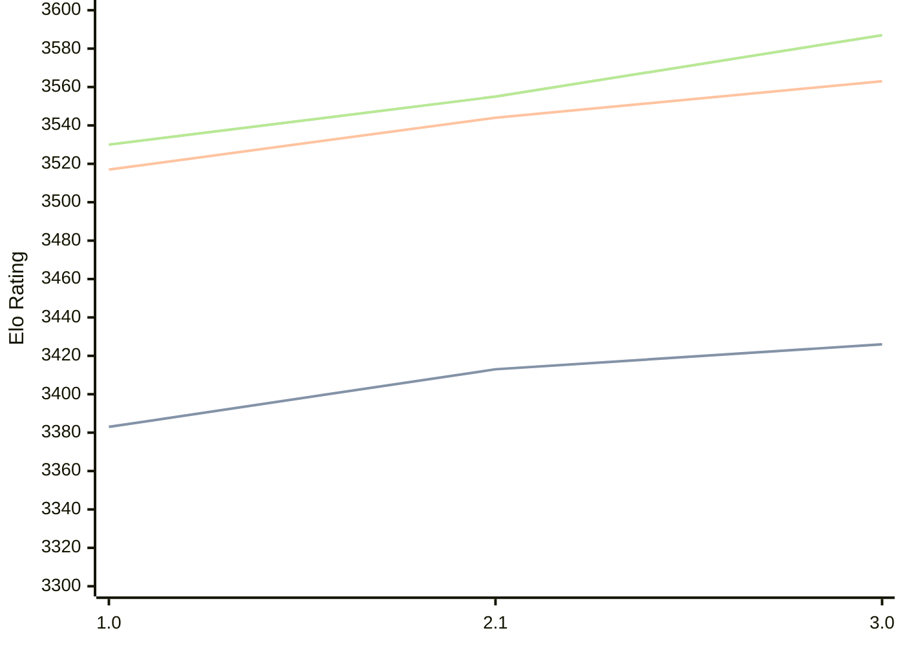

# Engine: Hobbes

Author: Dan Kelsey

Home: https://github.com/kelseyde/hobbes-chess-engine

## Elo Ratings E1

| Version | Published | STC 8.0+0.08s  | LTC 60.0+0.60s | VLTC 2m24s+1.12s | Comment |
| --- | --- | --- | --- | --- | --- |
| 3.0 | 2026-07-22 | 3352 | 3567 | 3595 |  |
 | | | cElo (∆ prev) | cElo (∆ prev) | cElo (∆ prev) | 

## Elo Ratings P1

| Version | Published | STC 8.0+0.08s  | LTC 60.0+0.60s | VLTC 2m24s+1.12s | Comment |
| --- | --- | --- | --- | --- | --- |
| 3.0 | 2026-07-22 | 3609 | 3780 | 3788 |  |
 | | | cElo (∆ prev) | cElo (∆ prev) | cElo (∆ prev) | 

## Elo Ratings T1

| Version | Published | STC 8.0+0.08s  | LTC 60.0+0.60s | VLTC 2m24s+1.12s | Comment |
| --- | --- | --- | --- | --- | --- |
| 3.0 | 2026-07-22 | 3426(+13) | 3563(+19) | 3587(+32) |  |
| 2.1 | 2026-05-26 | 3413(+30) | 3544(+27) | 3555(+25) |  |
| 1.0 | 2026-03-05 | 3383 | 3517 | 3530 |  |
 | | | cElo (∆ prev) | cElo (∆ prev) | cElo (∆ prev) | 

<a href="https://github.com/computer-chess-index/cci/issues/new?template=submit-version.yml&title=[VERSION]+Hobbes+<version>&body=###%20Engine%20name%0AHobbes%0A%0A###%20Version%0A3.0" target="_blank">Submit new version</a>

 Test Conditions:

GUI/CLI: <a href=https://github.com/cutechess/cutechess target="_blank">Cute-Chess</a> 
Elo Calculation: <a href=https://www.remi-coulom.fr/Bayesian-Elo/ target="_blank">Bayesian-Elo</a> 
CPU for P1: Intel(R) Core(TM) Ultra 7 265T (1.50 GHz) - P-Core 
CPU for E1: Intel(R) Core(TM) Ultra 7 265T (1.50 GHz) - E-Core 
CPU for T1: Intel(R) Core(TM) i5-7500T 2.70GHz 
Opening book: 8_moves_v3 
\* STC: 8.0+0.08s, LTC: 60.0+0.60s, VLTC: 2m24s+1.12s

 Lists:
Ratings: <a href=https://github.com/computer-chess-index/cci/blob/main/lists/CCIRatings.csv target="_blank">Complete list</a>

Generated: 2026-10-09 14:12:19

## Ratings Verlauf

```mermaid
%%{init: {"theme":"base","themeVariables":{"seriesColors:['#a3a3a3','#222221','#faa371']}}}%%
xychart-beta
  x-axis ["1.0", "2.1", "3.0"]
  y-axis "Elo Rating" 3300 --> 3600
  line "" [3383, 3413, 3426]
  line "STC (8.0+0.08s)" [3383, 3413, 3426]
  line "LTC (60.0+0.60s)" [3517, 3544, 3563]
  line "" [3530, 3555, 3587]
  line "VLTC (2m24s+1.12s)" [3530, 3555, 3587]
```

## Detailed Evaluation Results

| Version | Time Control | Elo  | Range +/- | Matches | Score | Average Opponent Elo | Draws |
| --- | --- | --- | --- | --- | --- | --- | --- |
| 3.0 | VLTC (2m24s+1.12s) | 3587 | 29 | 278 | 51% | 3576 | 88% |
| 3.0 | VLTC (2m24s+1.12s) | 3788 | 49 | 90 | 48% | 3799 | 94% |
| 3.0 | VLTC (2m24s+1.12s) | 3595 | 42 | 126 | 51% | 3590 | 94% |
| 3.0 | LTC (60.0+0.60s) | 3563 | 25 | 350 | 51% | 3557 | 90% |
| 3.0 | LTC (60.0+0.60s) | 3780 | 47 | 98 | 51% | 3773 | 98% |
| 3.0 | LTC (60.0+0.60s) | 3567 | 42 | 132 | 51% | 3560 | 84% |
| 3.0 | STC (8.0+0.08s) | 3426 | 26 | 350 | 49% | 3432 | 76% |
| --- | --- | --- | --- | --- | --- | --- | --- |
| 3.0 | STC (8.0+0.08s) | 3609 | 44 | 120 | 49% | 3613 | 78% |
| --- | --- | --- | --- | --- | --- | --- | --- |
| 3.0 | STC (8.0+0.08s) | 3352 | 36 | 188 | 48% | 3370 | 75% |
| --- | --- | --- | --- | --- | --- | --- | --- |
| 2.1 | VLTC (2m24s+1.12s) | 3555 | 31 | 232 | 51% | 3549 | 90% |
| 2.1 | LTC (60.0+0.60s) | 3544 | 30 | 260 | 52% | 3530 | 88% |
| 2.1 | STC (8.0+0.08s) | 3413 | 28 | 296 | 52% | 3401 | 80% |
| --- | --- | --- | --- | --- | --- | --- | --- |
| 1.0 | VLTC (2m24s+1.12s) | 3530 | 25 | 378 | 51% | 3521 | 90% |
| 1.0 | LTC (60.0+0.60s) | 3517 | 26 | 350 | 51% | 3506 | 87% |
| 1.0 | STC (8.0+0.08s) | 3383 | 23 | 484 | 53% | 3353 | 73% |
| --- | --- | --- | --- | --- | --- | --- | --- |