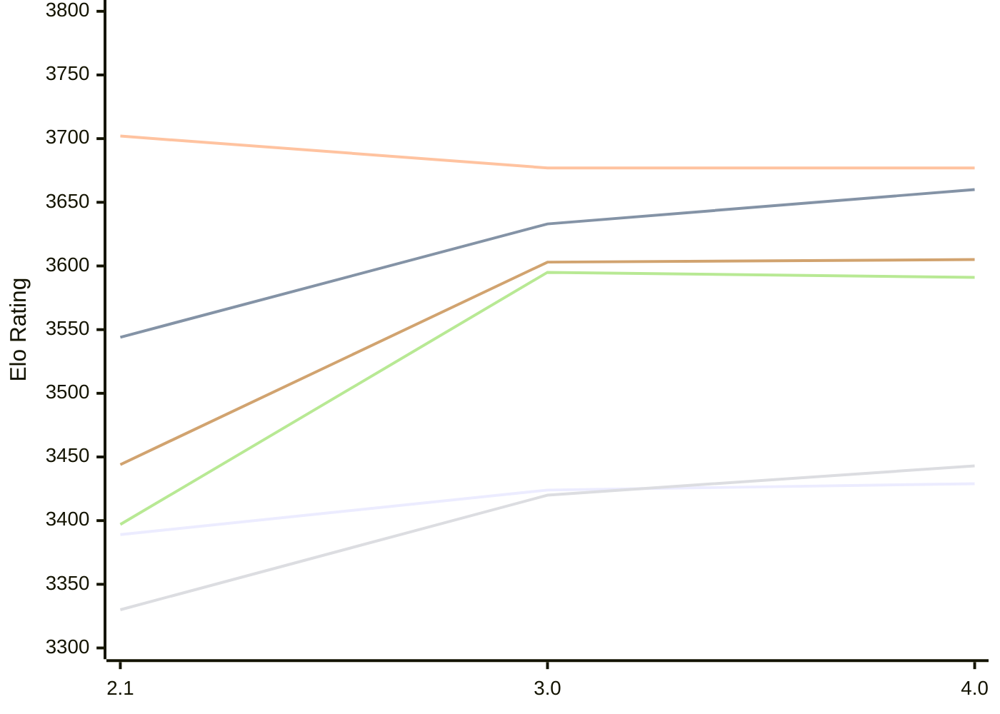
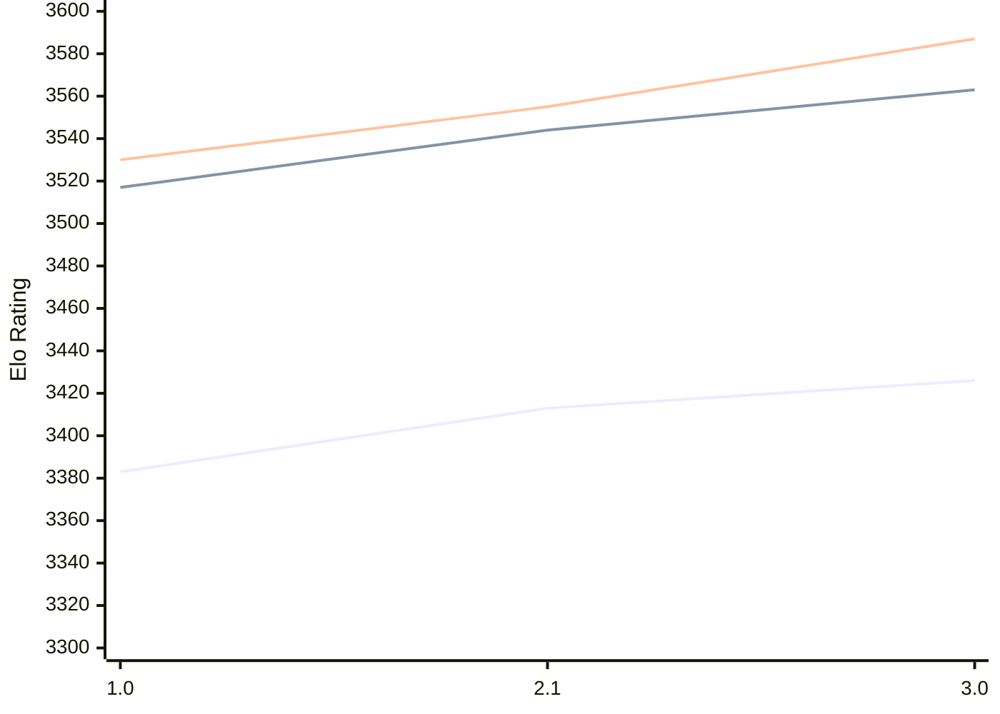

# Engine: Hobbes

Author: Dan Kelsey

Home: https://github.com/kelseyde/hobbes-chess-engine

## Elo Ratings E1 (Ultra 7 265T (1.50 GHz) - E-Core)

| Version | Published | STC 8.0+0.08s  | LTC 60.0+0.60s | VLTC 2m24s+1.12s | Comment |
| --- | --- | --- | --- | --- | --- |
| 4.0 | 2026-11-13 | 3429(+5) | 3660(+27) | 3677(0) |  |
| 3.0 | 2026-07-22 | 3424(+35) | 3633(+89) | 3677(-25) |  |
| 2.1 | 2026-05-26 | 3389 | 3544 | 3702 |  |
 | | | cElo (∆ prev) | cElo (∆ prev) | cElo (∆ prev) | 

## Elo Ratings P1 (Ultra 7 265T (1.50 GHz) - P-Core)

| Version | Published | STC 8.0+0.08s  | LTC 60.0+0.60s | VLTC 2m24s+1.12s | Comment |
| --- | --- | --- | --- | --- | --- |
| 4.0 | 2026-11-13 | 3443(+23) | 3591(-4) | 3605(+2) |  |
| 3.0 | 2026-07-22 | 3420(+90) | 3595(+198) | 3603(+159) |  |
| 2.1 | 2026-05-26 | 3330 | 3397 | 3444 |  |
 | | | cElo (∆ prev) | cElo (∆ prev) | cElo (∆ prev) | 

## Elo Ratings T1 (i5-7500T 2.70GHz)

| Version | Published | STC 8.0+0.08s  | LTC 60.0+0.60s | VLTC 2m24s+1.12s | Comment |
| --- | --- | --- | --- | --- | --- |
| 3.0 | 2026-07-22 | 3426(+13) | 3563(+19) | 3587(+32) |  |
| 2.1 | 2026-05-26 | 3413(+30) | 3544(+27) | 3555(+25) |  |
| 1.0 | 2026-03-05 | 3383 | 3517 | 3530 |  |
 | | | cElo (∆ prev) | cElo (∆ prev) | cElo (∆ prev) | 

<a href="https://github.com/computer-chess-index/cci/issues/new?template=submit-version.yml&title=[VERSION]+Hobbes+<version>&body=###%20Engine%20name%0AHobbes%0A%0A###%20Version%0A3.0" target="_blank">Submit new version</a>

 Test Conditions:

GUI/CLI: <a href=https://github.com/cutechess/cutechess target="_blank">Cute-Chess</a> 
Elo Calculation: <a href=https://www.remi-coulom.fr/Bayesian-Elo/ target="_blank">Bayesian-Elo</a> 
CPU for P1: Intel(R) Core(TM) Ultra 7 265T (1.50 GHz) - P-Core 
CPU for E1: Intel(R) Core(TM) Ultra 7 265T (1.50 GHz) - E-Core 
CPU for T1: Intel(R) Core(TM) i5-7500T 2.70GHz 
Opening book: 8_moves_v3 
\* STC: 8.0+0.08s, LTC: 60.0+0.60s, VLTC: 2m24s+1.12s

 Lists:
Ratings: <a href=https://github.com/computer-chess-index/cci/blob/main/lists/CCIRatings.csv target="_blank">Complete list</a>

Generated: 2026-11-27 05:39:02

## Ratings Verlauf E1 / P1

```mermaid
%%{init: {"theme":"base","themeVariables":{"seriesColors:['#a3a3a3','#222221','#faa371']}}}%%
xychart-beta
  x-axis ["2.1", "3.0", "4.0"]
  y-axis "Elo Rating" 3300 --> 3800
  line "E1: STC (8.0+0.08s)" [3389, 3424, 3429]
  line "E1: LTC (60.0+0.60s)" [3544, 3633, 3660]
  line "E1: VLTC (2m24s+1.12s)" [3702, 3677, 3677]
  line "P1: STC (8.0+0.08s)" [3330, 3420, 3443]
  line "P1: LTC (60.0+0.60s)" [3397, 3595, 3591]
  line "P1: VLTC (2m24s+1.12s)" [3444, 3603, 3605]
```

## Ratings Verlauf T1

```mermaid
%%{init: {"theme":"base","themeVariables":{"seriesColors:['#a3a3a3','#222221','#faa371']}}}%%
xychart-beta
  x-axis ["1.0", "2.1", "3.0"]
  y-axis "Elo Rating" 3300 --> 3600
  line "T1: STC (8.0+0.08s)" [3383, 3413, 3426]
  line "T1: LTC (60.0+0.60s)" [3517, 3544, 3563]
  line "T1: VLTC (2m24s+1.12s)" [3530, 3555, 3587]
```

## Detailed Evaluation Results

| Version | Time Control | Variant | Elo  | Range +/- | Matches | Score | Average Opponent Elo | Draws |
| --- | --- |--- | --- | --- | --- | --- | --- | --- |
| 4.0 | VLTC (2m24s+1.12s) | P1 | 3605 | 83 | 30 | 50% | 3605 | 100% |
|  |  | E1 | 3677 | 28 | 284 | 48% | 3692 | 88% |
|  | LTC (60.0+0.60s) | P1 | 3591 | 54 | 76 | 51% | 3586 | 88% |
|  |  | E1 | 3660 | 39 | 148 | 51% | 3656 | 86% |
|  | STC (8.0+0.08s) | P1 | 3443 | 43 | 132 | 52% | 3425 | 77% |
|  |  | E1 | 3429 | 34 | 216 | 47% | 3449 | 73% |
| --- | --- |--- | --- | --- | --- | --- | --- | --- |
| 3.0 | VLTC (2m24s+1.12s) | E1 | 3677 | 27 | 298 | 50% | 3676 | 96% |
|  |  | T1 | 3587 | 29 | 278 | 51% | 3576 | 88% |
|  |  | P1 | 3603 | 41 | 132 | 49% | 3610 | 96% |
|  | LTC (60.0+0.60s) | E1 | 3633 | 31 | 234 | 50% | 3633 | 86% |
|  |  | T1 | 3563 | 25 | 350 | 51% | 3557 | 90% |
|  |  | P1 | 3595 | 39 | 142 | 51% | 3588 | 96% |
|  | STC (8.0+0.08s) | E1 | 3424 | 28 | 308 | 48% | 3437 | 78% |
|  |  | T1 | 3426 | 26 | 350 | 49% | 3432 | 76% |
|  |  | P1 | 3420 | 35 | 196 | 50% | 3418 | 83% |
| --- | --- |--- | --- | --- | --- | --- | --- | --- |
| 2.1 | VLTC (2m24s+1.12s) | T1 | 3555 | 31 | 232 | 51% | 3549 | 90% |
|  |  | P1 | 3444 | 146 | 28 | 88% | 2726 | 25% |
|  |  | E1 | 3702 | 169 | 32 | 92% | 2705 | 9% |
|  | LTC (60.0+0.60s) | T1 | 3544 | 30 | 260 | 52% | 3530 | 88% |
|  |  | P1 | 3397 | 305 | 20 | 100% | 2472 | 0% |
|  |  | E1 | 3544 | 120 | 32 | 80% | 2935 | 34% |
|  | STC (8.0+0.08s) | T1 | 3413 | 28 | 296 | 52% | 3401 | 80% |
|  |  | P1 | 3330 | 330 | 10 | 100% | 2600 | 0% |
|  |  | E1 | 3389 | 96 | 36 | 63% | 3109 | 47% |
| --- | --- |--- | --- | --- | --- | --- | --- | --- |
| 1.0 | VLTC (2m24s+1.12s) | T1 | 3530 | 25 | 378 | 51% | 3521 | 90% |
|  | LTC (60.0+0.60s) | T1 | 3517 | 26 | 350 | 51% | 3506 | 87% |
|  | STC (8.0+0.08s) | T1 | 3383 | 23 | 484 | 53% | 3353 | 73% |