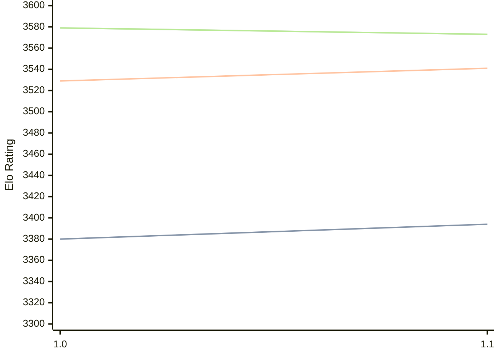

# Engine: Horsie

Author: Liam McGuire

Home: https://github.com/liamt19/Horsie

## Elo Ratings

| Version | Published | STC 8.0+0.08s  | LTC 60.0+0.60s | VLTC 2m24s+1.12s | Comment |
| --- | --- | --- | --- | --- | --- |
| 1.1 | 2025-05-13 | 3394(+14) | 3541(+12) | 3573(-6) |  |
| 1.0 | 2025-01-08 | 3380 | 3529 | 3579 |  |
 | | | cElo (∆ prev) | cElo (∆ prev) | cElo (∆ prev) | 

<a href="https://github.com/computer-chess-index/cci/issues/new?template=submit-version.yml&title=[VERSION]+Horsie+<version>&body=###%20Engine%20name%0AHorsie%0A%0A###%20Version%0A1.1" target="_blank">Submit new version</a>

 Test Conditions:

GUI/CLI: <a href=https://github.com/cutechess/cutechess target="_blank">Cute-Chess</a> 
Elo Calculation: <a href=https://www.remi-coulom.fr/Bayesian-Elo/ target="_blank">Bayesian-Elo</a> 
CPU: Intel(R) Core(TM) i5-7500T 2.70GHz 
Opening book: 8_moves_v3 
\* STC: 8.0+0.08s, LTC: 60.0+0.60s, VLTC: 2m24s+1.12s

 Lists:
Ratings: <a href=https://github.com/computer-chess-index/cci/blob/main/lists/CCIRatings.csv target="_blank">Complete list</a>

Generated: 2026-05-03 07:39:06

## Ratings Verlauf

⬛ STC (8.0+0.08s) &nbsp;&nbsp; 🟧 LTC (60.0+0.60s) &nbsp;&nbsp; 🟩 VLTC (2m24s+1.12s)

dark mode: 🟩STC (8.0+0.08s) 🟧LTC (60.0+0.60s) ⬜VLTC (2m24s+1.12s)

## Detailed Evaluation Results

| Version | Time Control | Elo  | Range +/- | Matches | Score | Average Opponent Elo | Draws |
| --- | --- | --- | --- | --- | --- | --- | --- |
| 1.1 | VLTC (2m24s+1.12s) | 3573 | 17 | 816 | 50% | 3572 | 86% |
| 1.1 | D1 | 1017 | 22 | 708 | 52% | 1003 | 27% |
| 1.1 | D10 | 3013 | 19 | 822 | 50% | 3000 | 48% |
| 1.1 | D11 | 3140 | 18 | 900 | 51% | 3119 | 54% |
| 1.1 | D12 | 3228 | 17 | 894 | 49% | 3235 | 60% |
| 1.1 | D13 | 3301 | 17 | 862 | 50% | 3299 | 64% |
| 1.1 | D14 | 3351 | 17 | 892 | 49% | 3355 | 71% |
| 1.1 | D15 | 3399 | 17 | 892 | 48% | 3414 | 73% |
| 1.1 | D16 | 3438 | 16 | 982 | 50% | 3437 | 78% |
| 1.1 | D17 | 3475 | 16 | 990 | 50% | 3474 | 78% |
| 1.1 | D18 | 3492 | 15 | 1000 | 50% | 3495 | 79% |
| 1.1 | D2 | 1287 | 24 | 660 | 49% | 1293 | 17% |
| 1.1 | D3 | 1149 | 24 | 692 | 49% | 1154 | 13% |
| 1.1 | D4 | 1230 | 24 | 700 | 54% | 1189 | 12% |
| 1.1 | D5 | 1501 | 23 | 750 | 51% | 1488 | 14% |
| 1.1 | D6 | 1879 | 23 | 724 | 50% | 1883 | 15% |
| 1.1 | D7 | 2333 | 21 | 832 | 51% | 2325 | 19% |
| 1.1 | D8 | 2666 | 20 | 812 | 50% | 2670 | 35% |
| 1.1 | D9 | 2905 | 19 | 846 | 50% | 2904 | 47% |
| 1.1 | S10 | 3424 | 17 | 848 | 51% | 3420 | 74% |
| 1.1 | S40 | 3525 | 17 | 814 | 49% | 3529 | 79% |
| 1.1 | LTC (60.0+0.60s) | 3541 | 17 | 834 | 50% | 3538 | 83% |
| 1.1 | STC (8.0+0.08s) | 3394 | 16 | 930 | 50% | 3395 | 70% |
| --- | --- | --- | --- | --- | --- | --- | --- |
| 1.0 | VLTC (2m24s+1.12s) | 3579 | 28 | 304 | 49% | 3584 | 86% |
| 1.0 | D1 | 883 | 33 | 312 | 53% | 830 | 49% |
| 1.0 | D10 | 3000 | 33 | 248 | 50% | 2994 | 56% |
| 1.0 | D11 | 3121 | 34 | 240 | 50% | 3117 | 59% |
| 1.0 | D12 | 3197 | 31 | 272 | 49% | 3202 | 67% |
| 1.0 | D13 | 3282 | 30 | 292 | 48% | 3295 | 64% |
| 1.0 | D14 | 3314 | 31 | 268 | 51% | 3309 | 70% |
| 1.0 | D15 | 3393 | 30 | 272 | 51% | 3389 | 76% |
| 1.0 | D16 | 3413 | 28 | 308 | 50% | 3413 | 73% |
| 1.0 | D17 | 3444 | 29 | 280 | 50% | 3444 | 79% |
| 1.0 | D18 | 3476 | 28 | 308 | 51% | 3468 | 78% |
| 1.0 | D2 | 1099 | 33 | 264 | 50% | 1102 | 52% |
| 1.0 | D3 | 1029 | 35 | 244 | 50% | 1029 | 48% |
| 1.0 | D4 | 1079 | 34 | 280 | 46% | 1112 | 33% |
| 1.0 | D5 | 1200 | 36 | 268 | 50% | 1200 | 25% |
| 1.0 | D6 | 1685 | 38 | 240 | 46% | 1724 | 24% |
| 1.0 | D7 | 2098 | 36 | 256 | 48% | 2120 | 30% |
| 1.0 | D8 | 2502 | 34 | 284 | 48% | 2519 | 34% |
| 1.0 | D9 | 2799 | 35 | 240 | 51% | 2792 | 47% |
| 1.0 | S10 | 3379 | 29 | 304 | 50% | 3382 | 71% |
| 1.0 | S40 | 3521 | 27 | 316 | 51% | 3515 | 81% |
| 1.0 | LTC (60.0+0.60s) | 3529 | 26 | 348 | 51% | 3521 | 85% |
| 1.0 | STC (8.0+0.08s) | 3380 | 29 | 292 | 49% | 3384 | 75% |
| --- | --- | --- | --- | --- | --- | --- | --- |