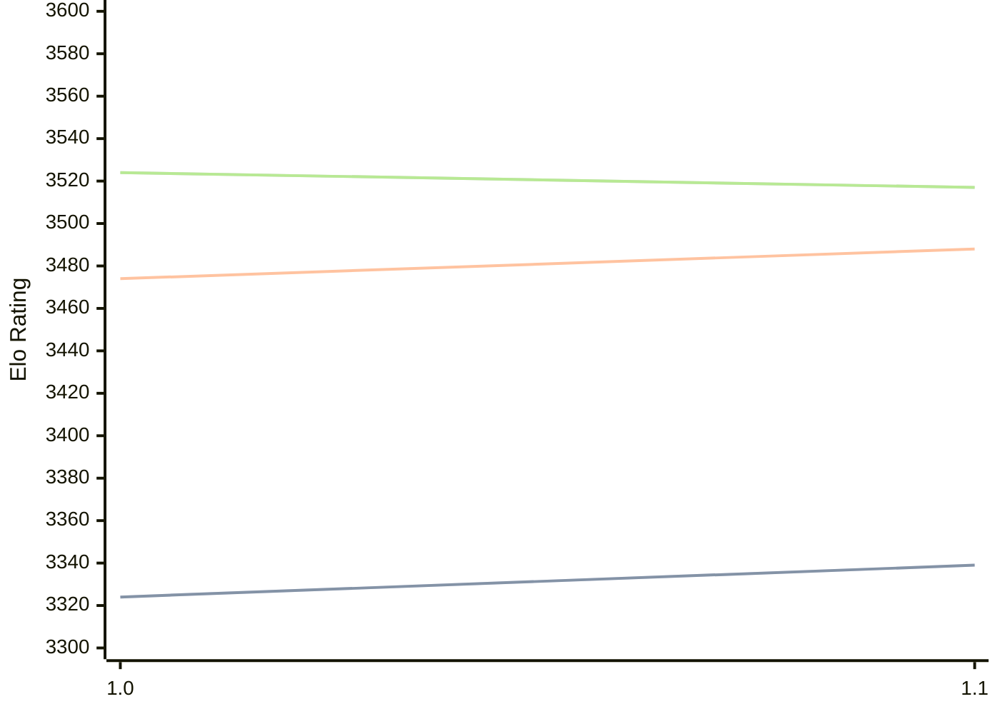

# Engine: Horsie

Author: Liam McGuire

Home: https://github.com/liamt19/Horsie

## Elo Ratings

| Version | Published | STC 8.0+0.08s  | LTC 60.0+0.60s | VLTC 2m24s+1.12s | Comment |
| --- | --- | --- | --- | --- | --- |
| 1.1 | 2025-05-13 | 3339(+15) | 3488(+14) | 3517(-7) |  |
| 1.0 | 2025-01-08 | 3324 | 3474 | 3524 |  |
 | | | cElo (∆ prev) | cElo (∆ prev) | cElo (∆ prev) | 

<a href="https://github.com/computer-chess-index/cci/issues/new?template=submit-version.yml&title=[VERSION]+Horsie+<version>&body=###%20Engine%20name%0AHorsie%0A%0A###%20Version%0A1.1" target="_blank">Submit new version</a>

 Test Conditions:

GUI/CLI: <a href=https://github.com/cutechess/cutechess target="_blank">Cute-Chess</a> 
Elo Calculation: <a href=https://www.remi-coulom.fr/Bayesian-Elo/ target="_blank">Bayesian-Elo</a> 
CPU: Intel(R) Core(TM) i5-7500T 2.70GHz 
Opening book: 8_moves_v3 
\* STC: 8.0+0.08s, LTC: 60.0+0.60s, VLTC: 2m24s+1.12s

 Lists:
Ratings: <a href=https://github.com/computer-chess-index/cci/blob/main/lists/CCIRatings.csv target="_blank">Complete list</a>

Generated: 2026-07-08 06:25:55

## Ratings Verlauf

## Ratings Verlauf

⬛ STC (8.0+0.08s) &nbsp;&nbsp; 🟧 LTC (60.0+0.60s) &nbsp;&nbsp; 🟩 VLTC (2m24s+1.12s)

dark mode: 🟩STC (8.0+0.08s) 🟧LTC (60.0+0.60s) ⬜VLTC (2m24s+1.12s)

## Detailed Evaluation Results

| Version | Time Control | Elo  | Range +/- | Matches | Score | Average Opponent Elo | Draws |
| --- | --- | --- | --- | --- | --- | --- | --- |
| 1.1 | VLTC (2m24s+1.12s) | 3517 | 16 | 860 | 50% | 3518 | 87% |
| 1.1 | LTC (60.0+0.60s) | 3488 | 17 | 862 | 51% | 3483 | 83% |
| 1.1 | STC (8.0+0.08s) | 3339 | 16 | 986 | 50% | 3341 | 69% |
| --- | --- | --- | --- | --- | --- | --- | --- |
| 1.0 | VLTC (2m24s+1.12s) | 3524 | 28 | 304 | 49% | 3529 | 86% |
| 1.0 | LTC (60.0+0.60s) | 3474 | 26 | 348 | 51% | 3465 | 85% |
| 1.0 | STC (8.0+0.08s) | 3324 | 29 | 292 | 49% | 3329 | 75% |
| --- | --- | --- | --- | --- | --- | --- | --- |