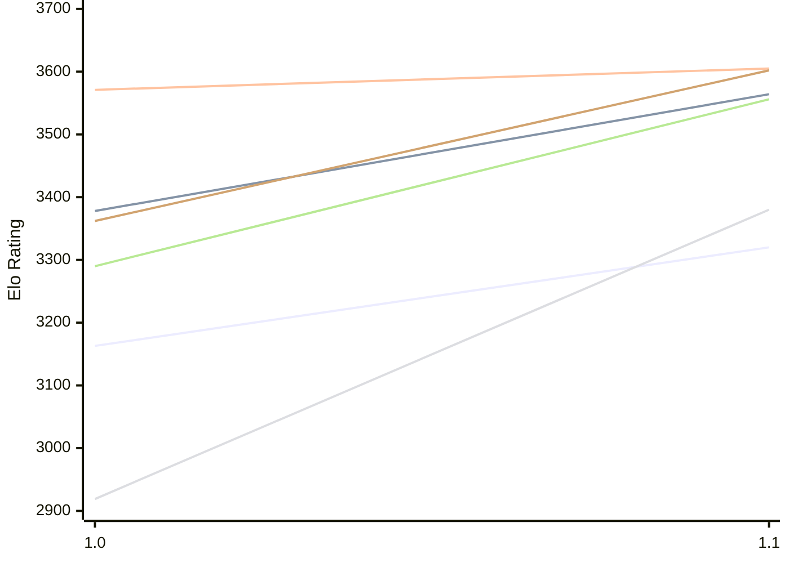
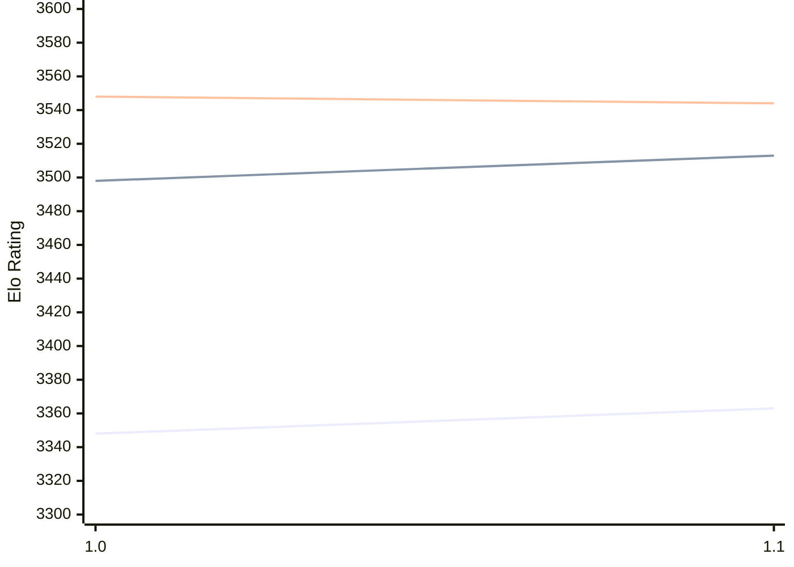

# Engine: Horsie

Author: Liam McGuire

Home: https://github.com/liamt19/Horsie

## Elo Ratings E1 (Ultra 7 265T (1.50 GHz) - E-Core)

| Version | Published | STC 8.0+0.08s  | LTC 60.0+0.60s | VLTC 2m24s+1.12s | Comment |
| --- | --- | --- | --- | --- | --- |
| 1.1 | 2025-05-13 | 3320(+157) | 3564(+186) | 3605(+34) |  |
| 1.0 | 2025-01-08 | 3163 | 3378 | 3571 |  |
 | | | cElo (∆ prev) | cElo (∆ prev) | cElo (∆ prev) | 

## Elo Ratings P1 (Ultra 7 265T (1.50 GHz) - P-Core)

| Version | Published | STC 8.0+0.08s  | LTC 60.0+0.60s | VLTC 2m24s+1.12s | Comment |
| --- | --- | --- | --- | --- | --- |
| 1.1 | 2025-05-13 | 3380(+461) | 3556(+266) | 3602(+240) |  |
| 1.0 | 2025-01-08 | 2919 | 3290 | 3362 |  |
 | | | cElo (∆ prev) | cElo (∆ prev) | cElo (∆ prev) | 

## Elo Ratings T1 (i5-7500T 2.70GHz)

| Version | Published | STC 8.0+0.08s  | LTC 60.0+0.60s | VLTC 2m24s+1.12s | Comment |
| --- | --- | --- | --- | --- | --- |
| 1.1 | 2025-05-13 | 3363(+15) | 3513(+15) | 3544(-4) |  |
| 1.0 | 2025-01-08 | 3348 | 3498 | 3548 |  |
 | | | cElo (∆ prev) | cElo (∆ prev) | cElo (∆ prev) | 

<a href="https://github.com/computer-chess-index/cci/issues/new?template=submit-version.yml&title=[VERSION]+Horsie+<version>&body=###%20Engine%20name%0AHorsie%0A%0A###%20Version%0A1.1" target="_blank">Submit new version</a>

 Test Conditions:

GUI/CLI: <a href=https://github.com/cutechess/cutechess target="_blank">Cute-Chess</a> 
Elo Calculation: <a href=https://www.remi-coulom.fr/Bayesian-Elo/ target="_blank">Bayesian-Elo</a> 
CPU for P1: Intel(R) Core(TM) Ultra 7 265T (1.50 GHz) - P-Core 
CPU for E1: Intel(R) Core(TM) Ultra 7 265T (1.50 GHz) - E-Core 
CPU for T1: Intel(R) Core(TM) i5-7500T 2.70GHz 
Opening book: 8_moves_v3 
\* STC: 8.0+0.08s, LTC: 60.0+0.60s, VLTC: 2m24s+1.12s

 Lists:
Ratings: <a href=https://github.com/computer-chess-index/cci/blob/main/lists/CCIRatings.csv target="_blank">Complete list</a>

Generated: 2026-11-13 05:39:00

## Ratings Verlauf E1 / P1

```mermaid
%%{init: {"theme":"base","themeVariables":{"seriesColors:['#a3a3a3','#222221','#faa371']}}}%%
xychart-beta
  x-axis ["1.0", "1.1"]
  y-axis "Elo Rating" 2900 --> 3700
  line "E1: STC (8.0+0.08s)" [3163, 3320]
  line "E1: LTC (60.0+0.60s)" [3378, 3564]
  line "E1: VLTC (2m24s+1.12s)" [3571, 3605]
  line "P1: STC (8.0+0.08s)" [2919, 3380]
  line "P1: LTC (60.0+0.60s)" [3290, 3556]
  line "P1: VLTC (2m24s+1.12s)" [3362, 3602]
```

## Ratings Verlauf T1

```mermaid
%%{init: {"theme":"base","themeVariables":{"seriesColors:['#a3a3a3','#222221','#faa371']}}}%%
xychart-beta
  x-axis ["1.0", "1.1"]
  y-axis "Elo Rating" 3300 --> 3600
  line "T1: STC (8.0+0.08s)" [3348, 3363]
  line "T1: LTC (60.0+0.60s)" [3498, 3513]
  line "T1: VLTC (2m24s+1.12s)" [3548, 3544]
```

## Detailed Evaluation Results

| Version | Time Control | Variant | Elo  | Range +/- | Matches | Score | Average Opponent Elo | Draws |
| --- | --- |--- | --- | --- | --- | --- | --- | --- |
| 1.1 | VLTC (2m24s+1.12s) | E1 | 3605 | 30 | 248 | 51% | 3596 | 85% |
|  |  | T1 | 3544 | 16 | 946 | 50% | 3541 | 87% |
|  |  | P1 | 3602 | 38 | 160 | 48% | 3617 | 87% |
|  | LTC (60.0+0.60s) | T1 | 3513 | 16 | 950 | 51% | 3509 | 83% |
|  |  | P1 | 3556 | 38 | 164 | 48% | 3567 | 82% |
|  |  | E1 | 3564 | 30 | 260 | 52% | 3553 | 79% |
|  | STC (8.0+0.08s) | T1 | 3363 | 15 | 1098 | 50% | 3364 | 69% |
|  |  | P1 | 3380 | 32 | 248 | 49% | 3389 | 67% |
|  |  | E1 | 3320 | 25 | 422 | 47% | 3340 | 64% |
| --- | --- |--- | --- | --- | --- | --- | --- | --- |
| 1.0 | VLTC (2m24s+1.12s) | E1 | 3571 | 303 | 12 | 100% | 2935 | 0% |
|  |  | T1 | 3548 | 28 | 304 | 49% | 3553 | 86% |
|  |  | P1 | 3362 | 146 | 16 | 75% | 3082 | 38% |
|  | LTC (60.0+0.60s) | E1 | 3378 | 238 | 12 | 96% | 2831 | 8% |
|  |  | T1 | 3498 | 26 | 348 | 51% | 3490 | 85% |
|  |  | P1 | 3290 | 180 | 8 | 75% | 3101 | 50% |
|  | STC (8.0+0.08s) | T1 | 3348 | 29 | 292 | 49% | 3352 | 75% |
|  |  | P1 | 2919 | 145 | 20 | 80% | 2450 | 40% |
|  |  | E1 | 3163 | 115 | 28 | 70% | 2827 | 32% |