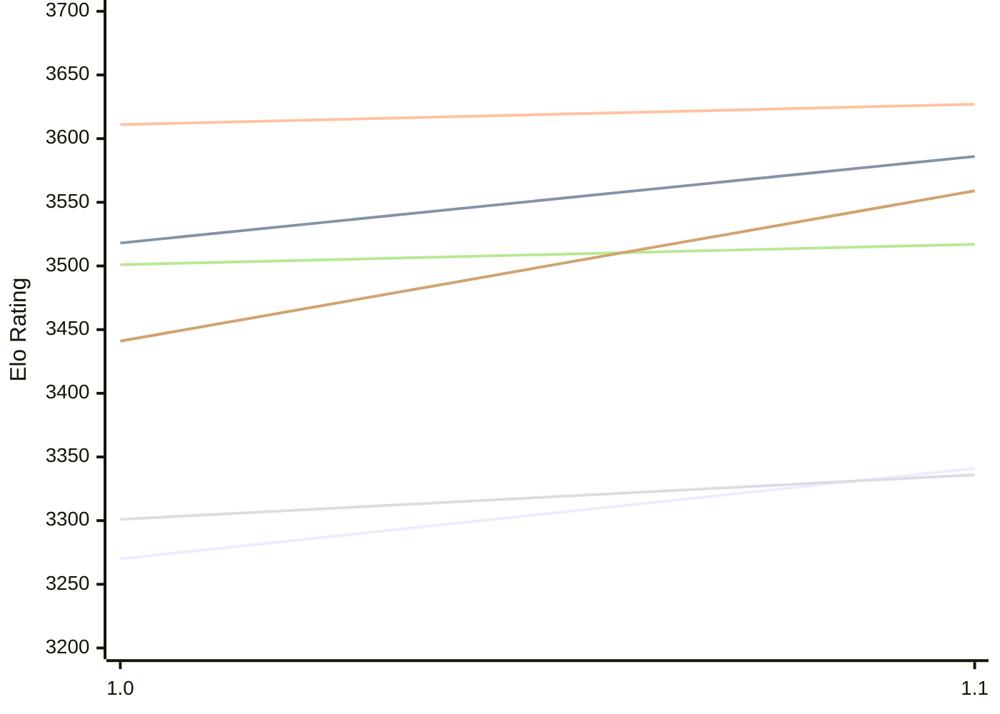
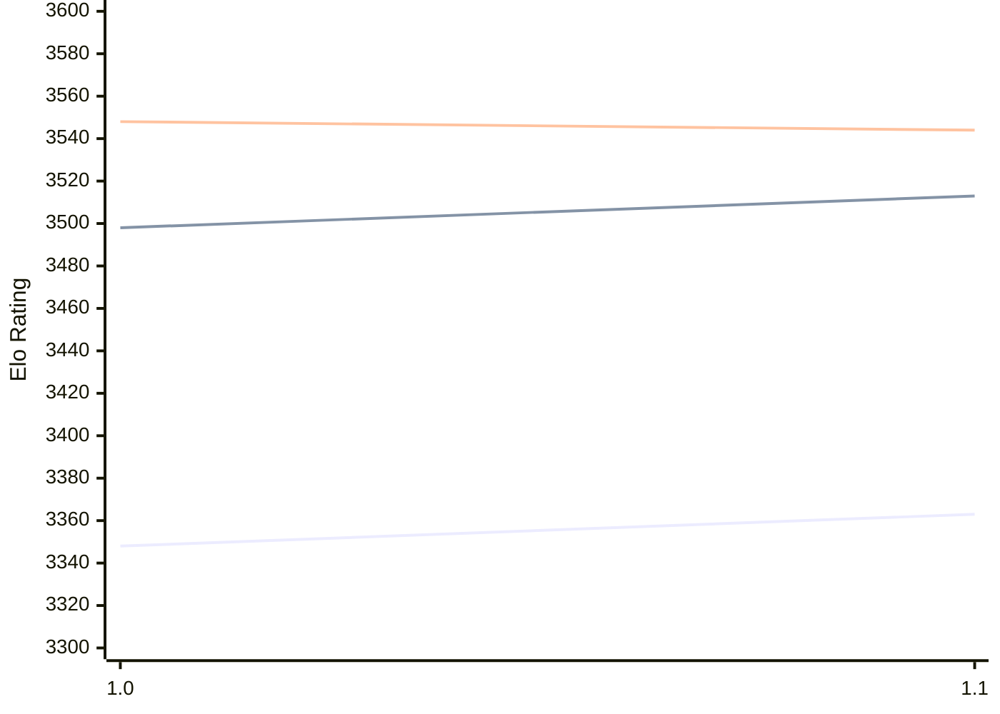

# Engine: Horsie

Author: Liam McGuire

Home: https://github.com/liamt19/Horsie

## Elo Ratings E1 (Ultra 7 265T (1.50 GHz) - E-Core)

| Version | Published | STC 8.0+0.08s  | LTC 60.0+0.60s | VLTC 2m24s+1.12s | Comment |
| --- | --- | --- | --- | --- | --- |
| 1.1 | 2025-05-13 | 3341(+71) | 3586(+68) | 3627(+16) |  |
| 1.0 | 2025-01-08 | 3270 | 3518 | 3611 |  |
 | | | cElo (∆ prev) | cElo (∆ prev) | cElo (∆ prev) | 

## Elo Ratings P1 (Ultra 7 265T (1.50 GHz) - P-Core)

| Version | Published | STC 8.0+0.08s  | LTC 60.0+0.60s | VLTC 2m24s+1.12s | Comment |
| --- | --- | --- | --- | --- | --- |
| 1.1 | 2025-05-13 | 3336(+35) | 3517(+16) | 3559(+118) |  |
| 1.0 | 2025-01-08 | 3301 | 3501 | 3441 |  |
 | | | cElo (∆ prev) | cElo (∆ prev) | cElo (∆ prev) | 

## Elo Ratings T1 (i5-7500T 2.70GHz)

| Version | Published | STC 8.0+0.08s  | LTC 60.0+0.60s | VLTC 2m24s+1.12s | Comment |
| --- | --- | --- | --- | --- | --- |
| 1.1 | 2025-05-13 | 3363(+15) | 3513(+15) | 3544(-4) |  |
| 1.0 | 2025-01-08 | 3348 | 3498 | 3548 |  |
 | | | cElo (∆ prev) | cElo (∆ prev) | cElo (∆ prev) | 

<a href="https://github.com/computer-chess-index/cci/issues/new?template=submit-version.yml&title=[VERSION]+Horsie+<version>&body=###%20Engine%20name%0AHorsie%0A%0A###%20Version%0A1.1" target="_blank">Submit new version</a>

 Test Conditions:

GUI/CLI: <a href=https://github.com/cutechess/cutechess target="_blank">Cute-Chess</a> 
Elo Calculation: <a href=https://www.remi-coulom.fr/Bayesian-Elo/ target="_blank">Bayesian-Elo</a> 
CPU for P1: Intel(R) Core(TM) Ultra 7 265T (1.50 GHz) - P-Core 
CPU for E1: Intel(R) Core(TM) Ultra 7 265T (1.50 GHz) - E-Core 
CPU for T1: Intel(R) Core(TM) i5-7500T 2.70GHz 
Opening book: 8_moves_v3 
\* STC: 8.0+0.08s, LTC: 60.0+0.60s, VLTC: 2m24s+1.12s

 Lists:
Ratings: <a href=https://github.com/computer-chess-index/cci/blob/main/lists/CCIRatings.csv target="_blank">Complete list</a>

Generated: 2026-11-20 05:38:55

## Ratings Verlauf E1 / P1

```mermaid
%%{init: {"theme":"base","themeVariables":{"seriesColors:['#a3a3a3','#222221','#faa371']}}}%%
xychart-beta
  x-axis ["1.0", "1.1"]
  y-axis "Elo Rating" 3200 --> 3700
  line "E1: STC (8.0+0.08s)" [3270, 3341]
  line "E1: LTC (60.0+0.60s)" [3518, 3586]
  line "E1: VLTC (2m24s+1.12s)" [3611, 3627]
  line "P1: STC (8.0+0.08s)" [3301, 3336]
  line "P1: LTC (60.0+0.60s)" [3501, 3517]
  line "P1: VLTC (2m24s+1.12s)" [3441, 3559]
```

## Ratings Verlauf T1

```mermaid
%%{init: {"theme":"base","themeVariables":{"seriesColors:['#a3a3a3','#222221','#faa371']}}}%%
xychart-beta
  x-axis ["1.0", "1.1"]
  y-axis "Elo Rating" 3300 --> 3600
  line "T1: STC (8.0+0.08s)" [3348, 3363]
  line "T1: LTC (60.0+0.60s)" [3498, 3513]
  line "T1: VLTC (2m24s+1.12s)" [3548, 3544]
```

## Detailed Evaluation Results

| Version | Time Control | Variant | Elo  | Range +/- | Matches | Score | Average Opponent Elo | Draws |
| --- | --- |--- | --- | --- | --- | --- | --- | --- |
| 1.1 | VLTC (2m24s+1.12s) | E1 | 3627 | 29 | 268 | 51% | 3619 | 85% |
|  |  | T1 | 3544 | 16 | 946 | 50% | 3541 | 87% |
|  |  | P1 | 3559 | 37 | 168 | 48% | 3572 | 88% |
|  | LTC (60.0+0.60s) | T1 | 3513 | 16 | 950 | 51% | 3509 | 83% |
|  |  | P1 | 3517 | 37 | 168 | 49% | 3525 | 82% |
|  |  | E1 | 3586 | 30 | 276 | 52% | 3575 | 79% |
|  | STC (8.0+0.08s) | T1 | 3363 | 15 | 1098 | 50% | 3364 | 69% |
|  |  | P1 | 3336 | 32 | 256 | 49% | 3345 | 68% |
|  |  | E1 | 3341 | 24 | 450 | 47% | 3362 | 64% |
| --- | --- |--- | --- | --- | --- | --- | --- | --- |
| 1.0 | VLTC (2m24s+1.12s) | E1 | 3611 | 76 | 48 | 59% | 3464 | 65% |
|  |  | T1 | 3548 | 28 | 304 | 49% | 3553 | 86% |
|  |  | P1 | 3441 | 111 | 24 | 67% | 3229 | 58% |
|  | LTC (60.0+0.60s) | T1 | 3498 | 26 | 348 | 51% | 3490 | 85% |
|  |  | P1 | 3501 | 131 | 16 | 72% | 3317 | 56% |
|  |  | E1 | 3518 | 79 | 50 | 66% | 3310 | 52% |
|  | STC (8.0+0.08s) | T1 | 3348 | 29 | 292 | 49% | 3352 | 75% |
|  |  | P1 | 3301 | 78 | 52 | 63% | 3035 | 54% |
|  |  | E1 | 3270 | 61 | 82 | 58% | 3132 | 50% |