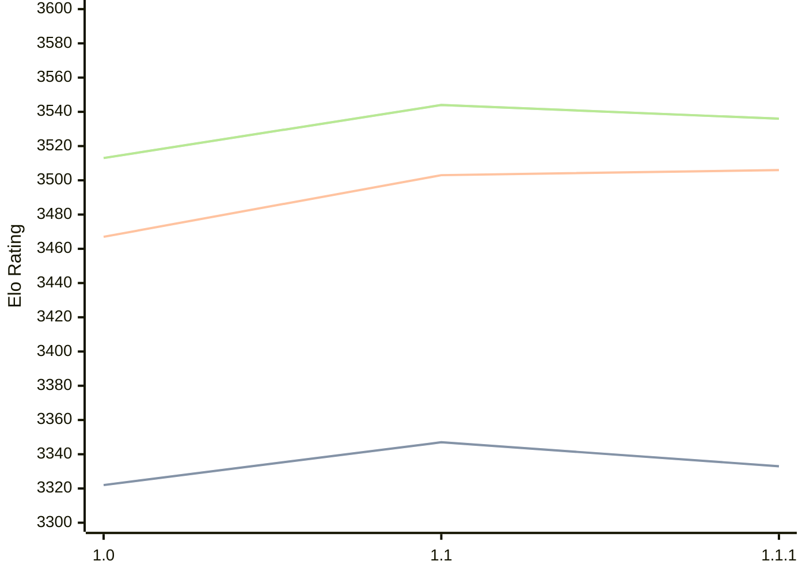

# Engine: Icarus

Author: 

Home: https://github.com/Sp00ph/icarus

## Elo Ratings

| Version | Published | STC 8.0+0.08s  | LTC 60.0+0.60s | VLTC 2m24s+1.12s | Comment |
| --- | --- | --- | --- | --- | --- |
| 1.1.1 | 2026-07-17 | 3333(-14) | 3506(+3) | 3536(-8) |  |
| 1.1 | 2026-06-05 | 3347(+25) | 3503(+36) | 3544(+31) |  |
| 1.0 | 2026-04-26 | 3322 | 3467 | 3513 |  |
 | | | cElo (∆ prev) | cElo (∆ prev) | cElo (∆ prev) | 

<a href="https://github.com/computer-chess-index/cci/issues/new?template=submit-version.yml&title=[VERSION]+Icarus+<version>&body=###%20Engine%20name%0AIcarus%0A%0A###%20Version%0A1.1.1" target="_blank">Submit new version</a>

 Test Conditions:

GUI/CLI: <a href=https://github.com/cutechess/cutechess target="_blank">Cute-Chess</a> 
Elo Calculation: <a href=https://www.remi-coulom.fr/Bayesian-Elo/ target="_blank">Bayesian-Elo</a> 
CPU: Intel(R) Core(TM) i5-7500T 2.70GHz 
Opening book: 8_moves_v3 
\* STC: 8.0+0.08s, LTC: 60.0+0.60s, VLTC: 2m24s+1.12s

 Lists:
Ratings: <a href=https://github.com/computer-chess-index/cci/blob/main/lists/CCIRatings.csv target="_blank">Complete list</a>

Generated: 2026-09-25 04:39:13

## Ratings Verlauf

## Detailed Evaluation Results

| Version | Time Control | Elo  | Range +/- | Matches | Score | Average Opponent Elo | Draws |
| --- | --- | --- | --- | --- | --- | --- | --- |
| 1.1.1 | VLTC (2m24s+1.12s) | 3536 | 24 | 400 | 50% | 3533 | 87% |
| 1.1.1 | LTC (60.0+0.60s) | 3506 | 27 | 322 | 50% | 3507 | 85% |
| 1.1.1 | STC (8.0+0.08s) | 3333 | 29 | 288 | 49% | 3340 | 74% |
| --- | --- | --- | --- | --- | --- | --- | --- |
| 1.1 | VLTC (2m24s+1.12s) | 3544 | 28 | 300 | 50% | 3541 | 86% |
| 1.1 | LTC (60.0+0.60s) | 3503 | 24 | 404 | 52% | 3488 | 81% |
| 1.1 | STC (8.0+0.08s) | 3347 | 28 | 324 | 51% | 3343 | 75% |
| --- | --- | --- | --- | --- | --- | --- | --- |
| 1.0 | VLTC (2m24s+1.12s) | 3513 | 27 | 334 | 50% | 3509 | 83% |
| 1.0 | LTC (60.0+0.60s) | 3467 | 26 | 338 | 51% | 3461 | 83% |
| 1.0 | STC (8.0+0.08s) | 3322 | 27 | 348 | 51% | 3316 | 71% |
| --- | --- | --- | --- | --- | --- | --- | --- |