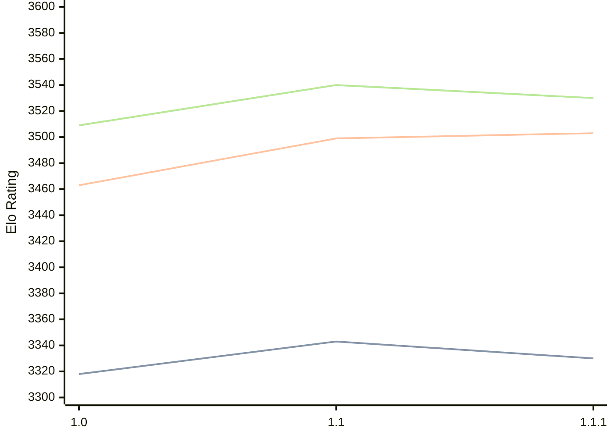

# Engine: Icarus

Author: 

Home: https://github.com/Sp00ph/icarus

## Elo Ratings

| Version | Published | STC 8.0+0.08s  | LTC 60.0+0.60s | VLTC 2m24s+1.12s | Comment |
| --- | --- | --- | --- | --- | --- |
| 1.1.1 | 2026-07-17 | 3330(-13) | 3503(+4) | 3530(-10) |  |
| 1.1 | 2026-06-05 | 3343(+25) | 3499(+36) | 3540(+31) |  |
| 1.0 | 2026-04-26 | 3318 | 3463 | 3509 |  |
 | | | cElo (∆ prev) | cElo (∆ prev) | cElo (∆ prev) | 

<a href="https://github.com/computer-chess-index/cci/issues/new?template=submit-version.yml&title=[VERSION]+Icarus+<version>&body=###%20Engine%20name%0AIcarus%0A%0A###%20Version%0A1.1.1" target="_blank">Submit new version</a>

 Test Conditions:

GUI/CLI: <a href=https://github.com/cutechess/cutechess target="_blank">Cute-Chess</a> 
Elo Calculation: <a href=https://www.remi-coulom.fr/Bayesian-Elo/ target="_blank">Bayesian-Elo</a> 
CPU: Intel(R) Core(TM) i5-7500T 2.70GHz 
Opening book: 8_moves_v3 
\* STC: 8.0+0.08s, LTC: 60.0+0.60s, VLTC: 2m24s+1.12s

 Lists:
Ratings: <a href=https://github.com/computer-chess-index/cci/blob/main/lists/CCIRatings.csv target="_blank">Complete list</a>

Generated: 2026-09-15 04:39:03

## Ratings Verlauf

## Detailed Evaluation Results

| Version | Time Control | Elo  | Range +/- | Matches | Score | Average Opponent Elo | Draws |
| --- | --- | --- | --- | --- | --- | --- | --- |
| 1.1.1 | VLTC (2m24s+1.12s) | 3530 | 25 | 376 | 50% | 3528 | 86% |
| 1.1.1 | LTC (60.0+0.60s) | 3503 | 28 | 304 | 50% | 3503 | 85% |
| 1.1.1 | STC (8.0+0.08s) | 3330 | 29 | 284 | 49% | 3336 | 74% |
| --- | --- | --- | --- | --- | --- | --- | --- |
| 1.1 | VLTC (2m24s+1.12s) | 3540 | 28 | 300 | 50% | 3537 | 86% |
| 1.1 | LTC (60.0+0.60s) | 3499 | 24 | 404 | 52% | 3484 | 81% |
| 1.1 | STC (8.0+0.08s) | 3343 | 28 | 324 | 51% | 3339 | 75% |
| --- | --- | --- | --- | --- | --- | --- | --- |
| 1.0 | VLTC (2m24s+1.12s) | 3509 | 27 | 334 | 50% | 3505 | 83% |
| 1.0 | LTC (60.0+0.60s) | 3463 | 26 | 338 | 51% | 3457 | 83% |
| 1.0 | STC (8.0+0.08s) | 3318 | 27 | 348 | 51% | 3312 | 71% |
| --- | --- | --- | --- | --- | --- | --- | --- |