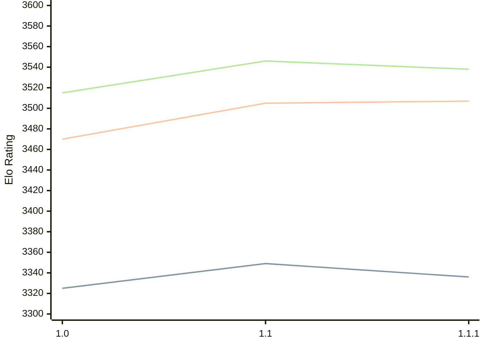

# Engine: Icarus

Author: 

Home: https://github.com/Sp00ph/icarus

## Elo Ratings E1

| Version | Published | STC 8.0+0.08s  | LTC 60.0+0.60s | VLTC 2m24s+1.12s | Comment |
| --- | --- | --- | --- | --- | --- |
| 1.1.1 | 2026-07-17 | 3264 | 3475 | 3517 |  |
 | | | cElo (∆ prev) | cElo (∆ prev) | cElo (∆ prev) | 

## Elo Ratings P1

| Version | Published | STC 8.0+0.08s  | LTC 60.0+0.60s | VLTC 2m24s+1.12s | Comment |
| --- | --- | --- | --- | --- | --- |
| 1.1.1 | 2026-07-17 | 3536 | 3695 | 3760 |  |
 | | | cElo (∆ prev) | cElo (∆ prev) | cElo (∆ prev) | 

## Elo Ratings T1

| Version | Published | STC 8.0+0.08s  | LTC 60.0+0.60s | VLTC 2m24s+1.12s | Comment |
| --- | --- | --- | --- | --- | --- |
| 1.1.1 | 2026-07-17 | 3336(-13) | 3507(+2) | 3538(-8) |  |
| 1.1 | 2026-06-05 | 3349(+24) | 3505(+35) | 3546(+31) |  |
| 1.0 | 2026-04-26 | 3325 | 3470 | 3515 |  |
 | | | cElo (∆ prev) | cElo (∆ prev) | cElo (∆ prev) | 

<a href="https://github.com/computer-chess-index/cci/issues/new?template=submit-version.yml&title=[VERSION]+Icarus+<version>&body=###%20Engine%20name%0AIcarus%0A%0A###%20Version%0A1.1.1" target="_blank">Submit new version</a>

 Test Conditions:

GUI/CLI: <a href=https://github.com/cutechess/cutechess target="_blank">Cute-Chess</a> 
Elo Calculation: <a href=https://www.remi-coulom.fr/Bayesian-Elo/ target="_blank">Bayesian-Elo</a> 
CPU for P1: Intel(R) Core(TM) Ultra 7 265T (1.50 GHz) - P-Core 
CPU for E1: Intel(R) Core(TM) Ultra 7 265T (1.50 GHz) - E-Core 
CPU for T1: Intel(R) Core(TM) i5-7500T 2.70GHz 
Opening book: 8_moves_v3 
\* STC: 8.0+0.08s, LTC: 60.0+0.60s, VLTC: 2m24s+1.12s

 Lists:
Ratings: <a href=https://github.com/computer-chess-index/cci/blob/main/lists/CCIRatings.csv target="_blank">Complete list</a>

Generated: 2026-10-09 14:12:28

## Ratings Verlauf

```mermaid
%%{init: {"theme":"base","themeVariables":{"seriesColors:['#a3a3a3','#222221','#faa371']}}}%%
xychart-beta
  x-axis ["1.0", "1.1", "1.1.1"]
  y-axis "Elo Rating" 3300 --> 3600
  line "" [3325, 3349, 3336]
  line "STC (8.0+0.08s)" [3325, 3349, 3336]
  line "LTC (60.0+0.60s)" [3470, 3505, 3507]
  line "" [3515, 3546, 3538]
  line "VLTC (2m24s+1.12s)" [3515, 3546, 3538]
```

## Detailed Evaluation Results

| Version | Time Control | Elo  | Range +/- | Matches | Score | Average Opponent Elo | Draws |
| --- | --- | --- | --- | --- | --- | --- | --- |
| 1.1.1 | VLTC (2m24s+1.12s) | 3538 | 24 | 404 | 50% | 3536 | 87% |
| 1.1.1 | VLTC (2m24s+1.12s) | 3760 | 42 | 132 | 51% | 3753 | 84% |
| 1.1.1 | VLTC (2m24s+1.12s) | 3517 | 33 | 216 | 49% | 3522 | 84% |
| 1.1.1 | LTC (60.0+0.60s) | 3507 | 27 | 326 | 50% | 3509 | 85% |
| 1.1.1 | LTC (60.0+0.60s) | 3695 | 38 | 164 | 49% | 3703 | 83% |
| 1.1.1 | LTC (60.0+0.60s) | 3475 | 33 | 214 | 48% | 3488 | 82% |
| 1.1.1 | STC (8.0+0.08s) | 3336 | 29 | 288 | 49% | 3341 | 74% |
| --- | --- | --- | --- | --- | --- | --- | --- |
| 1.1.1 | STC (8.0+0.08s) | 3536 | 36 | 196 | 51% | 3529 | 71% |
| --- | --- | --- | --- | --- | --- | --- | --- |
| 1.1.1 | STC (8.0+0.08s) | 3264 | 33 | 240 | 49% | 3270 | 62% |
| --- | --- | --- | --- | --- | --- | --- | --- |
| 1.1 | VLTC (2m24s+1.12s) | 3546 | 28 | 300 | 50% | 3544 | 86% |
| 1.1 | LTC (60.0+0.60s) | 3505 | 24 | 404 | 52% | 3491 | 81% |
| 1.1 | STC (8.0+0.08s) | 3349 | 28 | 324 | 51% | 3345 | 75% |
| --- | --- | --- | --- | --- | --- | --- | --- |
| 1.0 | VLTC (2m24s+1.12s) | 3515 | 27 | 334 | 50% | 3511 | 83% |
| 1.0 | LTC (60.0+0.60s) | 3470 | 26 | 338 | 51% | 3464 | 83% |
| 1.0 | STC (8.0+0.08s) | 3325 | 27 | 348 | 51% | 3318 | 71% |
| --- | --- | --- | --- | --- | --- | --- | --- |