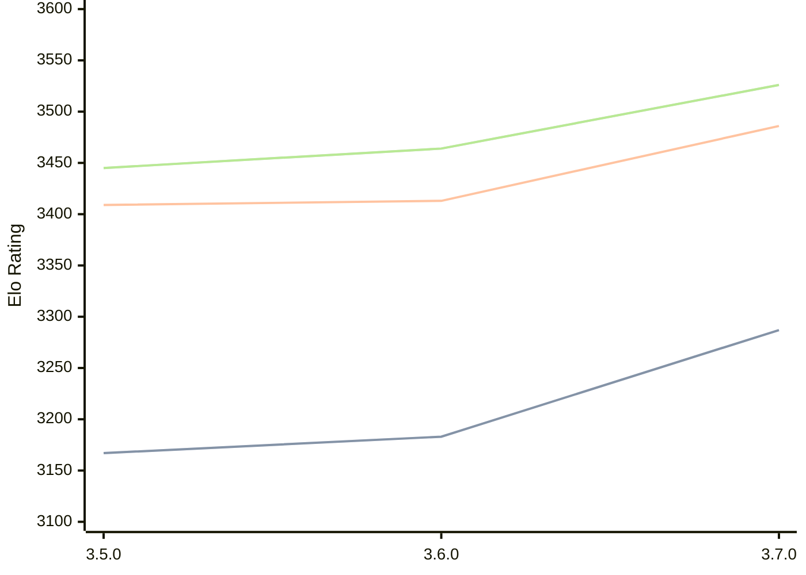

# Engine: Igel

Author: Volodymyr Shcherbyna

Home: https://github.com/vshcherbyna/igel

## Elo Ratings

| Version | Published | STC 8.0+0.08s  | LTC 60.0+0.60s | VLTC 2m24s+1.12s | Comment |
| --- | --- | --- | --- | --- | --- |
| 3.7.0 | 2026-08-27 | 3287(+104) | 3486(+73) | 3526(+62) |  |
| 3.6.0 | 2024-12-28 | 3183(+16) | 3413(+4) | 3464(+19) |  |
| 3.5.0 | 2023-06-22 | 3167 | 3409 | 3445 |  |
 | | | cElo (∆ prev) | cElo (∆ prev) | cElo (∆ prev) | 

<a href="https://github.com/computer-chess-index/cci/issues/new?template=submit-version.yml&title=[VERSION]+Igel+<version>&body=###%20Engine%20name%0AIgel%0A%0A###%20Version%0A3.7.0" target="_blank">Submit new version</a>

 Test Conditions:

GUI/CLI: <a href=https://github.com/cutechess/cutechess target="_blank">Cute-Chess</a> 
Elo Calculation: <a href=https://www.remi-coulom.fr/Bayesian-Elo/ target="_blank">Bayesian-Elo</a> 
CPU: Intel(R) Core(TM) i5-7500T 2.70GHz 
Opening book: 8_moves_v3 
\* STC: 8.0+0.08s, LTC: 60.0+0.60s, VLTC: 2m24s+1.12s

 Lists:
Ratings: <a href=https://github.com/computer-chess-index/cci/blob/main/lists/CCIRatings.csv target="_blank">Complete list</a>

Generated: 2026-09-13 04:38:49

## Ratings Verlauf

## Detailed Evaluation Results

| Version | Time Control | Elo  | Range +/- | Matches | Score | Average Opponent Elo | Draws |
| --- | --- | --- | --- | --- | --- | --- | --- |
| 3.7.0 | VLTC (2m24s+1.12s) | 3526 | 30 | 254 | 51% | 3519 | 87% |
| 3.7.0 | LTC (60.0+0.60s) | 3486 | 31 | 240 | 49% | 3490 | 81% |
| 3.7.0 | STC (8.0+0.08s) | 3287 | 33 | 224 | 50% | 3290 | 71% |
| --- | --- | --- | --- | --- | --- | --- | --- |
| 3.6.0 | VLTC (2m24s+1.12s) | 3464 | 12 | 1674 | 50% | 3467 | 82% |
| 3.6.0 | LTC (60.0+0.60s) | 3413 | 12 | 1616 | 50% | 3410 | 76% |
| 3.6.0 | STC (8.0+0.08s) | 3183 | 12 | 1708 | 49% | 3191 | 63% |
| --- | --- | --- | --- | --- | --- | --- | --- |
| 3.5.0 | VLTC (2m24s+1.12s) | 3445 | 17 | 800 | 50% | 3443 | 78% |
| 3.5.0 | LTC (60.0+0.60s) | 3409 | 17 | 828 | 49% | 3411 | 78% |
| 3.5.0 | STC (8.0+0.08s) | 3167 | 18 | 872 | 52% | 3128 | 58% |
| --- | --- | --- | --- | --- | --- | --- | --- |