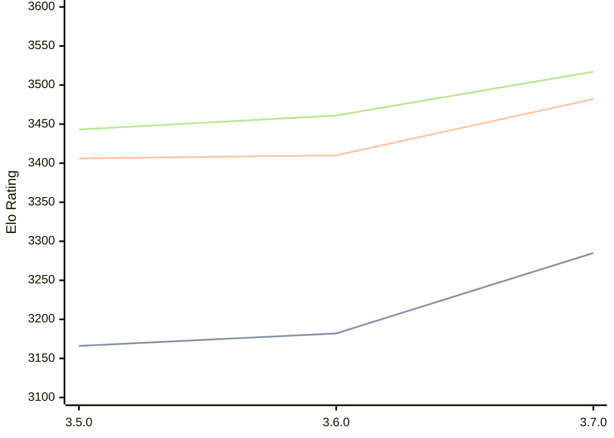

# Engine: Igel

Author: Volodymyr Shcherbyna

Home: https://github.com/vshcherbyna/igel

## Elo Ratings

| Version | Published | STC 8.0+0.08s  | LTC 60.0+0.60s | VLTC 2m24s+1.12s | Comment |
| --- | --- | --- | --- | --- | --- |
| 3.7.0 | 2026-08-27 | 3285(+103) | 3482(+72) | 3517(+56) |  |
| 3.6.0 | 2024-12-28 | 3182(+16) | 3410(+4) | 3461(+18) |  |
| 3.5.0 | 2023-06-22 | 3166 | 3406 | 3443 |  |
 | | | cElo (∆ prev) | cElo (∆ prev) | cElo (∆ prev) | 

<a href="https://github.com/computer-chess-index/cci/issues/new?template=submit-version.yml&title=[VERSION]+Igel+<version>&body=###%20Engine%20name%0AIgel%0A%0A###%20Version%0A3.7.0" target="_blank">Submit new version</a>

 Test Conditions:

GUI/CLI: <a href=https://github.com/cutechess/cutechess target="_blank">Cute-Chess</a> 
Elo Calculation: <a href=https://www.remi-coulom.fr/Bayesian-Elo/ target="_blank">Bayesian-Elo</a> 
CPU: Intel(R) Core(TM) i5-7500T 2.70GHz 
Opening book: 8_moves_v3 
\* STC: 8.0+0.08s, LTC: 60.0+0.60s, VLTC: 2m24s+1.12s

 Lists:
Ratings: <a href=https://github.com/computer-chess-index/cci/blob/main/lists/CCIRatings.csv target="_blank">Complete list</a>

Generated: 2026-09-01 04:35:48

## Ratings Verlauf

## Detailed Evaluation Results

| Version | Time Control | Elo  | Range +/- | Matches | Score | Average Opponent Elo | Draws |
| --- | --- | --- | --- | --- | --- | --- | --- |
| 3.7.0 | VLTC (2m24s+1.12s) | 3517 | 36 | 176 | 51% | 3506 | 86% |
| 3.7.0 | LTC (60.0+0.60s) | 3482 | 36 | 180 | 49% | 3488 | 86% |
| 3.7.0 | STC (8.0+0.08s) | 3285 | 39 | 164 | 49% | 3290 | 70% |
| --- | --- | --- | --- | --- | --- | --- | --- |
| 3.6.0 | VLTC (2m24s+1.12s) | 3461 | 12 | 1674 | 50% | 3464 | 82% |
| 3.6.0 | LTC (60.0+0.60s) | 3410 | 12 | 1616 | 50% | 3407 | 76% |
| 3.6.0 | STC (8.0+0.08s) | 3182 | 12 | 1708 | 49% | 3190 | 63% |
| --- | --- | --- | --- | --- | --- | --- | --- |
| 3.5.0 | VLTC (2m24s+1.12s) | 3443 | 17 | 800 | 50% | 3440 | 78% |
| 3.5.0 | LTC (60.0+0.60s) | 3406 | 17 | 828 | 49% | 3409 | 78% |
| 3.5.0 | STC (8.0+0.08s) | 3166 | 18 | 872 | 52% | 3127 | 58% |
| --- | --- | --- | --- | --- | --- | --- | --- |