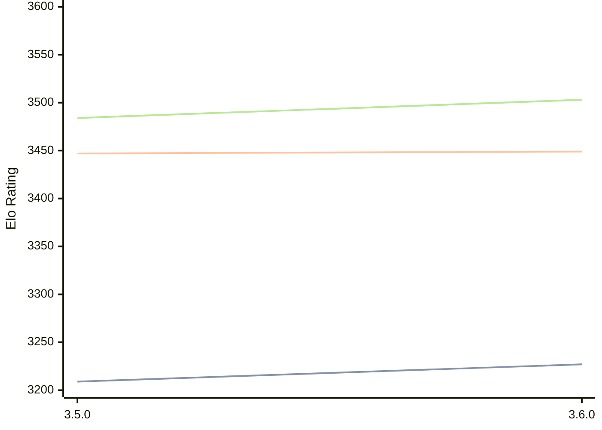

# Engine: Igel

Author: Volodymyr Shcherbyna

Home: https://github.com/vshcherbyna/igel

## Elo Ratings

| Version | Published | STC 8.0+0.08s  | LTC 60.0+0.60s | VLTC 2m24s+1.12s | Comment |
| --- | --- | --- | --- | --- | --- |
| 3.6.0 | 2024-12-28 | 3227(+18) | 3449(+2) | 3503(+19) |  |
| 3.5.0 | 2023-06-22 | 3209(+new) | 3447(+new) | 3484(+new) |  |
| 3.4.0 | 2023-01-30 |  |  |  |  |
| 3.3.0 | 2023-01-15 |  |  |  |  |
| 3.2.0 | 2022-12-17 |  |  |  |  |
| 3.1.0 | 2022-06-03 |  |  |  |  |
| 3.0.5 | 2021-04-28 |  |  |  |  |
| 3.0.0 | 2021-04-04 |  |  |  |  |
| 2.9.0 | 2020-12-25 |  |  |  |  |
| 2.8.0 | 2020-09-23 |  |  |  |  |
| 2.7.0 | 2020-08-19 |  |  |  |  |
| 2.6.0 | 2020-08-01 |  |  |  |  |
| 2.5.0 | 2020-06-15 |  |  |  |  |
| 2.4.0 | 2020-03-22 |  |  |  |  |
| 2.3.1 | 2020-01-14 |  |  |  |  |
| 2.3.0 | 2020-01-01 |  |  |  |  |
| 2.2.2 | 2019-12-29 |  |  |  |  |
| 2.2.1 | 2019-12-29 |  |  |  |  |
| 2.2.0 | 2019-12-23 |  |  |  |  |
| 2.1.0 | 2019-11-20 |  |  |  |  |
| 2.0.0 | 2019-10-06 |  |  |  |  |
| 1.9.2 | 2019-09-24 |  |  |  |  |
| 1.9.1 | 2019-09-22 |  |  |  |  |
| 1.9.0 | 2019-09-01 |  |  |  |  |
| 1.8.3 | 2019-07-28 |  |  |  |  |
| 1.8.2 | 2019-07-17 |  |  |  |  |
| 1.8.0 | 2019-07-09 |  |  |  |  |
| 1.7.0 | 2019-06-17 |  |  |  |  |
| 1.6.0 | 2019-05-26 |  |  |  |  |
| 1.5.1 | 2019-05-09 |  |  |  |  |
| 1.5.0 | 2019-05-05 |  |  |  |  |
| 1.4.2 | 2019-04-09 |  |  |  |  |
| 1.4.1 | 2019-03-25 |  |  |  |  |
| 1.4 | 2019-03-17 |  |  |  |  |
| 1.3 | 2019-03-05 |  |  |  |  |
| 1.2 | 2018-08-05 |  |  |  |  |
| 1.1 | 2018-07-03 |  |  |  |  |
| 0.8 | 2018-06-30 |  |  |  |  |
 | | | cElo (∆ prev) | cElo (∆ prev) | cElo (∆ prev) | 

<a href="https://github.com/computer-chess-index/cci/issues/new?template=submit-version.yml&title=[VERSION]+Igel+<version>&body=###%20Engine%20name%0AIgel%0A%0A###%20Version%0A3.6.0" target="_blank">Submit new version</a>

 Test Conditions:

GUI/CLI: <a href=https://github.com/cutechess/cutechess target="_blank">Cute-Chess</a> 
Elo Calculation: <a href=https://www.remi-coulom.fr/Bayesian-Elo/ target="_blank">Bayesian-Elo</a> 
CPU: Intel(R) Core(TM) i5-7500T 2.70GHz 
Opening book: 8_moves_v3 
\* STC: 8.0+0.08s, LTC: 60.0+0.60s, VLTC: 2m24s+1.12s

 Lists:
Ratings: <a href=https://github.com/computer-chess-index/cci/blob/main/lists/CCIRatings.csv target="_blank">Complete list</a>

Generated: 2026-05-03 07:39:13

## Ratings Verlauf

⬛ STC (8.0+0.08s) &nbsp;&nbsp; 🟧 LTC (60.0+0.60s) &nbsp;&nbsp; 🟩 VLTC (2m24s+1.12s)

dark mode: 🟩STC (8.0+0.08s) 🟧LTC (60.0+0.60s) ⬜VLTC (2m24s+1.12s)

## Detailed Evaluation Results

| Version | Time Control | Elo  | Range +/- | Matches | Score | Average Opponent Elo | Draws |
| --- | --- | --- | --- | --- | --- | --- | --- |
| 3.6.0 | VLTC (2m24s+1.12s) | 3503 | 12 | 1602 | 50% | 3505 | 82% |
| 3.6.0 | D1 | 1075 | 16 | 1352 | 49% | 1080 | 30% |
| 3.6.0 | D10 | 2774 | 15 | 1450 | 51% | 2749 | 43% |
| 3.6.0 | D11 | 2940 | 14 | 1514 | 50% | 2936 | 50% |
| 3.6.0 | D12 | 3087 | 13 | 1542 | 48% | 3105 | 58% |
| 3.6.0 | D13 | 3156 | 13 | 1560 | 50% | 3154 | 60% |
| 3.6.0 | D14 | 3231 | 13 | 1572 | 49% | 3236 | 64% |
| 3.6.0 | D15 | 3289 | 17 | 902 | 50% | 3290 | 66% |
| 3.6.0 | D16 | 3326 | 17 | 904 | 49% | 3332 | 70% |
| 3.6.0 | D2 | 1110 | 16 | 1360 | 49% | 1119 | 25% |
| 3.6.0 | D3 | 1060 | 16 | 1356 | 49% | 1068 | 21% |
| 3.6.0 | D4 | 1152 | 16 | 1376 | 48% | 1169 | 19% |
| 3.6.0 | D5 | 1280 | 17 | 1340 | 51% | 1270 | 17% |
| 3.6.0 | D6 | 1600 | 16 | 1400 | 51% | 1592 | 22% |
| 3.6.0 | D7 | 1881 | 16 | 1438 | 49% | 1891 | 26% |
| 3.6.0 | D8 | 2160 | 15 | 1472 | 52% | 2145 | 28% |
| 3.6.0 | D9 | 2539 | 15 | 1508 | 50% | 2535 | 35% |
| 3.6.0 | S10 | 3264 | 13 | 1448 | 50% | 3267 | 65% |
| 3.6.0 | S40 | 3417 | 13 | 1520 | 51% | 3413 | 76% |
| 3.6.0 | LTC (60.0+0.60s) | 3449 | 13 | 1536 | 50% | 3449 | 76% |
| 3.6.0 | STC (8.0+0.08s) | 3227 | 13 | 1572 | 49% | 3233 | 62% |
| --- | --- | --- | --- | --- | --- | --- | --- |
| 3.5.0 | VLTC (2m24s+1.12s) | 3484 | 17 | 800 | 50% | 3480 | 78% |
| 3.5.0 | D1 | 1062 | 14 | 1692 | 52% | 1042 | 30% |
| 3.5.0 | D10 | 2785 | 14 | 1516 | 50% | 2782 | 48% |
| 3.5.0 | D11 | 2989 | 14 | 1496 | 50% | 2988 | 56% |
| 3.5.0 | D12 | 3101 | 14 | 1416 | 50% | 3097 | 60% |
| 3.5.0 | D13 | 3183 | 13 | 1627 | 51% | 3177 | 64% |
| 3.5.0 | D14 | 3266 | 13 | 1652 | 50% | 3262 | 67% |
| 3.5.0 | D15 | 3325 | 20 | 660 | 52% | 3312 | 67% |
| 3.5.0 | D16 | 3362 | 17 | 860 | 56% | 3318 | 70% |
| 3.5.0 | D2 | 1076 | 15 | 1492 | 50% | 1079 | 24% |
| 3.5.0 | D3 | 1072 | 15 | 1512 | 49% | 1085 | 22% |
| 3.5.0 | D4 | 1130 | 15 | 1596 | 51% | 1118 | 15% |
| 3.5.0 | D5 | 1262 | 15 | 1564 | 49% | 1272 | 18% |
| 3.5.0 | D6 | 1567 | 16 | 1440 | 50% | 1562 | 23% |
| 3.5.0 | D7 | 1883 | 16 | 1432 | 50% | 1886 | 25% |
| 3.5.0 | D8 | 2165 | 15 | 1532 | 53% | 2137 | 29% |
| 3.5.0 | D9 | 2552 | 14 | 1528 | 50% | 2549 | 36% |
| 3.5.0 | S10 | 3227 | 19 | 744 | 50% | 3227 | 63% |
| 3.5.0 | S40 | 3406 | 16 | 924 | 49% | 3413 | 74% |
| 3.5.0 | LTC (60.0+0.60s) | 3447 | 17 | 828 | 49% | 3451 | 78% |
| 3.5.0 | STC (8.0+0.08s) | 3209 | 18 | 872 | 52% | 3170 | 58% |
| --- | --- | --- | --- | --- | --- | --- | --- |
| 3.4.0 |  |  |  |  |  |  |  |
| 3.3.0 |  |  |  |  |  |  |  |
| 3.2.0 |  |  |  |  |  |  |  |
| 3.1.0 |  |  |  |  |  |  |  |
| 3.0.5 |  |  |  |  |  |  |  |
| 3.0.0 |  |  |  |  |  |  |  |
| 2.9.0 |  |  |  |  |  |  |  |
| 2.8.0 |  |  |  |  |  |  |  |
| 2.7.0 |  |  |  |  |  |  |  |
| 2.6.0 |  |  |  |  |  |  |  |
| 2.5.0 |  |  |  |  |  |  |  |
| 2.4.0 |  |  |  |  |  |  |  |
| 2.3.1 |  |  |  |  |  |  |  |
| 2.3.0 |  |  |  |  |  |  |  |
| 2.2.2 |  |  |  |  |  |  |  |
| 2.2.1 |  |  |  |  |  |  |  |
| 2.2.0 |  |  |  |  |  |  |  |
| 2.1.0 |  |  |  |  |  |  |  |
| 2.0.0 |  |  |  |  |  |  |  |
| 1.9.2 |  |  |  |  |  |  |  |
| 1.9.1 |  |  |  |  |  |  |  |
| 1.9.0 |  |  |  |  |  |  |  |
| 1.8.3 |  |  |  |  |  |  |  |
| 1.8.2 |  |  |  |  |  |  |  |
| 1.8.0 |  |  |  |  |  |  |  |
| 1.7.0 |  |  |  |  |  |  |  |
| 1.6.0 |  |  |  |  |  |  |  |
| 1.5.1 |  |  |  |  |  |  |  |
| 1.5.0 |  |  |  |  |  |  |  |
| 1.4.2 |  |  |  |  |  |  |  |
| 1.4.1 |  |  |  |  |  |  |  |
| 1.4 |  |  |  |  |  |  |  |
| 1.3 |  |  |  |  |  |  |  |
| 1.2 |  |  |  |  |  |  |  |
| 1.1 |  |  |  |  |  |  |  |
| 0.8 |  |  |  |  |  |  |  |