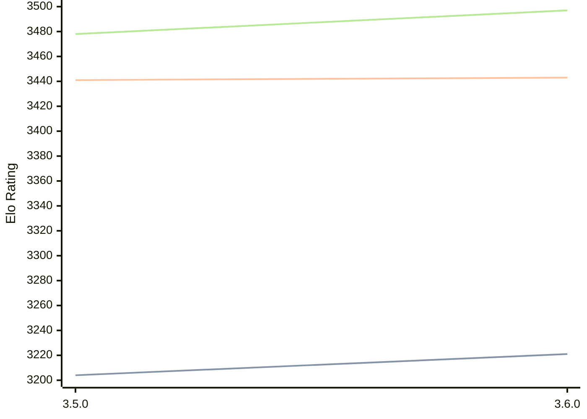

# Engine: Igel

Author: Volodymyr Shcherbyna

Home: https://github.com/vshcherbyna/igel

## Ratings nach Version

| Version | Published | STC 8.0+0.08s  | LTC 60.0+0.60s | VLTC 2m24s+1.12s | Comment |
| --- | --- | --- | --- | --- | --- |
| 3.6.0 | 2024-12-28 | 3221(+17) | 3443(+2) | 3497(+19) |  |
| 3.5.0 | 2023-06-22 | 3204(+new) | 3441(+new) | 3478(+new) |  |
| 3.4.0 | 2023-01-30 |  |  |  |  |
| 3.3.0 | 2023-01-15 |  |  |  |  |
| 3.2.0 | 2022-12-17 |  |  |  |  |
| 3.1.0 | 2022-06-03 |  |  |  |  |
| 3.0.5 | 2021-04-28 |  |  |  |  |
| 3.0.0 | 2021-04-04 |  |  |  |  |
| 2.9.0 | 2020-12-25 |  |  |  |  |
| 2.8.0 | 2020-09-23 |  |  |  |  |
| 2.7.0 | 2020-08-19 |  |  |  |  |
| 2.6.0 | 2020-08-01 |  |  |  |  |
| 2.5.0 | 2020-06-15 |  |  |  |  |
| 2.4.0 | 2020-03-22 |  |  |  |  |
| 2.3.1 | 2020-01-14 |  |  |  |  |
| 2.3.0 | 2020-01-01 |  |  |  |  |
| 2.2.2 | 2019-12-29 |  |  |  |  |
| 2.2.1 | 2019-12-29 |  |  |  |  |
| 2.2.0 | 2019-12-23 |  |  |  |  |
| 2.1.0 | 2019-11-20 |  |  |  |  |
| 2.0.0 | 2019-10-06 |  |  |  |  |
| 1.9.2 | 2019-09-24 |  |  |  |  |
| 1.9.1 | 2019-09-22 |  |  |  |  |
| 1.9.0 | 2019-09-01 |  |  |  |  |
| 1.8.3 | 2019-07-28 |  |  |  |  |
| 1.8.2 | 2019-07-17 |  |  |  |  |
| 1.8.0 | 2019-07-09 |  |  |  |  |
| 1.7.0 | 2019-06-17 |  |  |  |  |
| 1.6.0 | 2019-05-26 |  |  |  |  |
| 1.5.1 | 2019-05-09 |  |  |  |  |
| 1.5.0 | 2019-05-05 |  |  |  |  |
| 1.4.2 | 2019-04-09 |  |  |  |  |
| 1.4.1 | 2019-03-25 |  |  |  |  |
| 1.4 | 2019-03-17 |  |  |  |  |
| 1.3 | 2019-03-05 |  |  |  |  |
| 1.2 | 2018-08-05 |  |  |  |  |
| 1.1 | 2018-07-03 |  |  |  |  |
| 0.8 | 2018-06-30 |  |  |  |  |
 | | | cElo (∆ prev) | cElo (∆ prev) | cElo (∆ prev) | 

<a href="https://github.com/computer-chess-index/cci/issues/new?template=submit-version.yml&title=[VERSION]+Igel+<version>&body=###%20Engine%20name%0AIgel%0A%0A###%20Version%0A3.6.0" target="_blank">Submit new version</a>

 Test Conditions:

GUI/CLI: <a href=https://github.com/cutechess/cutechess target="_blank">Cute-Chess</a> 
Elo Calculation: <a href=https://www.remi-coulom.fr/Bayesian-Elo/ target="_blank">Bayesian-Elo</a> 
CPU: Intel(R) Core(TM) i5-7500T 2.70GHz 
Opening book: 8_moves_v3 
\* STC: 8.0+0.08s, LTC: 60.0+0.60s, VLTC: 2m24s+1.12s

 Lists:
Ratings: <a href=https://github.com/computer-chess-index/cci/blob/main/lists/CCIRatings.csv target="_blank">Complete list</a>

Generated: 2026-04-22 06:24:51

## Ratings Verlauf

⬛ STC (8.0+0.08s) &nbsp;&nbsp; 🟧 LTC (60.0+0.60s) &nbsp;&nbsp; 🟩 VLTC (2m24s+1.12s)

dark mode: 🟩STC (8.0+0.08s) 🟧LTC (60.0+0.60s) ⬜VLTC (2m24s+1.12s)

