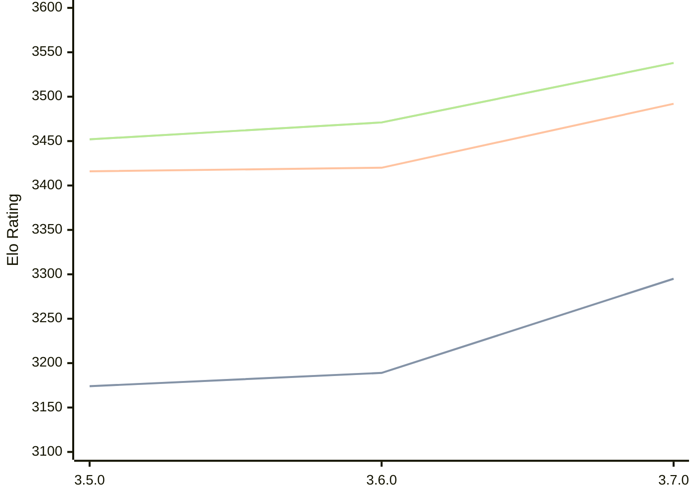

# Engine: Igel

Author: Volodymyr Shcherbyna

Home: https://github.com/vshcherbyna/igel

## Elo Ratings

| Version | Published | STC 8.0+0.08s  | LTC 60.0+0.60s | VLTC 2m24s+1.12s | Comment |
| --- | --- | --- | --- | --- | --- |
| 3.7.0 | 2026-08-27 | 3295(+106) | 3492(+72) | 3538(+67) |  |
| 3.6.0 | 2024-12-28 | 3189(+15) | 3420(+4) | 3471(+19) |  |
| 3.5.0 | 2023-06-22 | 3174 | 3416 | 3452 |  |
 | | | cElo (∆ prev) | cElo (∆ prev) | cElo (∆ prev) | 

<a href="https://github.com/computer-chess-index/cci/issues/new?template=submit-version.yml&title=[VERSION]+Igel+<version>&body=###%20Engine%20name%0AIgel%0A%0A###%20Version%0A3.7.0" target="_blank">Submit new version</a>

 Test Conditions:

GUI/CLI: <a href=https://github.com/cutechess/cutechess target="_blank">Cute-Chess</a> 
Elo Calculation: <a href=https://www.remi-coulom.fr/Bayesian-Elo/ target="_blank">Bayesian-Elo</a> 
CPU: Intel(R) Core(TM) i5-7500T 2.70GHz 
Opening book: 8_moves_v3 
\* STC: 8.0+0.08s, LTC: 60.0+0.60s, VLTC: 2m24s+1.12s

 Lists:
Ratings: <a href=https://github.com/computer-chess-index/cci/blob/main/lists/CCIRatings.csv target="_blank">Complete list</a>

Generated: 2026-10-09 04:39:19

## Ratings Verlauf

```mermaid
%%{init: {"theme":"base","themeVariables":{"seriesColors:['#a3a3a3','#222221','#faa371']}}}%%
xychart-beta
  x-axis ["3.5.0", "3.6.0", "3.7.0"]
  y-axis "Elo Rating" 3100 --> 3600
  line "" [3174, 3189, 3295]
  line "STC (8.0+0.08s)" [3174, 3189, 3295]
  line "LTC (60.0+0.60s)" [3416, 3420, 3492]
  line "" [3452, 3471, 3538]
  line "VLTC (2m24s+1.12s)" [3452, 3471, 3538]
```

## Detailed Evaluation Results

| Version | Time Control | Elo  | Range +/- | Matches | Score | Average Opponent Elo | Draws |
| --- | --- | --- | --- | --- | --- | --- | --- |
| 3.7.0 | VLTC (2m24s+1.12s) | 3538 | 28 | 282 | 51% | 3529 | 87% |
| 3.7.0 | LTC (60.0+0.60s) | 3492 | 30 | 260 | 49% | 3497 | 80% |
| 3.7.0 | STC (8.0+0.08s) | 3295 | 32 | 248 | 50% | 3298 | 71% |
| --- | --- | --- | --- | --- | --- | --- | --- |
| 3.6.0 | VLTC (2m24s+1.12s) | 3471 | 12 | 1674 | 50% | 3474 | 82% |
| 3.6.0 | LTC (60.0+0.60s) | 3420 | 12 | 1616 | 50% | 3417 | 76% |
| 3.6.0 | STC (8.0+0.08s) | 3189 | 12 | 1708 | 49% | 3198 | 63% |
| --- | --- | --- | --- | --- | --- | --- | --- |
| 3.5.0 | VLTC (2m24s+1.12s) | 3452 | 17 | 800 | 50% | 3449 | 78% |
| 3.5.0 | LTC (60.0+0.60s) | 3416 | 17 | 828 | 49% | 3418 | 78% |
| 3.5.0 | STC (8.0+0.08s) | 3174 | 18 | 872 | 52% | 3133 | 58% |
| --- | --- | --- | --- | --- | --- | --- | --- |