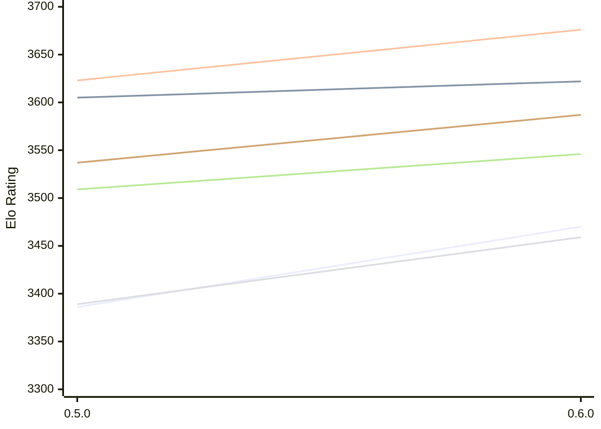

# Engine: Incipit

Author: Adam Twiss

Home: https://github.com/adamtwiss/incipit

## Elo Ratings E1 (Ultra 7 265T (1.50 GHz) - E-Core)

| Version | Published | STC 8.0+0.08s  | LTC 60.0+0.60s | VLTC 2m24s+1.12s | Comment |
| --- | --- | --- | --- | --- | --- |
| 0.6.0 | 2026-11-06 | 3470(+84) | 3622(+17) | 3676(+53) |  |
| 0.5.0 | 2026-10-17 | 3386 | 3605 | 3623 |  |
 | | | cElo (∆ prev) | cElo (∆ prev) | cElo (∆ prev) | 

## Elo Ratings P1 (Ultra 7 265T (1.50 GHz) - P-Core)

| Version | Published | STC 8.0+0.08s  | LTC 60.0+0.60s | VLTC 2m24s+1.12s | Comment |
| --- | --- | --- | --- | --- | --- |
| 0.6.0 | 2026-11-06 | 3459(+70) | 3546(+37) | 3587(+50) |  |
| 0.5.0 | 2026-10-17 | 3389 | 3509 | 3537 |  |
 | | | cElo (∆ prev) | cElo (∆ prev) | cElo (∆ prev) | 

## Elo Ratings T1 (i5-7500T 2.70GHz)

| Version | Published | STC 8.0+0.08s  | LTC 60.0+0.60s | VLTC 2m24s+1.12s | Comment |
| --- | --- | --- | --- | --- | --- |
| 0.5.0 | 2026-10-17 | 3389 | 3509 | 3537 |  |
 | | | cElo (∆ prev) | cElo (∆ prev) | cElo (∆ prev) | 

<a href="https://github.com/computer-chess-index/cci/issues/new?template=submit-version.yml&title=[VERSION]+Incipit+<version>&body=###%20Engine%20name%0AIncipit%0A%0A###%20Version%0A0.6.0" target="_blank">Submit new version</a>

 Test Conditions:

GUI/CLI: <a href=https://github.com/cutechess/cutechess target="_blank">Cute-Chess</a> 
Elo Calculation: <a href=https://www.remi-coulom.fr/Bayesian-Elo/ target="_blank">Bayesian-Elo</a> 
CPU for P1: Intel(R) Core(TM) Ultra 7 265T (1.50 GHz) - P-Core 
CPU for E1: Intel(R) Core(TM) Ultra 7 265T (1.50 GHz) - E-Core 
CPU for T1: Intel(R) Core(TM) i5-7500T 2.70GHz 
Opening book: 8_moves_v3 
\* STC: 8.0+0.08s, LTC: 60.0+0.60s, VLTC: 2m24s+1.12s

 Lists:
Ratings: <a href=https://github.com/computer-chess-index/cci/blob/main/lists/CCIRatings.csv target="_blank">Complete list</a>

Generated: 2026-11-17 05:39:14

## Ratings Verlauf E1 / P1

```mermaid
%%{init: {"theme":"base","themeVariables":{"seriesColors:['#a3a3a3','#222221','#faa371']}}}%%
xychart-beta
  x-axis ["0.5.0", "0.6.0"]
  y-axis "Elo Rating" 3300 --> 3700
  line "E1: STC (8.0+0.08s)" [3386, 3470]
  line "E1: LTC (60.0+0.60s)" [3605, 3622]
  line "E1: VLTC (2m24s+1.12s)" [3623, 3676]
  line "P1: STC (8.0+0.08s)" [3389, 3459]
  line "P1: LTC (60.0+0.60s)" [3509, 3546]
  line "P1: VLTC (2m24s+1.12s)" [3537, 3587]
```

## Detailed Evaluation Results

| Version | Time Control | Variant | Elo  | Range +/- | Matches | Score | Average Opponent Elo | Draws |
| --- | --- |--- | --- | --- | --- | --- | --- | --- |
| 0.6.0 | VLTC (2m24s+1.12s) | P1 | 3587 | 48 | 96 | 51% | 3580 | 85% |
|  |  | E1 | 3676 | 34 | 194 | 52% | 3665 | 90% |
|  | LTC (60.0+0.60s) | P1 | 3546 | 44 | 120 | 52% | 3536 | 82% |
|  |  | E1 | 3622 | 37 | 170 | 51% | 3615 | 81% |
|  | STC (8.0+0.08s) | P1 | 3459 | 43 | 128 | 51% | 3451 | 79% |
|  |  | E1 | 3470 | 30 | 270 | 50% | 3468 | 74% |
| --- | --- |--- | --- | --- | --- | --- | --- | --- |
| 0.5.0 | VLTC (2m24s+1.12s) | P1 | 3537 | 36 | 212 | 62% | 3376 | 69% |
|  |  | E1 | 3623 | 33 | 246 | 59% | 3482 | 74% |
|  | LTC (60.0+0.60s) | P1 | 3509 | 42 | 164 | 64% | 3249 | 69% |
|  |  | E1 | 3605 | 33 | 256 | 57% | 3426 | 68% |
|  | STC (8.0+0.08s) | P1 | 3389 | 38 | 200 | 60% | 3167 | 64% |
|  |  | E1 | 3386 | 31 | 304 | 57% | 3231 | 61% |