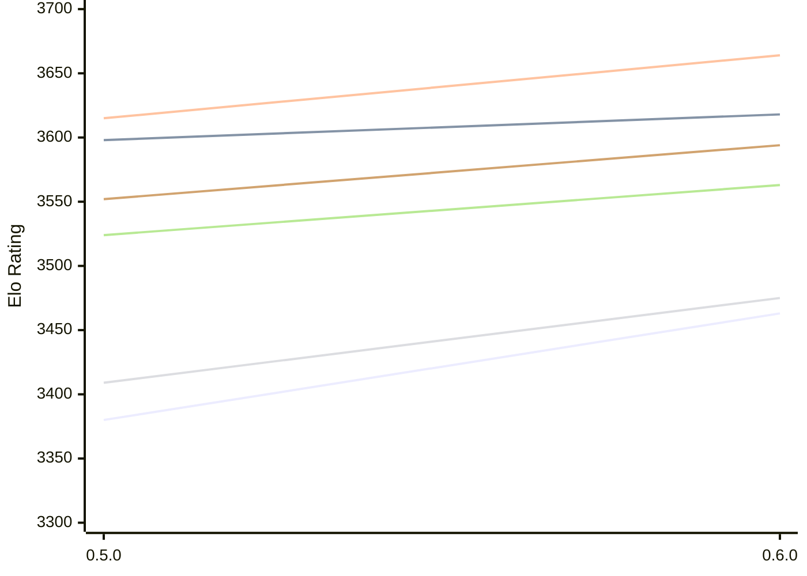

# Engine: Incipit

Author: Adam Twiss

Home: https://github.com/adamtwiss/incipit

## Elo Ratings E1 (Ultra 7 265T (1.50 GHz) - E-Core)

| Version | Published | STC 8.0+0.08s  | LTC 60.0+0.60s | VLTC 2m24s+1.12s | Comment |
| --- | --- | --- | --- | --- | --- |
| 0.6.0 | 2026-11-06 | 3463(+83) | 3618(+20) | 3664(+49) |  |
| 0.5.0 | 2026-10-17 | 3380 | 3598 | 3615 |  |
 | | | cElo (∆ prev) | cElo (∆ prev) | cElo (∆ prev) | 

## Elo Ratings P1 (Ultra 7 265T (1.50 GHz) - P-Core)

| Version | Published | STC 8.0+0.08s  | LTC 60.0+0.60s | VLTC 2m24s+1.12s | Comment |
| --- | --- | --- | --- | --- | --- |
| 0.6.0 | 2026-11-06 | 3475(+66) | 3563(+39) | 3594(+42) |  |
| 0.5.0 | 2026-10-17 | 3409 | 3524 | 3552 |  |
 | | | cElo (∆ prev) | cElo (∆ prev) | cElo (∆ prev) | 

## Elo Ratings T1 (i5-7500T 2.70GHz)

| Version | Published | STC 8.0+0.08s  | LTC 60.0+0.60s | VLTC 2m24s+1.12s | Comment |
| --- | --- | --- | --- | --- | --- |
| 0.5.0 | 2026-10-17 | 3409 | 3524 | 3552 |  |
 | | | cElo (∆ prev) | cElo (∆ prev) | cElo (∆ prev) | 

<a href="https://github.com/computer-chess-index/cci/issues/new?template=submit-version.yml&title=[VERSION]+Incipit+<version>&body=###%20Engine%20name%0AIncipit%0A%0A###%20Version%0A0.6.0" target="_blank">Submit new version</a>

 Test Conditions:

GUI/CLI: <a href=https://github.com/cutechess/cutechess target="_blank">Cute-Chess</a> 
Elo Calculation: <a href=https://www.remi-coulom.fr/Bayesian-Elo/ target="_blank">Bayesian-Elo</a> 
CPU for P1: Intel(R) Core(TM) Ultra 7 265T (1.50 GHz) - P-Core 
CPU for E1: Intel(R) Core(TM) Ultra 7 265T (1.50 GHz) - E-Core 
CPU for T1: Intel(R) Core(TM) i5-7500T 2.70GHz 
Opening book: 8_moves_v3 
\* STC: 8.0+0.08s, LTC: 60.0+0.60s, VLTC: 2m24s+1.12s

 Lists:
Ratings: <a href=https://github.com/computer-chess-index/cci/blob/main/lists/CCIRatings.csv target="_blank">Complete list</a>

Generated: 2026-11-24 05:39:13

## Ratings Verlauf E1 / P1

```mermaid
%%{init: {"theme":"base","themeVariables":{"seriesColors:['#a3a3a3','#222221','#faa371']}}}%%
xychart-beta
  x-axis ["0.5.0", "0.6.0"]
  y-axis "Elo Rating" 3300 --> 3700
  line "E1: STC (8.0+0.08s)" [3380, 3463]
  line "E1: LTC (60.0+0.60s)" [3598, 3618]
  line "E1: VLTC (2m24s+1.12s)" [3615, 3664]
  line "P1: STC (8.0+0.08s)" [3409, 3475]
  line "P1: LTC (60.0+0.60s)" [3524, 3563]
  line "P1: VLTC (2m24s+1.12s)" [3552, 3594]
```

## Detailed Evaluation Results

| Version | Time Control | Variant | Elo  | Range +/- | Matches | Score | Average Opponent Elo | Draws |
| --- | --- |--- | --- | --- | --- | --- | --- | --- |
| 0.6.0 | VLTC (2m24s+1.12s) | P1 | 3594 | 48 | 100 | 50% | 3594 | 84% |
|  |  | E1 | 3664 | 32 | 218 | 51% | 3659 | 90% |
|  | LTC (60.0+0.60s) | P1 | 3563 | 43 | 124 | 52% | 3552 | 82% |
|  |  | E1 | 3618 | 34 | 206 | 51% | 3610 | 82% |
|  | STC (8.0+0.08s) | P1 | 3475 | 43 | 128 | 51% | 3467 | 79% |
|  |  | E1 | 3463 | 29 | 294 | 50% | 3460 | 73% |
| --- | --- |--- | --- | --- | --- | --- | --- | --- |
| 0.5.0 | VLTC (2m24s+1.12s) | P1 | 3552 | 36 | 212 | 62% | 3393 | 69% |
|  |  | E1 | 3615 | 33 | 246 | 59% | 3474 | 74% |
|  | LTC (60.0+0.60s) | P1 | 3524 | 42 | 164 | 64% | 3264 | 69% |
|  |  | E1 | 3598 | 33 | 256 | 57% | 3418 | 68% |
|  | STC (8.0+0.08s) | P1 | 3409 | 38 | 204 | 60% | 3193 | 64% |
|  |  | E1 | 3380 | 31 | 304 | 57% | 3225 | 61% |