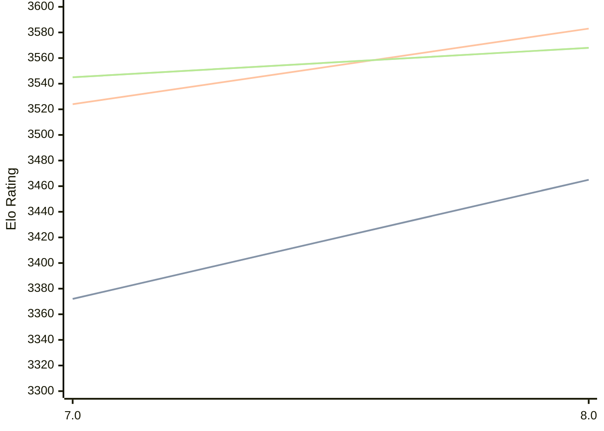

# Engine: Integral

Author: Aron Petkovski

Home: https://github.com/aronpetko/integral

## Elo Ratings

| Version | Published | STC 8.0+0.08s  | LTC 60.0+0.60s | VLTC 2m24s+1.12s | Comment |
| --- | --- | --- | --- | --- | --- |
| 8.0 | 2026-09-11 | 3465(+93) | 3583(+59) | 3568(+23) |  |
| 7.0 | 2025-02-14 | 3372 | 3524 | 3545 |  |
 | | | cElo (∆ prev) | cElo (∆ prev) | cElo (∆ prev) | 

<a href="https://github.com/computer-chess-index/cci/issues/new?template=submit-version.yml&title=[VERSION]+Integral+<version>&body=###%20Engine%20name%0AIntegral%0A%0A###%20Version%0A8.0" target="_blank">Submit new version</a>

 Test Conditions:

GUI/CLI: <a href=https://github.com/cutechess/cutechess target="_blank">Cute-Chess</a> 
Elo Calculation: <a href=https://www.remi-coulom.fr/Bayesian-Elo/ target="_blank">Bayesian-Elo</a> 
CPU: Intel(R) Core(TM) i5-7500T 2.70GHz 
Opening book: 8_moves_v3 
\* STC: 8.0+0.08s, LTC: 60.0+0.60s, VLTC: 2m24s+1.12s

 Lists:
Ratings: <a href=https://github.com/computer-chess-index/cci/blob/main/lists/CCIRatings.csv target="_blank">Complete list</a>

Generated: 2026-09-13 04:38:52

## Ratings Verlauf

## Detailed Evaluation Results

| Version | Time Control | Elo  | Range +/- | Matches | Score | Average Opponent Elo | Draws |
| --- | --- | --- | --- | --- | --- | --- | --- |
| 8.0 | VLTC (2m24s+1.12s) | 3568 | 37 | 164 | 51% | 3563 | 96% |
| 8.0 | LTC (60.0+0.60s) | 3583 | 43 | 120 | 51% | 3573 | 89% |
| 8.0 | STC (8.0+0.08s) | 3465 | 30 | 268 | 52% | 3451 | 82% |
| --- | --- | --- | --- | --- | --- | --- | --- |
| 7.0 | VLTC (2m24s+1.12s) | 3545 | 15 | 1010 | 50% | 3545 | 87% |
| 7.0 | LTC (60.0+0.60s) | 3524 | 15 | 1012 | 50% | 3524 | 85% |
| 7.0 | STC (8.0+0.08s) | 3372 | 15 | 1158 | 50% | 3371 | 70% |
| --- | --- | --- | --- | --- | --- | --- | --- |