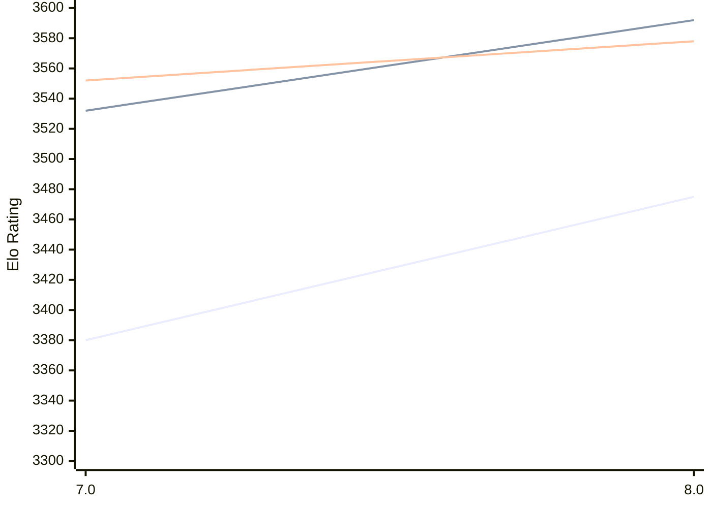

# Engine: Integral

Author: Aron Petkovski

Home: https://github.com/aronpetko/integral

## Elo Ratings E1 (Ultra 7 265T (1.50 GHz) - E-Core)

| Version | Published | STC 8.0+0.08s  | LTC 60.0+0.60s | VLTC 2m24s+1.12s | Comment |
| --- | --- | --- | --- | --- | --- |
| 8.0 | 2026-09-11 | 3465 | 3661 | 3702 |  |
 | | | cElo (∆ prev) | cElo (∆ prev) | cElo (∆ prev) | 

## Elo Ratings P1 (Ultra 7 265T (1.50 GHz) - P-Core)

| Version | Published | STC 8.0+0.08s  | LTC 60.0+0.60s | VLTC 2m24s+1.12s | Comment |
| --- | --- | --- | --- | --- | --- |
| 8.0 | 2026-09-11 | 3587 | 3725 | 3744 |  |
 | | | cElo (∆ prev) | cElo (∆ prev) | cElo (∆ prev) | 

## Elo Ratings T1 (i5-7500T 2.70GHz)

| Version | Published | STC 8.0+0.08s  | LTC 60.0+0.60s | VLTC 2m24s+1.12s | Comment |
| --- | --- | --- | --- | --- | --- |
| 8.0 | 2026-09-11 | 3475(+95) | 3592(+60) | 3578(+26) |  |
| 7.0 | 2025-02-14 | 3380 | 3532 | 3552 |  |
 | | | cElo (∆ prev) | cElo (∆ prev) | cElo (∆ prev) | 

<a href="https://github.com/computer-chess-index/cci/issues/new?template=submit-version.yml&title=[VERSION]+Integral+<version>&body=###%20Engine%20name%0AIntegral%0A%0A###%20Version%0A8.0" target="_blank">Submit new version</a>

 Test Conditions:

GUI/CLI: <a href=https://github.com/cutechess/cutechess target="_blank">Cute-Chess</a> 
Elo Calculation: <a href=https://www.remi-coulom.fr/Bayesian-Elo/ target="_blank">Bayesian-Elo</a> 
CPU for P1: Intel(R) Core(TM) Ultra 7 265T (1.50 GHz) - P-Core 
CPU for E1: Intel(R) Core(TM) Ultra 7 265T (1.50 GHz) - E-Core 
CPU for T1: Intel(R) Core(TM) i5-7500T 2.70GHz 
Opening book: 8_moves_v3 
\* STC: 8.0+0.08s, LTC: 60.0+0.60s, VLTC: 2m24s+1.12s

 Lists:
Ratings: <a href=https://github.com/computer-chess-index/cci/blob/main/lists/CCIRatings.csv target="_blank">Complete list</a>

Generated: 2026-10-20 04:39:42

## Ratings Verlauf T1

```mermaid
%%{init: {"theme":"base","themeVariables":{"seriesColors:['#a3a3a3','#222221','#faa371']}}}%%
xychart-beta
  x-axis ["7.0", "8.0"]
  y-axis "Elo Rating" 3300 --> 3600
  line "T1: STC (8.0+0.08s)" [3380, 3475]
  line "T1: LTC (60.0+0.60s)" [3532, 3592]
  line "T1: VLTC (2m24s+1.12s)" [3552, 3578]
```

## Detailed Evaluation Results

| Version | Time Control | Variant | Elo  | Range +/- | Matches | Score | Average Opponent Elo | Draws |
| --- | --- |--- | --- | --- | --- | --- | --- | --- |
| 8.0 | VLTC (2m24s+1.12s) | E1 | 3702 | 33 | 212 | 52% | 3686 | 89% |
|  |  | T1 | 3578 | 34 | 190 | 51% | 3573 | 95% |
|  |  | P1 | 3744 | 42 | 126 | 50% | 3741 | 87% |
|  | LTC (60.0+0.60s) | T1 | 3592 | 39 | 148 | 51% | 3583 | 91% |
|  |  | P1 | 3725 | 42 | 128 | 49% | 3730 | 84% |
|  |  | E1 | 3661 | 35 | 184 | 50% | 3663 | 86% |
|  | STC (8.0+0.08s) | P1 | 3587 | 34 | 202 | 47% | 3609 | 78% |
|  |  | E1 | 3465 | 29 | 294 | 45% | 3497 | 72% |
|  |  | T1 | 3475 | 27 | 316 | 52% | 3463 | 82% |
| --- | --- |--- | --- | --- | --- | --- | --- | --- |
| 7.0 | VLTC (2m24s+1.12s) | T1 | 3552 | 15 | 1010 | 50% | 3552 | 87% |
|  | LTC (60.0+0.60s) | T1 | 3532 | 15 | 1012 | 50% | 3530 | 85% |
|  | STC (8.0+0.08s) | T1 | 3380 | 15 | 1158 | 50% | 3378 | 70% |