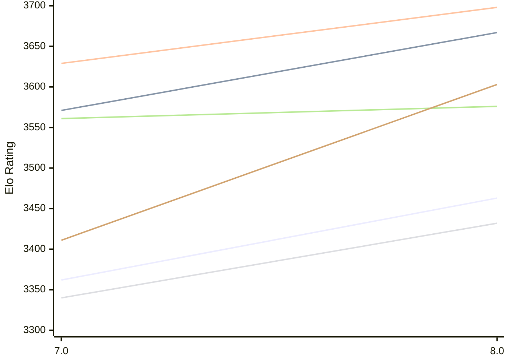
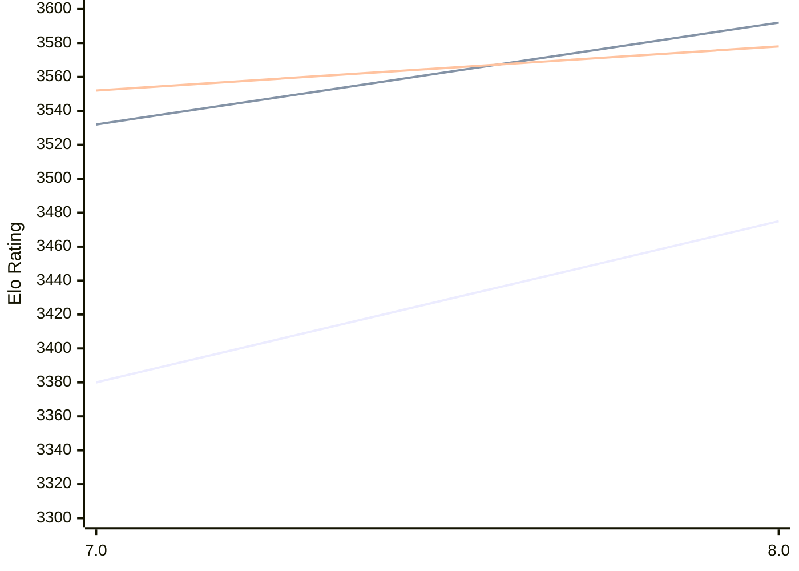

# Engine: Integral

Author: Aron Petkovski

Home: https://github.com/aronpetko/integral

## Elo Ratings E1 (Ultra 7 265T (1.50 GHz) - E-Core)

| Version | Published | STC 8.0+0.08s  | LTC 60.0+0.60s | VLTC 2m24s+1.12s | Comment |
| --- | --- | --- | --- | --- | --- |
| 8.0 | 2026-09-11 | 3463(+101) | 3667(+96) | 3698(+69) |  |
| 7.0 | 2025-02-14 | 3362 | 3571 | 3629 |  |
 | | | cElo (∆ prev) | cElo (∆ prev) | cElo (∆ prev) | 

## Elo Ratings P1 (Ultra 7 265T (1.50 GHz) - P-Core)

| Version | Published | STC 8.0+0.08s  | LTC 60.0+0.60s | VLTC 2m24s+1.12s | Comment |
| --- | --- | --- | --- | --- | --- |
| 8.0 | 2026-09-11 | 3432(+92) | 3576(+15) | 3603(+192) |  |
| 7.0 | 2025-02-14 | 3340 | 3561 | 3411 |  |
 | | | cElo (∆ prev) | cElo (∆ prev) | cElo (∆ prev) | 

## Elo Ratings T1 (i5-7500T 2.70GHz)

| Version | Published | STC 8.0+0.08s  | LTC 60.0+0.60s | VLTC 2m24s+1.12s | Comment |
| --- | --- | --- | --- | --- | --- |
| 8.0 | 2026-09-11 | 3475(+95) | 3592(+60) | 3578(+26) |  |
| 7.0 | 2025-02-14 | 3380 | 3532 | 3552 |  |
 | | | cElo (∆ prev) | cElo (∆ prev) | cElo (∆ prev) | 

<a href="https://github.com/computer-chess-index/cci/issues/new?template=submit-version.yml&title=[VERSION]+Integral+<version>&body=###%20Engine%20name%0AIntegral%0A%0A###%20Version%0A8.0" target="_blank">Submit new version</a>

 Test Conditions:

GUI/CLI: <a href=https://github.com/cutechess/cutechess target="_blank">Cute-Chess</a> 
Elo Calculation: <a href=https://www.remi-coulom.fr/Bayesian-Elo/ target="_blank">Bayesian-Elo</a> 
CPU for P1: Intel(R) Core(TM) Ultra 7 265T (1.50 GHz) - P-Core 
CPU for E1: Intel(R) Core(TM) Ultra 7 265T (1.50 GHz) - E-Core 
CPU for T1: Intel(R) Core(TM) i5-7500T 2.70GHz 
Opening book: 8_moves_v3 
\* STC: 8.0+0.08s, LTC: 60.0+0.60s, VLTC: 2m24s+1.12s

 Lists:
Ratings: <a href=https://github.com/computer-chess-index/cci/blob/main/lists/CCIRatings.csv target="_blank">Complete list</a>

Generated: 2026-11-17 05:39:17

## Ratings Verlauf E1 / P1

```mermaid
%%{init: {"theme":"base","themeVariables":{"seriesColors:['#a3a3a3','#222221','#faa371']}}}%%
xychart-beta
  x-axis ["7.0", "8.0"]
  y-axis "Elo Rating" 3300 --> 3700
  line "E1: STC (8.0+0.08s)" [3362, 3463]
  line "E1: LTC (60.0+0.60s)" [3571, 3667]
  line "E1: VLTC (2m24s+1.12s)" [3629, 3698]
  line "P1: STC (8.0+0.08s)" [3340, 3432]
  line "P1: LTC (60.0+0.60s)" [3561, 3576]
  line "P1: VLTC (2m24s+1.12s)" [3411, 3603]
```

## Ratings Verlauf T1

```mermaid
%%{init: {"theme":"base","themeVariables":{"seriesColors:['#a3a3a3','#222221','#faa371']}}}%%
xychart-beta
  x-axis ["7.0", "8.0"]
  y-axis "Elo Rating" 3300 --> 3600
  line "T1: STC (8.0+0.08s)" [3380, 3475]
  line "T1: LTC (60.0+0.60s)" [3532, 3592]
  line "T1: VLTC (2m24s+1.12s)" [3552, 3578]
```

## Detailed Evaluation Results

| Version | Time Control | Variant | Elo  | Range +/- | Matches | Score | Average Opponent Elo | Draws |
| --- | --- |--- | --- | --- | --- | --- | --- | --- |
| 8.0 | VLTC (2m24s+1.12s) | E1 | 3698 | 26 | 336 | 51% | 3691 | 90% |
|  |  | T1 | 3578 | 34 | 190 | 51% | 3573 | 95% |
|  |  | P1 | 3603 | 36 | 178 | 51% | 3598 | 86% |
|  | LTC (60.0+0.60s) | E1 | 3667 | 31 | 236 | 50% | 3663 | 86% |
|  |  | T1 | 3592 | 39 | 148 | 51% | 3583 | 91% |
|  |  | P1 | 3576 | 37 | 168 | 50% | 3578 | 85% |
|  | STC (8.0+0.08s) | T1 | 3475 | 27 | 316 | 52% | 3463 | 82% |
|  |  | P1 | 3432 | 31 | 254 | 47% | 3449 | 78% |
|  |  | E1 | 3463 | 26 | 382 | 46% | 3488 | 72% |
| --- | --- |--- | --- | --- | --- | --- | --- | --- |
| 7.0 | VLTC (2m24s+1.12s) | P1 | 3411 | 107 | 24 | 67% | 3158 | 67% |
|  |  | E1 | 3629 | 62 | 80 | 64% | 3389 | 59% |
|  |  | T1 | 3552 | 15 | 1010 | 50% | 3552 | 87% |
|  | LTC (60.0+0.60s) | E1 | 3571 | 64 | 60 | 54% | 3528 | 75% |
|  |  | T1 | 3532 | 15 | 1012 | 50% | 3530 | 85% |
|  |  | P1 | 3561 | 133 | 20 | 68% | 3235 | 45% |
|  | STC (8.0+0.08s) | E1 | 3362 | 58 | 82 | 52% | 3318 | 61% |
|  |  | T1 | 3380 | 15 | 1158 | 50% | 3378 | 70% |
|  |  | P1 | 3340 | 91 | 36 | 67% | 3129 | 56% |