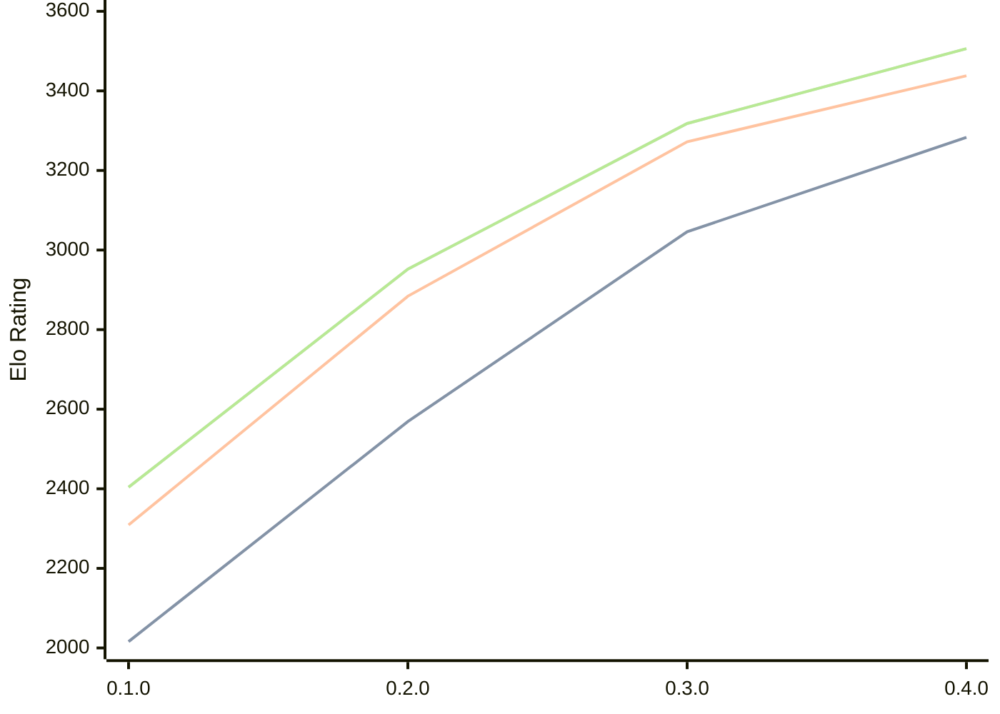

# Engine: Justbot

Author: Hassan Fakih

Home: https://github.com/HasanFakih21/JustBot

## Elo Ratings

| Version | Published | STC 8.0+0.08s  | LTC 60.0+0.60s | VLTC 2m24s+1.12s | Comment |
| --- | --- | --- | --- | --- | --- |
| 0.4.0 | 2026-08-11 | 3283(+237) | 3438(+166) | 3506(+188) |  |
| 0.3.0 | 2026-07-19 | 3046(+477) | 3272(+388) | 3318(+366) |  |
| 0.2.0 | 2026-06-24 | 2569(+553) | 2884(+575) | 2952(+548) |  |
| 0.1.0 | 2026-06-09 | 2016 | 2309 | 2404 |  |
 | | | cElo (∆ prev) | cElo (∆ prev) | cElo (∆ prev) | 

<a href="https://github.com/computer-chess-index/cci/issues/new?template=submit-version.yml&title=[VERSION]+Justbot+<version>&body=###%20Engine%20name%0AJustbot%0A%0A###%20Version%0A0.4.0" target="_blank">Submit new version</a>

 Test Conditions:

GUI/CLI: <a href=https://github.com/cutechess/cutechess target="_blank">Cute-Chess</a> 
Elo Calculation: <a href=https://www.remi-coulom.fr/Bayesian-Elo/ target="_blank">Bayesian-Elo</a> 
CPU: Intel(R) Core(TM) i5-7500T 2.70GHz 
Opening book: 8_moves_v3 
\* STC: 8.0+0.08s, LTC: 60.0+0.60s, VLTC: 2m24s+1.12s

 Lists:
Ratings: <a href=https://github.com/computer-chess-index/cci/blob/main/lists/CCIRatings.csv target="_blank">Complete list</a>

Generated: 2026-08-21 06:26:46

## Ratings Verlauf

⬛ STC (8.0+0.08s) &nbsp;&nbsp; 🟧 LTC (60.0+0.60s) &nbsp;&nbsp; 🟩 VLTC (2m24s+1.12s)

dark mode: 🟩STC (8.0+0.08s) 🟧LTC (60.0+0.60s) ⬜VLTC (2m24s+1.12s)

## Detailed Evaluation Results

| Version | Time Control | Elo  | Range +/- | Matches | Score | Average Opponent Elo | Draws |
| --- | --- | --- | --- | --- | --- | --- | --- |
| 0.4.0 | VLTC (2m24s+1.12s) | 3506 | 81 | 36 | 56% | 3463 | 78% |
| 0.4.0 | LTC (60.0+0.60s) | 3438 | 66 | 56 | 51% | 3428 | 73% |
| 0.4.0 | STC (8.0+0.08s) | 3283 | 59 | 76 | 47% | 3301 | 62% |
| --- | --- | --- | --- | --- | --- | --- | --- |
| 0.3.0 | VLTC (2m24s+1.12s) | 3318 | 28 | 336 | 53% | 3291 | 65% |
| 0.3.0 | LTC (60.0+0.60s) | 3272 | 29 | 296 | 52% | 3255 | 69% |
| 0.3.0 | STC (8.0+0.08s) | 3046 | 31 | 308 | 50% | 3043 | 49% |
| --- | --- | --- | --- | --- | --- | --- | --- |
| 0.2.0 | VLTC (2m24s+1.12s) | 2952 | 37 | 212 | 50% | 2942 | 50% |
| 0.2.0 | LTC (60.0+0.60s) | 2884 | 32 | 296 | 47% | 2903 | 42% |
| 0.2.0 | STC (8.0+0.08s) | 2569 | 36 | 252 | 46% | 2608 | 33% |
| --- | --- | --- | --- | --- | --- | --- | --- |
| 0.1.0 | VLTC (2m24s+1.12s) | 2404 | 36 | 278 | 49% | 2425 | 22% |
| 0.1.0 | LTC (60.0+0.60s) | 2309 | 35 | 284 | 49% | 2317 | 26% |
| 0.1.0 | STC (8.0+0.08s) | 2016 | 37 | 266 | 48% | 2030 | 21% |
| --- | --- | --- | --- | --- | --- | --- | --- |