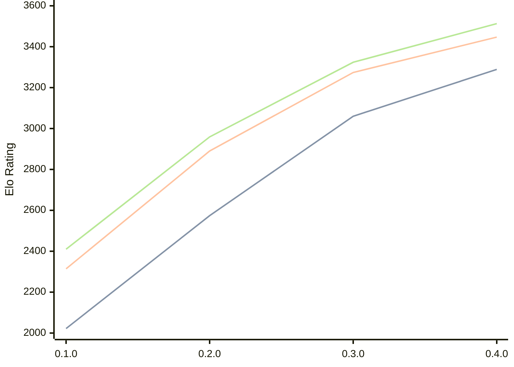

# Engine: Justbot

Author: Hassan Fakih

Home: https://github.com/HasanFakih21/JustBot

## Elo Ratings

| Version | Published | STC 8.0+0.08s  | LTC 60.0+0.60s | VLTC 2m24s+1.12s | Comment |
| --- | --- | --- | --- | --- | --- |
| 0.4.0 | 2026-08-11 | 3289(+229) | 3447(+173) | 3513(+189) |  |
| 0.3.0 | 2026-07-19 | 3060(+486) | 3274(+384) | 3324(+365) |  |
| 0.2.0 | 2026-06-24 | 2574(+552) | 2890(+576) | 2959(+549) |  |
| 0.1.0 | 2026-06-09 | 2022 | 2314 | 2410 |  |
 | | | cElo (∆ prev) | cElo (∆ prev) | cElo (∆ prev) | 

<a href="https://github.com/computer-chess-index/cci/issues/new?template=submit-version.yml&title=[VERSION]+Justbot+<version>&body=###%20Engine%20name%0AJustbot%0A%0A###%20Version%0A0.4.0" target="_blank">Submit new version</a>

 Test Conditions:

GUI/CLI: <a href=https://github.com/cutechess/cutechess target="_blank">Cute-Chess</a> 
Elo Calculation: <a href=https://www.remi-coulom.fr/Bayesian-Elo/ target="_blank">Bayesian-Elo</a> 
CPU: Intel(R) Core(TM) i5-7500T 2.70GHz 
Opening book: 8_moves_v3 
\* STC: 8.0+0.08s, LTC: 60.0+0.60s, VLTC: 2m24s+1.12s

 Lists:
Ratings: <a href=https://github.com/computer-chess-index/cci/blob/main/lists/CCIRatings.csv target="_blank">Complete list</a>

Generated: 2026-09-06 04:35:55

## Ratings Verlauf

## Detailed Evaluation Results

| Version | Time Control | Elo  | Range +/- | Matches | Score | Average Opponent Elo | Draws |
| --- | --- | --- | --- | --- | --- | --- | --- |
| 0.4.0 | VLTC (2m24s+1.12s) | 3513 | 81 | 36 | 56% | 3471 | 78% |
| 0.4.0 | LTC (60.0+0.60s) | 3447 | 66 | 56 | 51% | 3436 | 73% |
| 0.4.0 | STC (8.0+0.08s) | 3289 | 59 | 76 | 47% | 3306 | 62% |
| --- | --- | --- | --- | --- | --- | --- | --- |
| 0.3.0 | VLTC (2m24s+1.12s) | 3324 | 27 | 368 | 53% | 3301 | 65% |
| 0.3.0 | LTC (60.0+0.60s) | 3274 | 28 | 328 | 51% | 3264 | 69% |
| 0.3.0 | STC (8.0+0.08s) | 3060 | 29 | 352 | 51% | 3050 | 49% |
| --- | --- | --- | --- | --- | --- | --- | --- |
| 0.2.0 | VLTC (2m24s+1.12s) | 2959 | 37 | 212 | 50% | 2948 | 50% |
| 0.2.0 | LTC (60.0+0.60s) | 2890 | 32 | 296 | 47% | 2909 | 42% |
| 0.2.0 | STC (8.0+0.08s) | 2574 | 36 | 252 | 46% | 2614 | 33% |
| --- | --- | --- | --- | --- | --- | --- | --- |
| 0.1.0 | VLTC (2m24s+1.12s) | 2410 | 36 | 278 | 49% | 2431 | 22% |
| 0.1.0 | LTC (60.0+0.60s) | 2314 | 35 | 284 | 49% | 2322 | 26% |
| 0.1.0 | STC (8.0+0.08s) | 2022 | 37 | 266 | 48% | 2036 | 21% |
| --- | --- | --- | --- | --- | --- | --- | --- |