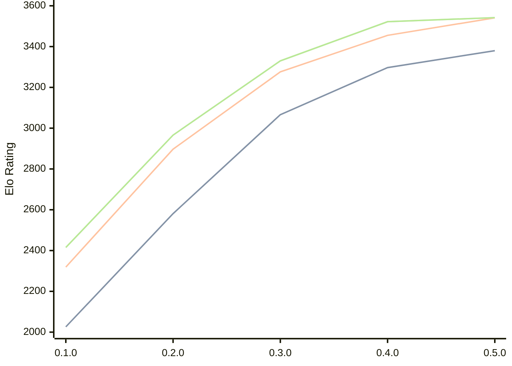

# Engine: Justbot

Author: Hassan Fakih

Home: https://github.com/HasanFakih21/JustBot

## Elo Ratings

| Version | Published | STC 8.0+0.08s  | LTC 60.0+0.60s | VLTC 2m24s+1.12s | Comment |
| --- | --- | --- | --- | --- | --- |
| 0.5.0 | 2026-09-24 | 3380(+83) | 3541(+86) | 3542(+20) |  |
| 0.4.0 | 2026-08-11 | 3297(+231) | 3455(+179) | 3522(+192) |  |
| 0.3.0 | 2026-07-19 | 3066(+485) | 3276(+379) | 3330(+364) |  |
| 0.2.0 | 2026-06-24 | 2581(+555) | 2897(+578) | 2966(+551) |  |
| 0.1.0 | 2026-06-09 | 2026 | 2319 | 2415 |  |
 | | | cElo (∆ prev) | cElo (∆ prev) | cElo (∆ prev) | 

<a href="https://github.com/computer-chess-index/cci/issues/new?template=submit-version.yml&title=[VERSION]+Justbot+<version>&body=###%20Engine%20name%0AJustbot%0A%0A###%20Version%0A0.5.0" target="_blank">Submit new version</a>

 Test Conditions:

GUI/CLI: <a href=https://github.com/cutechess/cutechess target="_blank">Cute-Chess</a> 
Elo Calculation: <a href=https://www.remi-coulom.fr/Bayesian-Elo/ target="_blank">Bayesian-Elo</a> 
CPU: Intel(R) Core(TM) i5-7500T 2.70GHz 
Opening book: 8_moves_v3 
\* STC: 8.0+0.08s, LTC: 60.0+0.60s, VLTC: 2m24s+1.12s

 Lists:
Ratings: <a href=https://github.com/computer-chess-index/cci/blob/main/lists/CCIRatings.csv target="_blank">Complete list</a>

Generated: 2026-10-08 04:39:41

## Ratings Verlauf

```mermaid
%%{init: {"theme":"base","themeVariables":{"seriesColors:['#a3a3a3','#222221','#faa371']}}}%%
xychart-beta
  x-axis ["0.1.0", "0.2.0", "0.3.0", "0.4.0", "0.5.0"]
  y-axis "Elo Rating" 2000 --> 3600
  line "" [2026, 2581, 3066, 3297, 3380]
  line "STC (8.0+0.08s)" [2026, 2581, 3066, 3297, 3380]
  line "LTC (60.0+0.60s)" [2319, 2897, 3276, 3455, 3541]
  line "" [2415, 2966, 3330, 3522, 3542]
  line "VLTC (2m24s+1.12s)" [2415, 2966, 3330, 3522, 3542]
```

## Detailed Evaluation Results

| Version | Time Control | Elo  | Range +/- | Matches | Score | Average Opponent Elo | Draws |
| --- | --- | --- | --- | --- | --- | --- | --- |
| 0.5.0 | VLTC (2m24s+1.12s) | 3542 | 46 | 106 | 51% | 3534 | 92% |
| 0.5.0 | LTC (60.0+0.60s) | 3541 | 31 | 244 | 55% | 3510 | 83% |
| 0.5.0 | STC (8.0+0.08s) | 3380 | 36 | 194 | 53% | 3362 | 74% |
| --- | --- | --- | --- | --- | --- | --- | --- |
| 0.4.0 | VLTC (2m24s+1.12s) | 3522 | 81 | 36 | 56% | 3479 | 78% |
| 0.4.0 | LTC (60.0+0.60s) | 3455 | 66 | 56 | 51% | 3444 | 73% |
| 0.4.0 | STC (8.0+0.08s) | 3297 | 59 | 76 | 47% | 3314 | 62% |
| --- | --- | --- | --- | --- | --- | --- | --- |
| 0.3.0 | VLTC (2m24s+1.12s) | 3330 | 26 | 376 | 53% | 3309 | 65% |
| 0.3.0 | LTC (60.0+0.60s) | 3276 | 27 | 352 | 50% | 3274 | 68% |
| 0.3.0 | STC (8.0+0.08s) | 3066 | 27 | 384 | 51% | 3058 | 50% |
| --- | --- | --- | --- | --- | --- | --- | --- |
| 0.2.0 | VLTC (2m24s+1.12s) | 2966 | 37 | 212 | 50% | 2955 | 50% |
| 0.2.0 | LTC (60.0+0.60s) | 2897 | 32 | 296 | 47% | 2916 | 42% |
| 0.2.0 | STC (8.0+0.08s) | 2581 | 36 | 252 | 46% | 2620 | 33% |
| --- | --- | --- | --- | --- | --- | --- | --- |
| 0.1.0 | VLTC (2m24s+1.12s) | 2415 | 36 | 278 | 49% | 2437 | 22% |
| 0.1.0 | LTC (60.0+0.60s) | 2319 | 35 | 284 | 49% | 2326 | 26% |
| 0.1.0 | STC (8.0+0.08s) | 2026 | 37 | 266 | 48% | 2040 | 21% |
| --- | --- | --- | --- | --- | --- | --- | --- |