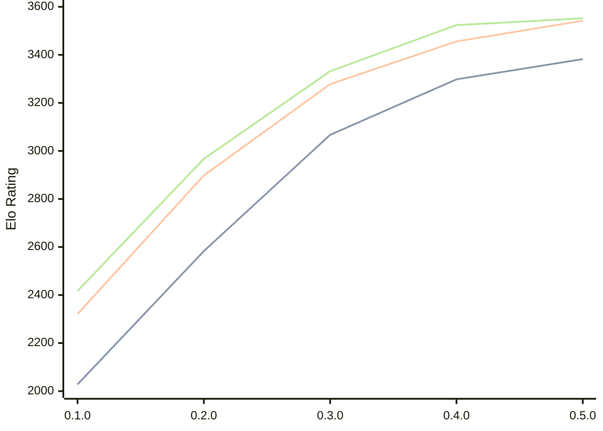

# Engine: Justbot

Author: Hassan Fakih

Home: https://github.com/HasanFakih21/JustBot

## Elo Ratings E1

| Version | Published | STC 8.0+0.08s  | LTC 60.0+0.60s | VLTC 2m24s+1.12s | Comment |
| --- | --- | --- | --- | --- | --- |
| 0.3.0 | 2026-07-19 | 2936 | 3212 | 3270 |  |
 | | | cElo (∆ prev) | cElo (∆ prev) | cElo (∆ prev) | 

## Elo Ratings P1

| Version | Published | STC 8.0+0.08s  | LTC 60.0+0.60s | VLTC 2m24s+1.12s | Comment |
| --- | --- | --- | --- | --- | --- |
| 0.3.0 | 2026-07-19 | 3213 | 3478 | 3522 |  |
 | | | cElo (∆ prev) | cElo (∆ prev) | cElo (∆ prev) | 

## Elo Ratings T1

| Version | Published | STC 8.0+0.08s  | LTC 60.0+0.60s | VLTC 2m24s+1.12s | Comment |
| --- | --- | --- | --- | --- | --- |
| 0.5.0 | 2026-09-24 | 3382(+84) | 3542(+86) | 3552(+28) |  |
| 0.4.0 | 2026-08-11 | 3298(+231) | 3456(+178) | 3524(+192) |  |
| 0.3.0 | 2026-07-19 | 3067(+484) | 3278(+380) | 3332(+365) |  |
| 0.2.0 | 2026-06-24 | 2583(+555) | 2898(+577) | 2967(+550) |  |
| 0.1.0 | 2026-06-09 | 2028 | 2321 | 2417 |  |
 | | | cElo (∆ prev) | cElo (∆ prev) | cElo (∆ prev) | 

<a href="https://github.com/computer-chess-index/cci/issues/new?template=submit-version.yml&title=[VERSION]+Justbot+<version>&body=###%20Engine%20name%0AJustbot%0A%0A###%20Version%0A0.5.0" target="_blank">Submit new version</a>

 Test Conditions:

GUI/CLI: <a href=https://github.com/cutechess/cutechess target="_blank">Cute-Chess</a> 
Elo Calculation: <a href=https://www.remi-coulom.fr/Bayesian-Elo/ target="_blank">Bayesian-Elo</a> 
CPU for P1: Intel(R) Core(TM) Ultra 7 265T (1.50 GHz) - P-Core 
CPU for E1: Intel(R) Core(TM) Ultra 7 265T (1.50 GHz) - E-Core 
CPU for T1: Intel(R) Core(TM) i5-7500T 2.70GHz 
Opening book: 8_moves_v3 
\* STC: 8.0+0.08s, LTC: 60.0+0.60s, VLTC: 2m24s+1.12s

 Lists:
Ratings: <a href=https://github.com/computer-chess-index/cci/blob/main/lists/CCIRatings.csv target="_blank">Complete list</a>

Generated: 2026-10-09 14:12:44

## Ratings Verlauf

```mermaid
%%{init: {"theme":"base","themeVariables":{"seriesColors:['#a3a3a3','#222221','#faa371']}}}%%
xychart-beta
  x-axis ["0.1.0", "0.2.0", "0.3.0", "0.4.0", "0.5.0"]
  y-axis "Elo Rating" 2000 --> 3600
  line "" [2028, 2583, 3067, 3298, 3382]
  line "STC (8.0+0.08s)" [2028, 2583, 3067, 3298, 3382]
  line "LTC (60.0+0.60s)" [2321, 2898, 3278, 3456, 3542]
  line "" [2417, 2967, 3332, 3524, 3552]
  line "VLTC (2m24s+1.12s)" [2417, 2967, 3332, 3524, 3552]
```

## Detailed Evaluation Results

| Version | Time Control | Elo  | Range +/- | Matches | Score | Average Opponent Elo | Draws |
| --- | --- | --- | --- | --- | --- | --- | --- |
| 0.5.0 | VLTC (2m24s+1.12s) | 3552 | 36 | 178 | 52% | 3542 | 88% |
| 0.5.0 | LTC (60.0+0.60s) | 3542 | 31 | 244 | 55% | 3511 | 83% |
| 0.5.0 | STC (8.0+0.08s) | 3382 | 36 | 194 | 53% | 3364 | 74% |
| --- | --- | --- | --- | --- | --- | --- | --- |
| 0.4.0 | VLTC (2m24s+1.12s) | 3524 | 81 | 36 | 56% | 3482 | 78% |
| 0.4.0 | LTC (60.0+0.60s) | 3456 | 66 | 56 | 51% | 3445 | 73% |
| 0.4.0 | STC (8.0+0.08s) | 3298 | 59 | 76 | 47% | 3316 | 62% |
| --- | --- | --- | --- | --- | --- | --- | --- |
| 0.3.0 | VLTC (2m24s+1.12s) | 3332 | 26 | 376 | 53% | 3310 | 65% |
| 0.3.0 | VLTC (2m24s+1.12s) | 3522 | 40 | 164 | 51% | 3517 | 63% |
| 0.3.0 | VLTC (2m24s+1.12s) | 3270 | 32 | 256 | 49% | 3275 | 63% |
| 0.3.0 | LTC (60.0+0.60s) | 3278 | 27 | 352 | 50% | 3275 | 68% |
| 0.3.0 | LTC (60.0+0.60s) | 3478 | 38 | 176 | 51% | 3476 | 70% |
| 0.3.0 | LTC (60.0+0.60s) | 3212 | 31 | 276 | 50% | 3216 | 64% |
| 0.3.0 | STC (8.0+0.08s) | 3067 | 27 | 384 | 51% | 3059 | 50% |
| --- | --- | --- | --- | --- | --- | --- | --- |
| 0.3.0 | STC (8.0+0.08s) | 3213 | 39 | 186 | 48% | 3232 | 52% |
| --- | --- | --- | --- | --- | --- | --- | --- |
| 0.3.0 | STC (8.0+0.08s) | 2936 | 32 | 300 | 44% | 2992 | 46% |
| --- | --- | --- | --- | --- | --- | --- | --- |
| 0.2.0 | VLTC (2m24s+1.12s) | 2967 | 37 | 212 | 50% | 2957 | 50% |
| 0.2.0 | LTC (60.0+0.60s) | 2898 | 32 | 296 | 47% | 2917 | 42% |
| 0.2.0 | STC (8.0+0.08s) | 2583 | 36 | 252 | 46% | 2622 | 33% |
| --- | --- | --- | --- | --- | --- | --- | --- |
| 0.1.0 | VLTC (2m24s+1.12s) | 2417 | 36 | 278 | 49% | 2438 | 22% |
| 0.1.0 | LTC (60.0+0.60s) | 2321 | 35 | 284 | 49% | 2327 | 26% |
| 0.1.0 | STC (8.0+0.08s) | 2028 | 37 | 266 | 48% | 2041 | 21% |
| --- | --- | --- | --- | --- | --- | --- | --- |