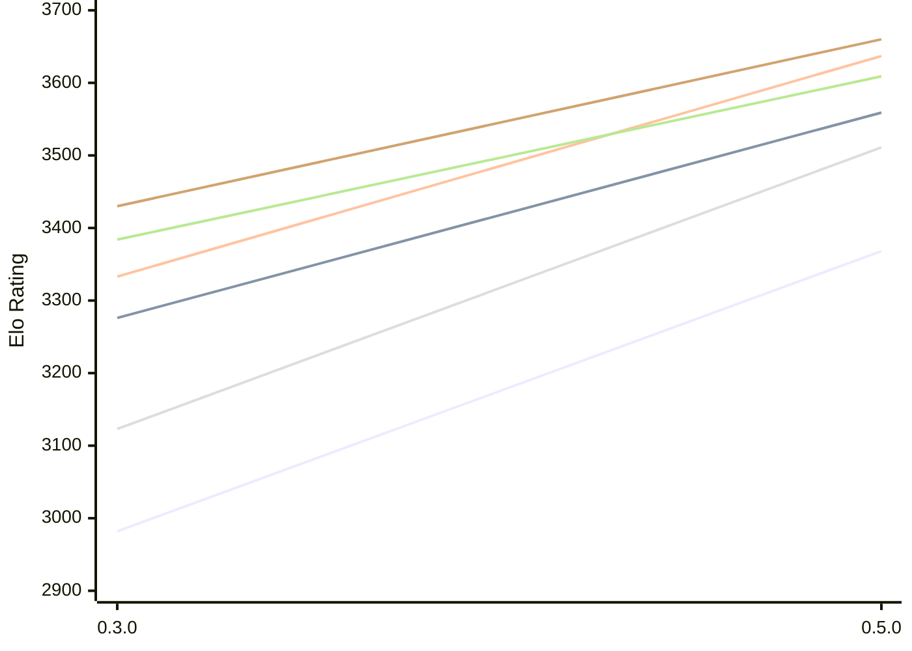
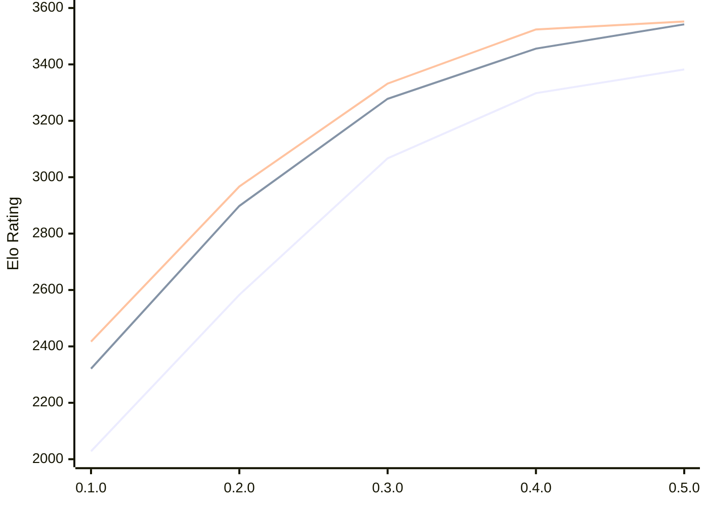

# Engine: Justbot

Author: Hassan Fakih

Home: https://github.com/HasanFakih21/JustBot

## Elo Ratings E1 (Ultra 7 265T (1.50 GHz) - E-Core)

| Version | Published | STC 8.0+0.08s  | LTC 60.0+0.60s | VLTC 2m24s+1.12s | Comment |
| --- | --- | --- | --- | --- | --- |
| 0.5.0 | 2026-09-24 | 3368(+386) | 3559(+283) | 3637(+304) |  |
| 0.3.0 | 2026-07-19 | 2982 | 3276 | 3333 |  |
 | | | cElo (∆ prev) | cElo (∆ prev) | cElo (∆ prev) | 

## Elo Ratings P1 (Ultra 7 265T (1.50 GHz) - P-Core)

| Version | Published | STC 8.0+0.08s  | LTC 60.0+0.60s | VLTC 2m24s+1.12s | Comment |
| --- | --- | --- | --- | --- | --- |
| 0.5.0 | 2026-09-24 | 3511(+388) | 3609(+225) | 3660(+230) |  |
| 0.3.0 | 2026-07-19 | 3123 | 3384 | 3430 |  |
 | | | cElo (∆ prev) | cElo (∆ prev) | cElo (∆ prev) | 

## Elo Ratings T1 (i5-7500T 2.70GHz)

| Version | Published | STC 8.0+0.08s  | LTC 60.0+0.60s | VLTC 2m24s+1.12s | Comment |
| --- | --- | --- | --- | --- | --- |
| 0.5.0 | 2026-09-24 | 3382(+84) | 3542(+86) | 3552(+28) |  |
| 0.4.0 | 2026-08-11 | 3298(+231) | 3456(+178) | 3524(+192) |  |
| 0.3.0 | 2026-07-19 | 3067(+484) | 3278(+380) | 3332(+365) |  |
| 0.2.0 | 2026-06-24 | 2583(+555) | 2898(+577) | 2967(+550) |  |
| 0.1.0 | 2026-06-09 | 2028 | 2321 | 2417 |  |
 | | | cElo (∆ prev) | cElo (∆ prev) | cElo (∆ prev) | 

<a href="https://github.com/computer-chess-index/cci/issues/new?template=submit-version.yml&title=[VERSION]+Justbot+<version>&body=###%20Engine%20name%0AJustbot%0A%0A###%20Version%0A0.5.0" target="_blank">Submit new version</a>

 Test Conditions:

GUI/CLI: <a href=https://github.com/cutechess/cutechess target="_blank">Cute-Chess</a> 
Elo Calculation: <a href=https://www.remi-coulom.fr/Bayesian-Elo/ target="_blank">Bayesian-Elo</a> 
CPU for P1: Intel(R) Core(TM) Ultra 7 265T (1.50 GHz) - P-Core 
CPU for E1: Intel(R) Core(TM) Ultra 7 265T (1.50 GHz) - E-Core 
CPU for T1: Intel(R) Core(TM) i5-7500T 2.70GHz 
Opening book: 8_moves_v3 
\* STC: 8.0+0.08s, LTC: 60.0+0.60s, VLTC: 2m24s+1.12s

 Lists:
Ratings: <a href=https://github.com/computer-chess-index/cci/blob/main/lists/CCIRatings.csv target="_blank">Complete list</a>

Generated: 2026-10-19 04:39:39

## Ratings Verlauf E1 / P1

```mermaid
%%{init: {"theme":"base","themeVariables":{"seriesColors:['#a3a3a3','#222221','#faa371']}}}%%
xychart-beta
  x-axis ["0.3.0", "0.5.0"]
  y-axis "Elo Rating" 2900 --> 3700
  line "E1: STC (8.0+0.08s)" [2982, 3368]
  line "E1: LTC (60.0+0.60s)" [3276, 3559]
  line "E1: VLTC (2m24s+1.12s)" [3333, 3637]
  line "P1: STC (8.0+0.08s)" [3123, 3511]
  line "P1: LTC (60.0+0.60s)" [3384, 3609]
  line "P1: VLTC (2m24s+1.12s)" [3430, 3660]
```

## Ratings Verlauf T1

```mermaid
%%{init: {"theme":"base","themeVariables":{"seriesColors:['#a3a3a3','#222221','#faa371']}}}%%
xychart-beta
  x-axis ["0.1.0", "0.2.0", "0.3.0", "0.4.0", "0.5.0"]
  y-axis "Elo Rating" 2000 --> 3600
  line "T1: STC (8.0+0.08s)" [2028, 2583, 3067, 3298, 3382]
  line "T1: LTC (60.0+0.60s)" [2321, 2898, 3278, 3456, 3542]
  line "T1: VLTC (2m24s+1.12s)" [2417, 2967, 3332, 3524, 3552]
```

## Detailed Evaluation Results

| Version | Time Control | Variant | Elo  | Range +/- | Matches | Score | Average Opponent Elo | Draws |
| --- | --- |--- | --- | --- | --- | --- | --- | --- |
| 0.5.0 | VLTC (2m24s+1.12s) | E1 | 3637 | 87 | 34 | 57% | 3568 | 68% |
|  |  | T1 | 3552 | 36 | 178 | 52% | 3542 | 88% |
|  |  | P1 | 3660 | 101 | 24 | 63% | 3565 | 75% |
|  | LTC (60.0+0.60s) | E1 | 3559 | 72 | 48 | 56% | 3505 | 71% |
|  |  | T1 | 3542 | 31 | 244 | 55% | 3511 | 83% |
|  |  | P1 | 3609 | 92 | 28 | 57% | 3548 | 79% |
|  | STC (8.0+0.08s) | T1 | 3382 | 36 | 194 | 53% | 3364 | 74% |
|  |  | P1 | 3511 | 91 | 32 | 59% | 3413 | 63% |
|  |  | E1 | 3368 | 49 | 110 | 54% | 3330 | 63% |
| --- | --- |--- | --- | --- | --- | --- | --- | --- |
| 0.4.0 | VLTC (2m24s+1.12s) | T1 | 3524 | 81 | 36 | 56% | 3482 | 78% |
|  | LTC (60.0+0.60s) | T1 | 3456 | 66 | 56 | 51% | 3445 | 73% |
|  | STC (8.0+0.08s) | T1 | 3298 | 59 | 76 | 47% | 3316 | 62% |
| --- | --- |--- | --- | --- | --- | --- | --- | --- |
| 0.3.0 | VLTC (2m24s+1.12s) | E1 | 3333 | 29 | 302 | 50% | 3333 | 65% |
|  |  | T1 | 3332 | 26 | 376 | 53% | 3310 | 65% |
|  |  | P1 | 3430 | 37 | 192 | 51% | 3424 | 63% |
|  | LTC (60.0+0.60s) | E1 | 3276 | 29 | 304 | 50% | 3274 | 65% |
|  |  | T1 | 3278 | 27 | 352 | 50% | 3275 | 68% |
|  |  | P1 | 3384 | 35 | 208 | 50% | 3383 | 69% |
|  | STC (8.0+0.08s) | T1 | 3067 | 27 | 384 | 51% | 3059 | 50% |
|  |  | P1 | 3123 | 35 | 226 | 49% | 3137 | 53% |
|  |  | E1 | 2982 | 29 | 348 | 44% | 3038 | 47% |
| --- | --- |--- | --- | --- | --- | --- | --- | --- |
| 0.2.0 | VLTC (2m24s+1.12s) | T1 | 2967 | 37 | 212 | 50% | 2957 | 50% |
|  | LTC (60.0+0.60s) | T1 | 2898 | 32 | 296 | 47% | 2917 | 42% |
|  | STC (8.0+0.08s) | T1 | 2583 | 36 | 252 | 46% | 2622 | 33% |
| --- | --- |--- | --- | --- | --- | --- | --- | --- |
| 0.1.0 | VLTC (2m24s+1.12s) | T1 | 2417 | 36 | 278 | 49% | 2438 | 22% |
|  | LTC (60.0+0.60s) | T1 | 2321 | 35 | 284 | 49% | 2327 | 26% |
|  | STC (8.0+0.08s) | T1 | 2028 | 37 | 266 | 48% | 2041 | 21% |