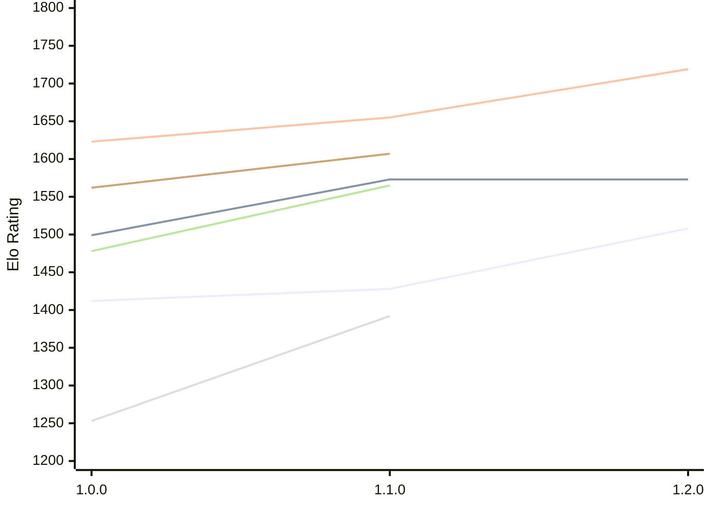

# Engine: Klak

Author: Daniele Marpino

Home: https://github.com/Spunc595/Klak

## Elo Ratings E1 (Ultra 7 265T (1.50 GHz) - E-Core)

| Version | Published | STC 8.0+0.08s  | LTC 60.0+0.60s | VLTC 2m24s+1.12s | Comment |
| --- | --- | --- | --- | --- | --- |
| 1.2.0 | 2026-11-14 | 1508(+80) | 1573(0) | 1719(+64) |  |
| 1.1.0 | 2026-11-08 | 1428(+16) | 1573(+74) | 1655(+32) |  |
| 1.0.0 | 2026-11-06 | 1412 | 1499 | 1623 |  |
 | | | cElo (∆ prev) | cElo (∆ prev) | cElo (∆ prev) | 

## Elo Ratings P1 (Ultra 7 265T (1.50 GHz) - P-Core)

| Version | Published | STC 8.0+0.08s  | LTC 60.0+0.60s | VLTC 2m24s+1.12s | Comment |
| --- | --- | --- | --- | --- | --- |
| 1.1.0 | 2026-11-08 | 1392(+139) | 1565(+87) | 1607(+45) |  |
| 1.0.0 | 2026-11-06 | 1253 | 1478 | 1562 |  |
 | | | cElo (∆ prev) | cElo (∆ prev) | cElo (∆ prev) | 

## Elo Ratings T1 (i5-7500T 2.70GHz)

| Version | Published | STC 8.0+0.08s  | LTC 60.0+0.60s | VLTC 2m24s+1.12s | Comment |
| --- | --- | --- | --- | --- | --- |
| 1.0.0 | 2026-11-06 | 1253 | 1478 | 1562 |  |
 | | | cElo (∆ prev) | cElo (∆ prev) | cElo (∆ prev) | 

<a href="https://github.com/computer-chess-index/cci/issues/new?template=submit-version.yml&title=[VERSION]+Klak+<version>&body=###%20Engine%20name%0AKlak%0A%0A###%20Version%0A1.1.0" target="_blank">Submit new version</a>

 Test Conditions:

GUI/CLI: <a href=https://github.com/cutechess/cutechess target="_blank">Cute-Chess</a> 
Elo Calculation: <a href=https://www.remi-coulom.fr/Bayesian-Elo/ target="_blank">Bayesian-Elo</a> 
CPU for P1: Intel(R) Core(TM) Ultra 7 265T (1.50 GHz) - P-Core 
CPU for E1: Intel(R) Core(TM) Ultra 7 265T (1.50 GHz) - E-Core 
CPU for T1: Intel(R) Core(TM) i5-7500T 2.70GHz 
Opening book: 8_moves_v3 
\* STC: 8.0+0.08s, LTC: 60.0+0.60s, VLTC: 2m24s+1.12s

 Lists:
Ratings: <a href=https://github.com/computer-chess-index/cci/blob/main/lists/CCIRatings.csv target="_blank">Complete list</a>

Generated: 2026-11-15 05:39:17

## Ratings Verlauf E1 / P1

```mermaid
%%{init: {"theme":"base","themeVariables":{"seriesColors:['#a3a3a3','#222221','#faa371']}}}%%
xychart-beta
  x-axis ["1.0.0", "1.1.0", "1.2.0"]
  y-axis "Elo Rating" 1200 --> 1800
  line "E1: STC (8.0+0.08s)" [1412, 1428, 1508]
  line "E1: LTC (60.0+0.60s)" [1499, 1573, 1573]
  line "E1: VLTC (2m24s+1.12s)" [1623, 1655, 1719]
  line "P1: STC (8.0+0.08s)" [1253, 1392]
  line "P1: LTC (60.0+0.60s)" [1478, 1565]
  line "P1: VLTC (2m24s+1.12s)" [1562, 1607]
```

## Detailed Evaluation Results

| Version | Time Control | Variant | Elo  | Range +/- | Matches | Score | Average Opponent Elo | Draws |
| --- | --- |--- | --- | --- | --- | --- | --- | --- |
| 1.2.0 | VLTC (2m24s+1.12s) | E1 | 1719 | 223 | 6 | 58% | 1655 | 17% |
|  | LTC (60.0+0.60s) | P1 | 1504 | 216 | 6 | 42% | 1573 | 17% |
|  |  | E1 | 1573 | 207 | 8 | 50% | 1573 | 0% |
|  | STC (8.0+0.08s) | P1 | 1484 | 250 | 4 | 63% | 1392 | 25% |
|  |  | E1 | 1508 | 249 | 4 | 63% | 1428 | 25% |
| --- | --- |--- | --- | --- | --- | --- | --- | --- |
| 1.1.0 | VLTC (2m24s+1.12s) | P1 | 1607 | 46 | 166 | 53% | 1570 | 19% |
|  |  | E1 | 1655 | 37 | 268 | 49% | 1669 | 19% |
|  | LTC (60.0+0.60s) | P1 | 1565 | 44 | 180 | 53% | 1535 | 24% |
|  |  | E1 | 1573 | 35 | 280 | 49% | 1577 | 23% |
|  | STC (8.0+0.08s) | P1 | 1392 | 38 | 246 | 58% | 1318 | 20% |
|  |  | E1 | 1428 | 38 | 252 | 47% | 1454 | 22% |
| --- | --- |--- | --- | --- | --- | --- | --- | --- |
| 1.0.0 | VLTC (2m24s+1.12s) | E1 | 1623 | 34 | 312 | 57% | 1485 | 34% |
|  |  | P1 | 1562 | 45 | 176 | 65% | 1357 | 36% |
|  | LTC (60.0+0.60s) | E1 | 1499 | 35 | 280 | 60% | 1351 | 41% |
|  |  | P1 | 1478 | 41 | 212 | 60% | 1337 | 31% |
|  | STC (8.0+0.08s) | E1 | 1412 | 34 | 304 | 60% | 1269 | 38% |
|  |  | P1 | 1253 | 42 | 196 | 65% | 1060 | 38% |