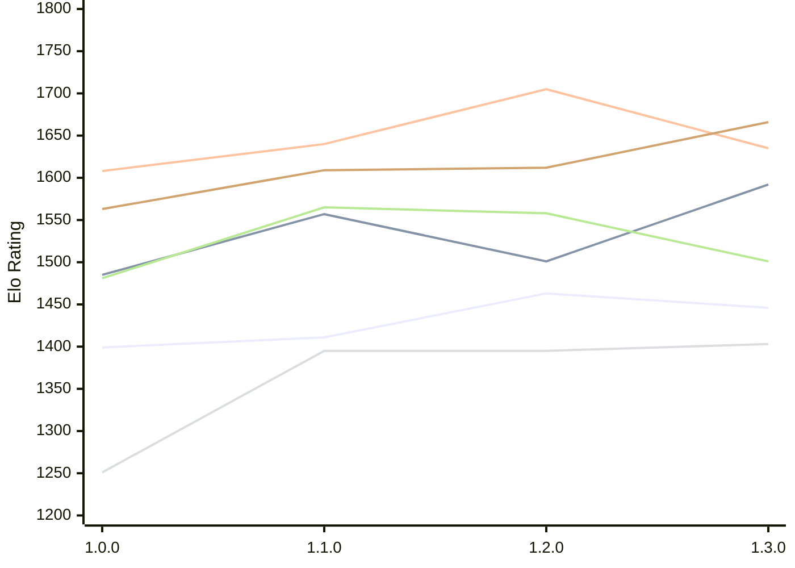

# Engine: Klak

Author: Daniele Marpino

Home: https://github.com/Spunc595/Klak

## Elo Ratings E1 (Ultra 7 265T (1.50 GHz) - E-Core)

| Version | Published | STC 8.0+0.08s  | LTC 60.0+0.60s | VLTC 2m24s+1.12s | Comment |
| --- | --- | --- | --- | --- | --- |
| 1.3.0 | 2026-11-16 | 1446(-17) | 1592(+91) | 1635(-70) |  |
| 1.2.0 | 2026-11-14 | 1463(+52) | 1501(-56) | 1705(+65) |  |
| 1.1.0 | 2026-11-08 | 1411(+12) | 1557(+72) | 1640(+32) |  |
| 1.0.0 | 2026-11-06 | 1399 | 1485 | 1608 |  |
 | | | cElo (∆ prev) | cElo (∆ prev) | cElo (∆ prev) | 

## Elo Ratings P1 (Ultra 7 265T (1.50 GHz) - P-Core)

| Version | Published | STC 8.0+0.08s  | LTC 60.0+0.60s | VLTC 2m24s+1.12s | Comment |
| --- | --- | --- | --- | --- | --- |
| 1.3.0 | 2026-11-16 | 1403(+8) | 1501(-57) | 1666(+54) |  |
| 1.2.0 | 2026-11-14 | 1395(0) | 1558(-7) | 1612(+3) |  |
| 1.1.0 | 2026-11-08 | 1395(+144) | 1565(+84) | 1609(+46) |  |
| 1.0.0 | 2026-11-06 | 1251 | 1481 | 1563 |  |
 | | | cElo (∆ prev) | cElo (∆ prev) | cElo (∆ prev) | 

## Elo Ratings T1 (i5-7500T 2.70GHz)

| Version | Published | STC 8.0+0.08s  | LTC 60.0+0.60s | VLTC 2m24s+1.12s | Comment |
| --- | --- | --- | --- | --- | --- |
| 1.0.0 | 2026-11-06 | 1251 | 1481 | 1563 |  |
 | | | cElo (∆ prev) | cElo (∆ prev) | cElo (∆ prev) | 

<a href="https://github.com/computer-chess-index/cci/issues/new?template=submit-version.yml&title=[VERSION]+Klak+<version>&body=###%20Engine%20name%0AKlak%0A%0A###%20Version%0A1.3.0" target="_blank">Submit new version</a>

 Test Conditions:

GUI/CLI: <a href=https://github.com/cutechess/cutechess target="_blank">Cute-Chess</a> 
Elo Calculation: <a href=https://www.remi-coulom.fr/Bayesian-Elo/ target="_blank">Bayesian-Elo</a> 
CPU for P1: Intel(R) Core(TM) Ultra 7 265T (1.50 GHz) - P-Core 
CPU for E1: Intel(R) Core(TM) Ultra 7 265T (1.50 GHz) - E-Core 
CPU for T1: Intel(R) Core(TM) i5-7500T 2.70GHz 
Opening book: 8_moves_v3 
\* STC: 8.0+0.08s, LTC: 60.0+0.60s, VLTC: 2m24s+1.12s

 Lists:
Ratings: <a href=https://github.com/computer-chess-index/cci/blob/main/lists/CCIRatings.csv target="_blank">Complete list</a>

Generated: 2026-11-19 05:39:26

## Ratings Verlauf E1 / P1

```mermaid
%%{init: {"theme":"base","themeVariables":{"seriesColors:['#a3a3a3','#222221','#faa371']}}}%%
xychart-beta
  x-axis ["1.0.0", "1.1.0", "1.2.0", "1.3.0"]
  y-axis "Elo Rating" 1200 --> 1800
  line "E1: STC (8.0+0.08s)" [1399, 1411, 1463, 1446]
  line "E1: LTC (60.0+0.60s)" [1485, 1557, 1501, 1592]
  line "E1: VLTC (2m24s+1.12s)" [1608, 1640, 1705, 1635]
  line "P1: STC (8.0+0.08s)" [1251, 1395, 1395, 1403]
  line "P1: LTC (60.0+0.60s)" [1481, 1565, 1558, 1501]
  line "P1: VLTC (2m24s+1.12s)" [1563, 1609, 1612, 1666]
```

## Detailed Evaluation Results

| Version | Time Control | Variant | Elo  | Range +/- | Matches | Score | Average Opponent Elo | Draws |
| --- | --- |--- | --- | --- | --- | --- | --- | --- |
| 1.3.0 | VLTC (2m24s+1.12s) | P1 | 1666 | 62 | 88 | 52% | 1648 | 24% |
|  |  | E1 | 1635 | 45 | 168 | 48% | 1656 | 23% |
|  | LTC (60.0+0.60s) | P1 | 1501 | 58 | 96 | 48% | 1520 | 31% |
|  |  | E1 | 1592 | 45 | 172 | 46% | 1635 | 22% |
|  | STC (8.0+0.08s) | P1 | 1403 | 68 | 72 | 51% | 1389 | 25% |
|  |  | E1 | 1446 | 45 | 170 | 44% | 1512 | 26% |
| --- | --- |--- | --- | --- | --- | --- | --- | --- |
| 1.2.0 | VLTC (2m24s+1.12s) | P1 | 1612 | 161 | 14 | 61% | 1500 | 7% |
|  |  | E1 | 1705 | 87 | 46 | 47% | 1737 | 20% |
|  | LTC (60.0+0.60s) | P1 | 1558 | 113 | 26 | 52% | 1536 | 19% |
|  |  | E1 | 1501 | 84 | 54 | 47% | 1532 | 9% |
|  | STC (8.0+0.08s) | P1 | 1395 | 117 | 24 | 48% | 1416 | 21% |
|  |  | E1 | 1463 | 75 | 60 | 50% | 1466 | 23% |
| --- | --- |--- | --- | --- | --- | --- | --- | --- |
| 1.1.0 | VLTC (2m24s+1.12s) | E1 | 1640 | 37 | 268 | 49% | 1654 | 19% |
|  |  | P1 | 1609 | 46 | 166 | 53% | 1571 | 19% |
|  | LTC (60.0+0.60s) | E1 | 1557 | 35 | 284 | 49% | 1563 | 23% |
|  |  | P1 | 1565 | 42 | 192 | 53% | 1539 | 24% |
|  | STC (8.0+0.08s) | E1 | 1411 | 38 | 252 | 47% | 1436 | 22% |
|  |  | P1 | 1395 | 38 | 250 | 57% | 1322 | 20% |
| --- | --- |--- | --- | --- | --- | --- | --- | --- |
| 1.0.0 | VLTC (2m24s+1.12s) | P1 | 1563 | 45 | 176 | 65% | 1358 | 36% |
|  |  | E1 | 1608 | 34 | 312 | 57% | 1472 | 34% |
|  | LTC (60.0+0.60s) | P1 | 1481 | 41 | 212 | 60% | 1339 | 31% |
|  |  | E1 | 1485 | 35 | 280 | 60% | 1338 | 41% |
|  | STC (8.0+0.08s) | P1 | 1251 | 42 | 196 | 65% | 1060 | 38% |
|  |  | E1 | 1399 | 34 | 304 | 60% | 1257 | 38% |