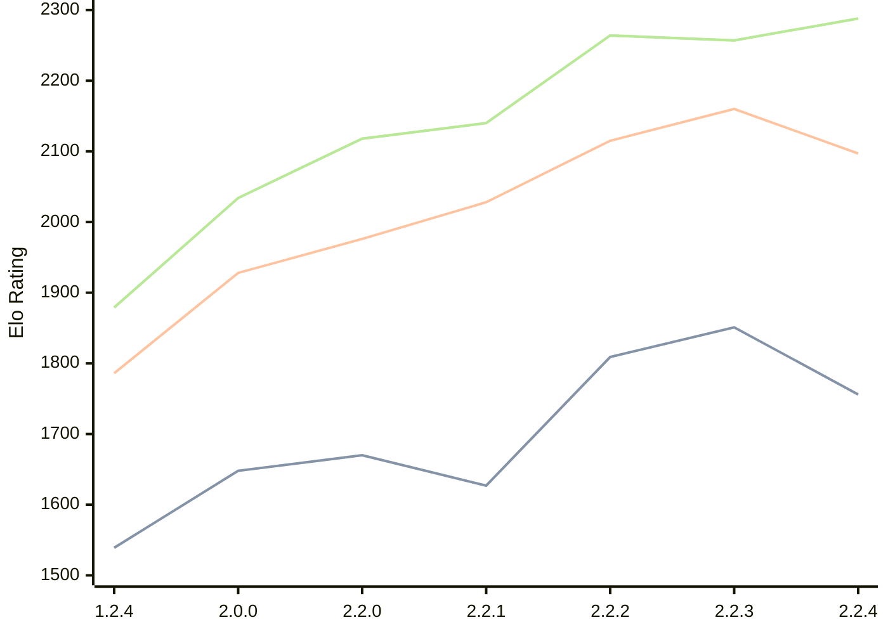

# Engine: Kreveta

Author: Daniel Michna

Home: https://github.com/ZlomenyMesic/Kreveta

## Ratings nach Version

| Version | Published | STC 8.0+0.08s  | LTC 60.0+0.60s | VLTC 2m24s+1.12s | Comment |
| --- | --- | --- | --- | --- | --- |
| 2.2.4 | 2026-03-05 | 1756(-95) | 2097(-63) | 2288(+31) |  |
| 2.2.3 | 2026-02-05 | 1851(+42) | 2160(+45) | 2257(-7) |  |
| 2.2.2 | 2026-01-13 | 1809(+182) | 2115(+87) | 2264(+124) |  |
| 2.2.1 | 2025-12-25 | 1627(-43) | 2028(+52) | 2140(+22) |  |
| 2.2.0 | 2025-12-23 | 1670(+22) | 1976(+48) | 2118(+84) |  |
| 2.0.0 | 2025-12-01 | 1648(+109) | 1928(+142) | 2034(+155) |  |
| 1.2.4 | 2025-11-17 | 1539(+new) | 1786(+new) | 1879(+new) |  |
| 1.2.3 | 2025-10-31 |  |  |  |  |
| 1.1.3 | 2025-10-26 |  |  |  |  |
| 1.0 | 2025-09-10 |  |  |  |  |
 | | | cElo (∆ prev) | cElo (∆ prev) | cElo (∆ prev) | 

 Test Conditions:

GUI/CLI: <a href=https://github.com/cutechess/cutechess target="_blank">Cute-Chess</a> 
Elo Calculation: <a href=https://www.remi-coulom.fr/Bayesian-Elo/ target="_blank">Bayesian-Elo</a> 
CPU: Intel(R) Core(TM) i5-7500T 2.70GHz 
Opening book: 8_moves_v3 
\* STC: 8.0+0.08s, LTC: 60.0+0.60s, VLTC: 2m24s+1.12s

 Lists:
Ratings: <a href=https://github.com/computer-chess-index/cci/blob/main/lists/CCIRatings.csv target="_blank">Complete list</a>

Generated: 2026-03-05 15:10:05

## Ratings Verlauf

⬛ STC (8.0+0.08s) &nbsp;&nbsp; 🟧 LTC (60.0+0.60s) &nbsp;&nbsp; 🟩 VLTC (2m24s+1.12s)

