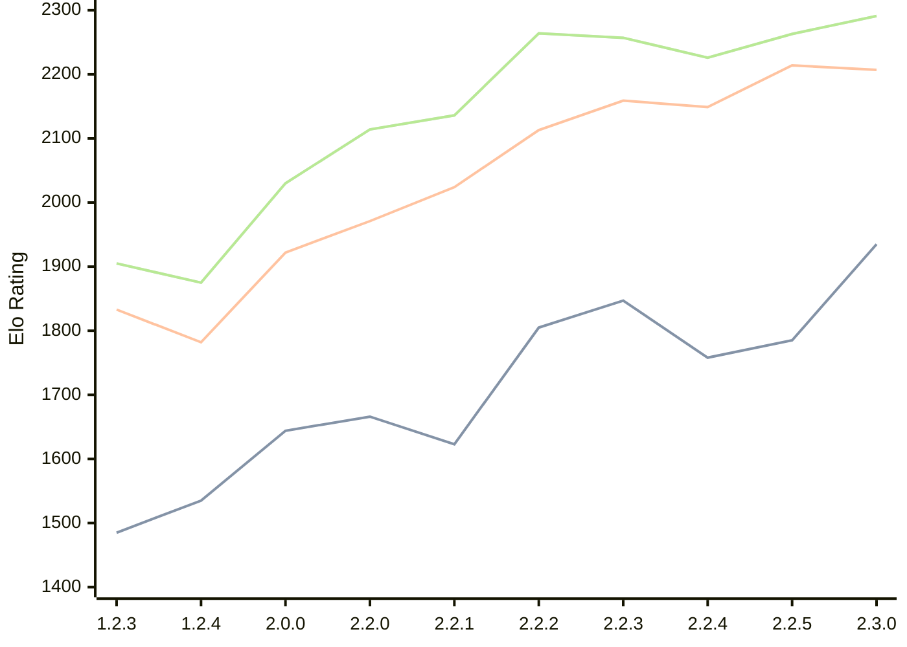

# Engine: Kreveta

Author: Daniel Michna

Home: https://github.com/ZlomenyMesic/Kreveta

## Elo Ratings

| Version | Published | STC 8.0+0.08s  | LTC 60.0+0.60s | VLTC 2m24s+1.12s | Comment |
| --- | --- | --- | --- | --- | --- |
| 2.3.0 | 2026-04-20 | 1935(+150) | 2207(-7) | 2291(+28) |  |
| 2.2.5 | 2026-03-15 | 1785(+27) | 2214(+65) | 2263(+37) |  |
| 2.2.4 | 2026-03-05 | 1758(-89) | 2149(-10) | 2226(-31) |  |
| 2.2.3 | 2026-02-05 | 1847(+42) | 2159(+46) | 2257(-7) |  |
| 2.2.2 | 2026-01-13 | 1805(+182) | 2113(+89) | 2264(+128) |  |
| 2.2.1 | 2025-12-25 | 1623(-43) | 2024(+53) | 2136(+22) |  |
| 2.2.0 | 2025-12-23 | 1666(+22) | 1971(+49) | 2114(+84) |  |
| 2.0.0 | 2025-12-01 | 1644(+109) | 1922(+140) | 2030(+155) |  |
| 1.2.4 | 2025-11-17 | 1535(+50) | 1782(-51) | 1875(-30) |  |
| 1.2.3 | 2025-10-31 | 1485(+new) | 1833(+new) | 1905(+new) |  |
| 1.1.3 | 2025-10-26 |  |  |  |  |
| 1.0 | 2025-09-10 |  |  |  |  |
 | | | cElo (∆ prev) | cElo (∆ prev) | cElo (∆ prev) | 

<a href="https://github.com/computer-chess-index/cci/issues/new?template=submit-version.yml&title=[VERSION]+Kreveta+<version>&body=###%20Engine%20name%0AKreveta%0A%0A###%20Version%0A2.3.0" target="_blank">Submit new version</a>

 Test Conditions:

GUI/CLI: <a href=https://github.com/cutechess/cutechess target="_blank">Cute-Chess</a> 
Elo Calculation: <a href=https://www.remi-coulom.fr/Bayesian-Elo/ target="_blank">Bayesian-Elo</a> 
CPU: Intel(R) Core(TM) i5-7500T 2.70GHz 
Opening book: 8_moves_v3 
\* STC: 8.0+0.08s, LTC: 60.0+0.60s, VLTC: 2m24s+1.12s

 Lists:
Ratings: <a href=https://github.com/computer-chess-index/cci/blob/main/lists/CCIRatings.csv target="_blank">Complete list</a>

Generated: 2026-05-07 06:25:20

## Ratings Verlauf

⬛ STC (8.0+0.08s) &nbsp;&nbsp; 🟧 LTC (60.0+0.60s) &nbsp;&nbsp; 🟩 VLTC (2m24s+1.12s)

dark mode: 🟩STC (8.0+0.08s) 🟧LTC (60.0+0.60s) ⬜VLTC (2m24s+1.12s)

## Detailed Evaluation Results

| Version | Time Control | Elo  | Range +/- | Matches | Score | Average Opponent Elo | Draws |
| --- | --- | --- | --- | --- | --- | --- | --- |
| 2.3.0 | VLTC (2m24s+1.12s) | 2291 | 35 | 272 | 51% | 2279 | 28% |
| 2.3.0 | LTC (60.0+0.60s) | 2207 | 37 | 254 | 48% | 2223 | 23% |
| 2.3.0 | STC (8.0+0.08s) | 1935 | 33 | 328 | 49% | 1932 | 22% |
| --- | --- | --- | --- | --- | --- | --- | --- |
| 2.2.5 | VLTC (2m24s+1.12s) | 2263 | 32 | 346 | 50% | 2265 | 18% |
| 2.2.5 | LTC (60.0+0.60s) | 2214 | 32 | 340 | 48% | 2228 | 25% |
| 2.2.5 | STC (8.0+0.08s) | 1785 | 32 | 352 | 52% | 1750 | 21% |
| --- | --- | --- | --- | --- | --- | --- | --- |
| 2.2.4 | VLTC (2m24s+1.12s) | 2226 | 38 | 230 | 49% | 2237 | 29% |
| 2.2.4 | LTC (60.0+0.60s) | 2149 | 37 | 248 | 54% | 2110 | 25% |
| 2.2.4 | STC (8.0+0.08s) | 1758 | 42 | 204 | 51% | 1752 | 22% |
| --- | --- | --- | --- | --- | --- | --- | --- |
| 2.2.3 | VLTC (2m24s+1.12s) | 2257 | 35 | 288 | 48% | 2275 | 26% |
| 2.2.3 | LTC (60.0+0.60s) | 2159 | 36 | 260 | 48% | 2180 | 24% |
| 2.2.3 | STC (8.0+0.08s) | 1847 | 37 | 252 | 48% | 1864 | 22% |
| --- | --- | --- | --- | --- | --- | --- | --- |
| 2.2.2 | VLTC (2m24s+1.12s) | 2264 | 37 | 256 | 52% | 2244 | 25% |
| 2.2.2 | LTC (60.0+0.60s) | 2113 | 41 | 216 | 49% | 2121 | 21% |
| 2.2.2 | STC (8.0+0.08s) | 1805 | 41 | 212 | 54% | 1771 | 19% |
| --- | --- | --- | --- | --- | --- | --- | --- |
| 2.2.1 | VLTC (2m24s+1.12s) | 2136 | 48 | 148 | 50% | 2130 | 22% |
| 2.2.1 | LTC (60.0+0.60s) | 2024 | 44 | 180 | 49% | 2037 | 21% |
| 2.2.1 | STC (8.0+0.08s) | 1623 | 56 | 110 | 52% | 1605 | 22% |
| --- | --- | --- | --- | --- | --- | --- | --- |
| 2.2.0 | VLTC (2m24s+1.12s) | 2114 | 52 | 124 | 52% | 2101 | 26% |
| 2.2.0 | LTC (60.0+0.60s) | 1971 | 64 | 84 | 55% | 1925 | 21% |
| 2.2.0 | STC (8.0+0.08s) | 1666 | 50 | 148 | 55% | 1616 | 18% |
| --- | --- | --- | --- | --- | --- | --- | --- |
| 2.0.0 | VLTC (2m24s+1.12s) | 2030 | 51 | 136 | 52% | 2012 | 24% |
| 2.0.0 | LTC (60.0+0.60s) | 1922 | 53 | 132 | 52% | 1905 | 17% |
| 2.0.0 | STC (8.0+0.08s) | 1644 | 46 | 172 | 48% | 1669 | 16% |
| --- | --- | --- | --- | --- | --- | --- | --- |
| 1.2.4 | VLTC (2m24s+1.12s) | 1875 | 52 | 158 | 42% | 2016 | 9% |
| 1.2.4 | LTC (60.0+0.60s) | 1782 | 60 | 110 | 48% | 1817 | 12% |
| 1.2.4 | STC (8.0+0.08s) | 1535 | 61 | 108 | 48% | 1563 | 9% |
| --- | --- | --- | --- | --- | --- | --- | --- |
| 1.2.3 | VLTC (2m24s+1.12s) | 1905 | 35 | 306 | 52% | 1889 | 18% |
| 1.2.3 | LTC (60.0+0.60s) | 1833 | 35 | 304 | 53% | 1809 | 19% |
| 1.2.3 | STC (8.0+0.08s) | 1485 | 34 | 316 | 50% | 1476 | 22% |
| --- | --- | --- | --- | --- | --- | --- | --- |