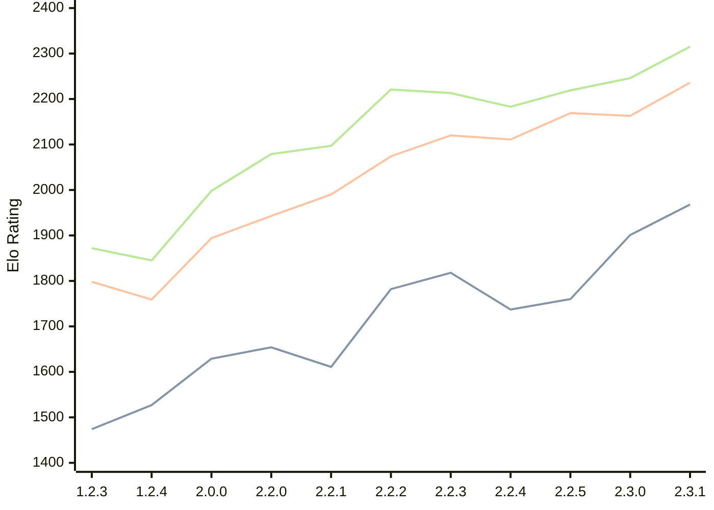

# Engine: Kreveta

Author: Daniel Michna

Home: https://github.com/ZlomenyMesic/Kreveta

## Elo Ratings

| Version | Published | STC 8.0+0.08s  | LTC 60.0+0.60s | VLTC 2m24s+1.12s | Comment |
| --- | --- | --- | --- | --- | --- |
| 2.3.1 | 2026-05-12 | 1968(+67) | 2236(+73) | 2315(+69) |  |
| 2.3.0 | 2026-04-20 | 1901(+141) | 2163(-6) | 2246(+27) |  |
| 2.2.5 | 2026-03-15 | 1760(+23) | 2169(+58) | 2219(+36) |  |
| 2.2.4 | 2026-03-05 | 1737(-81) | 2111(-9) | 2183(-30) |  |
| 2.2.3 | 2026-02-05 | 1818(+36) | 2120(+46) | 2213(-8) |  |
| 2.2.2 | 2026-01-13 | 1782(+171) | 2074(+84) | 2221(+124) |  |
| 2.2.1 | 2025-12-25 | 1611(-43) | 1990(+47) | 2097(+18) |  |
| 2.2.0 | 2025-12-23 | 1654(+25) | 1943(+49) | 2079(+81) |  |
| 2.0.0 | 2025-12-01 | 1629(+102) | 1894(+135) | 1998(+153) |  |
| 1.2.4 | 2025-11-17 | 1527(+53) | 1759(-39) | 1845(-27) |  |
| 1.2.3 | 2025-10-31 | 1474(+new) | 1798(+new) | 1872(+new) |  |
| 1.1.3 | 2025-10-26 |  |  |  |  |
| 1.0 | 2025-09-10 |  |  |  |  |
 | | | cElo (∆ prev) | cElo (∆ prev) | cElo (∆ prev) | 

<a href="https://github.com/computer-chess-index/cci/issues/new?template=submit-version.yml&title=[VERSION]+Kreveta+<version>&body=###%20Engine%20name%0AKreveta%0A%0A###%20Version%0A2.3.1" target="_blank">Submit new version</a>

 Test Conditions:

GUI/CLI: <a href=https://github.com/cutechess/cutechess target="_blank">Cute-Chess</a> 
Elo Calculation: <a href=https://www.remi-coulom.fr/Bayesian-Elo/ target="_blank">Bayesian-Elo</a> 
CPU: Intel(R) Core(TM) i5-7500T 2.70GHz 
Opening book: 8_moves_v3 
\* STC: 8.0+0.08s, LTC: 60.0+0.60s, VLTC: 2m24s+1.12s

 Lists:
Ratings: <a href=https://github.com/computer-chess-index/cci/blob/main/lists/CCIRatings.csv target="_blank">Complete list</a>

Generated: 2026-09-25 04:39:36

## Ratings Verlauf

## Detailed Evaluation Results

| Version | Time Control | Elo  | Range +/- | Matches | Score | Average Opponent Elo | Draws |
| --- | --- | --- | --- | --- | --- | --- | --- |
| 2.3.1 | VLTC (2m24s+1.12s) | 2315 | 29 | 400 | 51% | 2298 | 28% |
| 2.3.1 | LTC (60.0+0.60s) | 2236 | 29 | 416 | 49% | 2246 | 26% |
| 2.3.1 | STC (8.0+0.08s) | 1968 | 27 | 490 | 49% | 1971 | 23% |
| --- | --- | --- | --- | --- | --- | --- | --- |
| 2.3.0 | VLTC (2m24s+1.12s) | 2246 | 35 | 272 | 51% | 2234 | 28% |
| 2.3.0 | LTC (60.0+0.60s) | 2163 | 37 | 254 | 48% | 2180 | 23% |
| 2.3.0 | STC (8.0+0.08s) | 1901 | 33 | 328 | 49% | 1899 | 22% |
| --- | --- | --- | --- | --- | --- | --- | --- |
| 2.2.5 | VLTC (2m24s+1.12s) | 2219 | 32 | 346 | 50% | 2222 | 18% |
| 2.2.5 | LTC (60.0+0.60s) | 2169 | 32 | 340 | 48% | 2184 | 25% |
| 2.2.5 | STC (8.0+0.08s) | 1760 | 32 | 352 | 52% | 1725 | 21% |
| --- | --- | --- | --- | --- | --- | --- | --- |
| 2.2.4 | VLTC (2m24s+1.12s) | 2183 | 38 | 230 | 49% | 2194 | 29% |
| 2.2.4 | LTC (60.0+0.60s) | 2111 | 37 | 248 | 54% | 2072 | 25% |
| 2.2.4 | STC (8.0+0.08s) | 1737 | 42 | 204 | 51% | 1731 | 22% |
| --- | --- | --- | --- | --- | --- | --- | --- |
| 2.2.3 | VLTC (2m24s+1.12s) | 2213 | 35 | 288 | 48% | 2232 | 26% |
| 2.2.3 | LTC (60.0+0.60s) | 2120 | 36 | 260 | 48% | 2141 | 24% |
| 2.2.3 | STC (8.0+0.08s) | 1818 | 37 | 252 | 48% | 1836 | 22% |
| --- | --- | --- | --- | --- | --- | --- | --- |
| 2.2.2 | VLTC (2m24s+1.12s) | 2221 | 37 | 256 | 52% | 2201 | 25% |
| 2.2.2 | LTC (60.0+0.60s) | 2074 | 40 | 216 | 49% | 2082 | 21% |
| 2.2.2 | STC (8.0+0.08s) | 1782 | 41 | 212 | 54% | 1750 | 19% |
| --- | --- | --- | --- | --- | --- | --- | --- |
| 2.2.1 | VLTC (2m24s+1.12s) | 2097 | 48 | 148 | 50% | 2091 | 22% |
| 2.2.1 | LTC (60.0+0.60s) | 1990 | 44 | 180 | 49% | 2002 | 21% |
| 2.2.1 | STC (8.0+0.08s) | 1611 | 56 | 110 | 52% | 1593 | 22% |
| --- | --- | --- | --- | --- | --- | --- | --- |
| 2.2.0 | VLTC (2m24s+1.12s) | 2079 | 52 | 124 | 52% | 2064 | 26% |
| 2.2.0 | LTC (60.0+0.60s) | 1943 | 64 | 84 | 55% | 1897 | 21% |
| 2.2.0 | STC (8.0+0.08s) | 1654 | 50 | 148 | 55% | 1604 | 18% |
| --- | --- | --- | --- | --- | --- | --- | --- |
| 2.0.0 | VLTC (2m24s+1.12s) | 1998 | 51 | 136 | 52% | 1978 | 24% |
| 2.0.0 | LTC (60.0+0.60s) | 1894 | 52 | 132 | 52% | 1877 | 17% |
| 2.0.0 | STC (8.0+0.08s) | 1629 | 46 | 172 | 48% | 1652 | 16% |
| --- | --- | --- | --- | --- | --- | --- | --- |
| 1.2.4 | VLTC (2m24s+1.12s) | 1845 | 52 | 158 | 42% | 1986 | 9% |
| 1.2.4 | LTC (60.0+0.60s) | 1759 | 60 | 110 | 48% | 1793 | 12% |
| 1.2.4 | STC (8.0+0.08s) | 1527 | 61 | 108 | 48% | 1554 | 9% |
| --- | --- | --- | --- | --- | --- | --- | --- |
| 1.2.3 | VLTC (2m24s+1.12s) | 1872 | 34 | 324 | 52% | 1859 | 19% |
| 1.2.3 | LTC (60.0+0.60s) | 1798 | 34 | 316 | 52% | 1785 | 19% |
| 1.2.3 | STC (8.0+0.08s) | 1474 | 34 | 316 | 50% | 1466 | 22% |
| --- | --- | --- | --- | --- | --- | --- | --- |