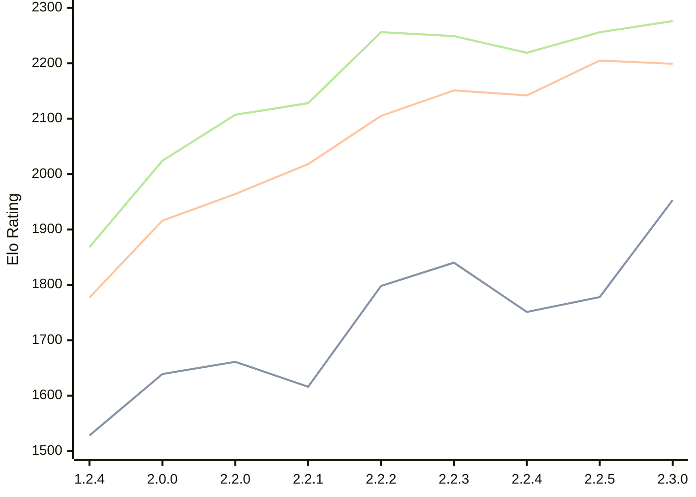

# Engine: Kreveta

Author: Daniel Michna

Home: https://github.com/ZlomenyMesic/Kreveta

## Ratings nach Version

| Version | Published | STC 8.0+0.08s  | LTC 60.0+0.60s | VLTC 2m24s+1.12s | Comment |
| --- | --- | --- | --- | --- | --- |
| 2.3.0 | 2026-04-20 | 1953(+175) | 2199(-6) | 2276(+20) |  |
| 2.2.5 | 2026-03-15 | 1778(+27) | 2205(+63) | 2256(+37) |  |
| 2.2.4 | 2026-03-05 | 1751(-89) | 2142(-9) | 2219(-30) |  |
| 2.2.3 | 2026-02-05 | 1840(+42) | 2151(+46) | 2249(-7) |  |
| 2.2.2 | 2026-01-13 | 1798(+182) | 2105(+87) | 2256(+128) |  |
| 2.2.1 | 2025-12-25 | 1616(-45) | 2018(+54) | 2128(+21) |  |
| 2.2.0 | 2025-12-23 | 1661(+22) | 1964(+48) | 2107(+83) |  |
| 2.0.0 | 2025-12-01 | 1639(+111) | 1916(+139) | 2024(+156) |  |
| 1.2.4 | 2025-11-17 | 1528(+new) | 1777(+new) | 1868(+new) |  |
| 1.2.3 | 2025-10-31 |  |  |  |  |
| 1.1.3 | 2025-10-26 |  |  |  |  |
| 1.0 | 2025-09-10 |  |  |  |  |
 | | | cElo (∆ prev) | cElo (∆ prev) | cElo (∆ prev) | 

<a href="https://github.com/computer-chess-index/cci/issues/new?template=submit-version.yml&title=[VERSION]+Kreveta+<version>&body=###%20Engine%20name%0AKreveta%0A%0A###%20Version%0A2.3.0" target="_blank">Submit new version</a>

 Test Conditions:

GUI/CLI: <a href=https://github.com/cutechess/cutechess target="_blank">Cute-Chess</a> 
Elo Calculation: <a href=https://www.remi-coulom.fr/Bayesian-Elo/ target="_blank">Bayesian-Elo</a> 
CPU: Intel(R) Core(TM) i5-7500T 2.70GHz 
Opening book: 8_moves_v3 
\* STC: 8.0+0.08s, LTC: 60.0+0.60s, VLTC: 2m24s+1.12s

 Lists:
Ratings: <a href=https://github.com/computer-chess-index/cci/blob/main/lists/CCIRatings.csv target="_blank">Complete list</a>

Generated: 2026-04-23 06:25:09

## Ratings Verlauf

⬛ STC (8.0+0.08s) &nbsp;&nbsp; 🟧 LTC (60.0+0.60s) &nbsp;&nbsp; 🟩 VLTC (2m24s+1.12s)

dark mode: 🟩STC (8.0+0.08s) 🟧LTC (60.0+0.60s) ⬜VLTC (2m24s+1.12s)

