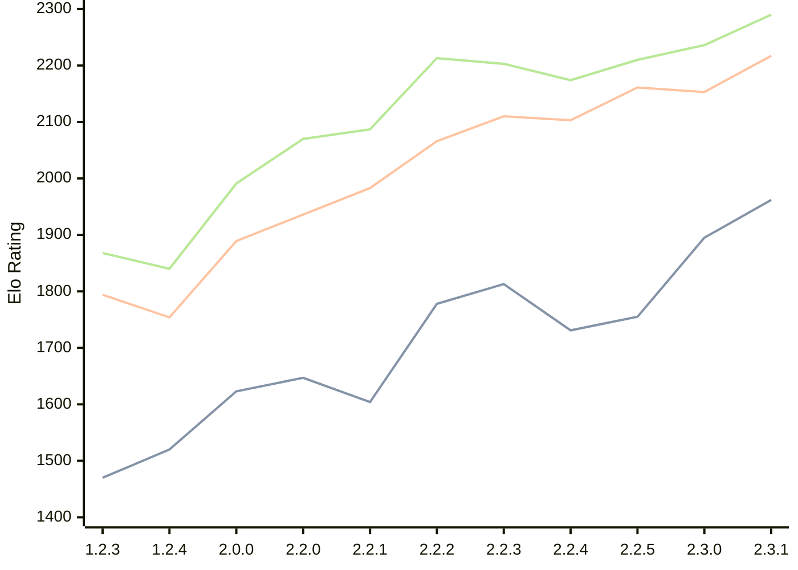

# Engine: Kreveta

Author: Daniel Michna

Home: https://github.com/ZlomenyMesic/Kreveta

## Elo Ratings

| Version | Published | STC 8.0+0.08s  | LTC 60.0+0.60s | VLTC 2m24s+1.12s | Comment |
| --- | --- | --- | --- | --- | --- |
| 2.3.1 | 2026-05-12 | 1962(+67) | 2217(+64) | 2290(+54) |  |
| 2.3.0 | 2026-04-20 | 1895(+140) | 2153(-8) | 2236(+26) |  |
| 2.2.5 | 2026-03-15 | 1755(+24) | 2161(+58) | 2210(+36) |  |
| 2.2.4 | 2026-03-05 | 1731(-82) | 2103(-7) | 2174(-29) |  |
| 2.2.3 | 2026-02-05 | 1813(+35) | 2110(+44) | 2203(-10) |  |
| 2.2.2 | 2026-01-13 | 1778(+174) | 2066(+83) | 2213(+126) |  |
| 2.2.1 | 2025-12-25 | 1604(-43) | 1983(+47) | 2087(+17) |  |
| 2.2.0 | 2025-12-23 | 1647(+24) | 1936(+47) | 2070(+79) |  |
| 2.0.0 | 2025-12-01 | 1623(+103) | 1889(+135) | 1991(+151) |  |
| 1.2.4 | 2025-11-17 | 1520(+50) | 1754(-40) | 1840(-28) |  |
| 1.2.3 | 2025-10-31 | 1470(+new) | 1794(+new) | 1868(+new) |  |
| 1.1.3 | 2025-10-26 |  |  |  |  |
| 1.0 | 2025-09-10 |  |  |  |  |
 | | | cElo (∆ prev) | cElo (∆ prev) | cElo (∆ prev) | 

<a href="https://github.com/computer-chess-index/cci/issues/new?template=submit-version.yml&title=[VERSION]+Kreveta+<version>&body=###%20Engine%20name%0AKreveta%0A%0A###%20Version%0A2.3.1" target="_blank">Submit new version</a>

 Test Conditions:

GUI/CLI: <a href=https://github.com/cutechess/cutechess target="_blank">Cute-Chess</a> 
Elo Calculation: <a href=https://www.remi-coulom.fr/Bayesian-Elo/ target="_blank">Bayesian-Elo</a> 
CPU: Intel(R) Core(TM) i5-7500T 2.70GHz 
Opening book: 8_moves_v3 
\* STC: 8.0+0.08s, LTC: 60.0+0.60s, VLTC: 2m24s+1.12s

 Lists:
Ratings: <a href=https://github.com/computer-chess-index/cci/blob/main/lists/CCIRatings.csv target="_blank">Complete list</a>

Generated: 2026-05-21 06:25:28

## Ratings Verlauf

⬛ STC (8.0+0.08s) &nbsp;&nbsp; 🟧 LTC (60.0+0.60s) &nbsp;&nbsp; 🟩 VLTC (2m24s+1.12s)

dark mode: 🟩STC (8.0+0.08s) 🟧LTC (60.0+0.60s) ⬜VLTC (2m24s+1.12s)

## Detailed Evaluation Results

| Version | Time Control | Elo  | Range +/- | Matches | Score | Average Opponent Elo | Draws |
| --- | --- | --- | --- | --- | --- | --- | --- |
| 2.3.1 | VLTC (2m24s+1.12s) | 2290 | 34 | 304 | 49% | 2287 | 25% |
| 2.3.1 | LTC (60.0+0.60s) | 2217 | 34 | 292 | 48% | 2230 | 28% |
| 2.3.1 | STC (8.0+0.08s) | 1962 | 33 | 326 | 49% | 1962 | 24% |
| --- | --- | --- | --- | --- | --- | --- | --- |
| 2.3.0 | VLTC (2m24s+1.12s) | 2236 | 35 | 272 | 51% | 2223 | 28% |
| 2.3.0 | LTC (60.0+0.60s) | 2153 | 37 | 254 | 48% | 2169 | 23% |
| 2.3.0 | STC (8.0+0.08s) | 1895 | 33 | 328 | 49% | 1894 | 22% |
| --- | --- | --- | --- | --- | --- | --- | --- |
| 2.2.5 | VLTC (2m24s+1.12s) | 2210 | 32 | 346 | 50% | 2213 | 18% |
| 2.2.5 | LTC (60.0+0.60s) | 2161 | 32 | 340 | 48% | 2175 | 25% |
| 2.2.5 | STC (8.0+0.08s) | 1755 | 32 | 352 | 52% | 1721 | 21% |
| --- | --- | --- | --- | --- | --- | --- | --- |
| 2.2.4 | VLTC (2m24s+1.12s) | 2174 | 38 | 230 | 49% | 2186 | 29% |
| 2.2.4 | LTC (60.0+0.60s) | 2103 | 37 | 248 | 54% | 2063 | 25% |
| 2.2.4 | STC (8.0+0.08s) | 1731 | 42 | 204 | 51% | 1725 | 22% |
| --- | --- | --- | --- | --- | --- | --- | --- |
| 2.2.3 | VLTC (2m24s+1.12s) | 2203 | 35 | 288 | 48% | 2222 | 26% |
| 2.2.3 | LTC (60.0+0.60s) | 2110 | 36 | 260 | 48% | 2132 | 24% |
| 2.2.3 | STC (8.0+0.08s) | 1813 | 37 | 252 | 48% | 1831 | 22% |
| --- | --- | --- | --- | --- | --- | --- | --- |
| 2.2.2 | VLTC (2m24s+1.12s) | 2213 | 37 | 256 | 52% | 2191 | 25% |
| 2.2.2 | LTC (60.0+0.60s) | 2066 | 40 | 216 | 49% | 2074 | 21% |
| 2.2.2 | STC (8.0+0.08s) | 1778 | 41 | 212 | 54% | 1744 | 19% |
| --- | --- | --- | --- | --- | --- | --- | --- |
| 2.2.1 | VLTC (2m24s+1.12s) | 2087 | 48 | 148 | 50% | 2082 | 22% |
| 2.2.1 | LTC (60.0+0.60s) | 1983 | 44 | 180 | 49% | 1995 | 21% |
| 2.2.1 | STC (8.0+0.08s) | 1604 | 56 | 110 | 52% | 1586 | 22% |
| --- | --- | --- | --- | --- | --- | --- | --- |
| 2.2.0 | VLTC (2m24s+1.12s) | 2070 | 52 | 124 | 52% | 2055 | 26% |
| 2.2.0 | LTC (60.0+0.60s) | 1936 | 64 | 84 | 55% | 1890 | 21% |
| 2.2.0 | STC (8.0+0.08s) | 1647 | 50 | 148 | 55% | 1597 | 18% |
| --- | --- | --- | --- | --- | --- | --- | --- |
| 2.0.0 | VLTC (2m24s+1.12s) | 1991 | 51 | 136 | 52% | 1971 | 24% |
| 2.0.0 | LTC (60.0+0.60s) | 1889 | 52 | 132 | 52% | 1871 | 17% |
| 2.0.0 | STC (8.0+0.08s) | 1623 | 46 | 172 | 48% | 1646 | 16% |
| --- | --- | --- | --- | --- | --- | --- | --- |
| 1.2.4 | VLTC (2m24s+1.12s) | 1840 | 52 | 158 | 42% | 1979 | 9% |
| 1.2.4 | LTC (60.0+0.60s) | 1754 | 60 | 110 | 48% | 1787 | 12% |
| 1.2.4 | STC (8.0+0.08s) | 1520 | 61 | 108 | 48% | 1548 | 9% |
| --- | --- | --- | --- | --- | --- | --- | --- |
| 1.2.3 | VLTC (2m24s+1.12s) | 1868 | 34 | 324 | 52% | 1854 | 19% |
| 1.2.3 | LTC (60.0+0.60s) | 1794 | 34 | 316 | 52% | 1781 | 19% |
| 1.2.3 | STC (8.0+0.08s) | 1470 | 34 | 316 | 50% | 1462 | 22% |
| --- | --- | --- | --- | --- | --- | --- | --- |