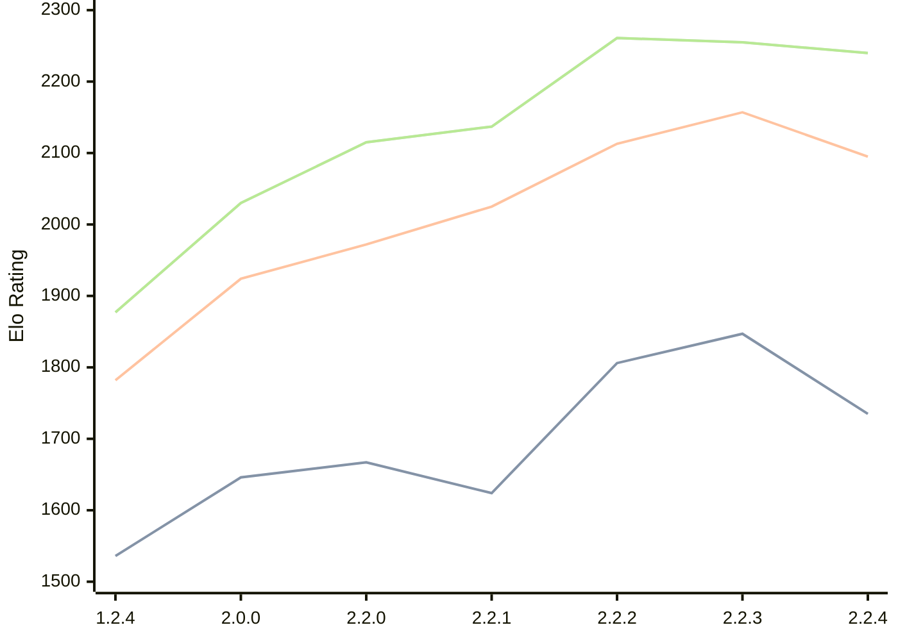

# Engine: Kreveta

Author: Daniel Michna

Home: https://github.com/ZlomenyMesic/Kreveta

## Ratings nach Version

| Version | Published | STC 8.0+0.08s  | LTC 60.0+0.60s | VLTC 2m24s+1.12s | Comment |
| --- | --- | --- | --- | --- | --- |
| 2.2.4 | 2026-03-05 | 1735(-112) | 2095(-62) | 2240(-15) |  |
| 2.2.3 | 2026-02-05 | 1847(+41) | 2157(+44) | 2255(-6) |  |
| 2.2.2 | 2026-01-13 | 1806(+182) | 2113(+88) | 2261(+124) |  |
| 2.2.1 | 2025-12-25 | 1624(-43) | 2025(+53) | 2137(+22) |  |
| 2.2.0 | 2025-12-23 | 1667(+21) | 1972(+48) | 2115(+85) |  |
| 2.0.0 | 2025-12-01 | 1646(+110) | 1924(+142) | 2030(+153) |  |
| 1.2.4 | 2025-11-17 | 1536(+new) | 1782(+new) | 1877(+new) |  |
| 1.2.3 | 2025-10-31 |  |  |  |  |
| 1.1.3 | 2025-10-26 |  |  |  |  |
| 1.0 | 2025-09-10 |  |  |  |  |
 | | | cElo (∆ prev) | cElo (∆ prev) | cElo (∆ prev) | 

 Test Conditions:

GUI/CLI: <a href=https://github.com/cutechess/cutechess target="_blank">Cute-Chess</a> 
Elo Calculation: <a href=https://www.remi-coulom.fr/Bayesian-Elo/ target="_blank">Bayesian-Elo</a> 
CPU: Intel(R) Core(TM) i5-7500T 2.70GHz 
Opening book: 8_moves_v3 
\* STC: 8.0+0.08s, LTC: 60.0+0.60s, VLTC: 2m24s+1.12s

 Lists:
Ratings: <a href=https://github.com/computer-chess-index/cci/blob/main/lists/CCIRatings.csv target="_blank">Complete list</a>

Generated: 2026-03-10 06:24:22

## Ratings Verlauf

⬛ STC (8.0+0.08s) &nbsp;&nbsp; 🟧 LTC (60.0+0.60s) &nbsp;&nbsp; 🟩 VLTC (2m24s+1.12s)

