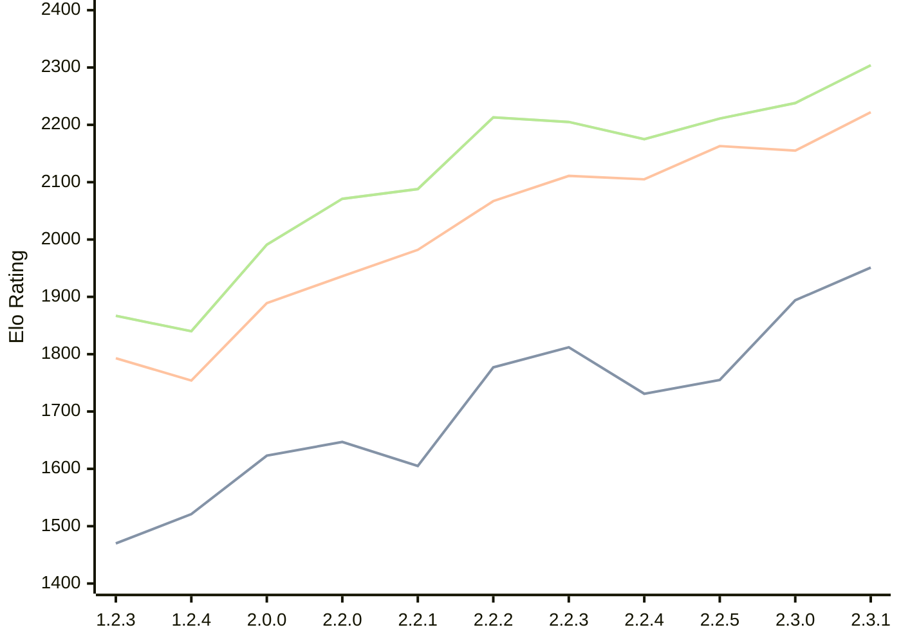

# Engine: Kreveta

Author: Daniel Michna

Home: https://github.com/ZlomenyMesic/Kreveta

## Elo Ratings

| Version | Published | STC 8.0+0.08s  | LTC 60.0+0.60s | VLTC 2m24s+1.12s | Comment |
| --- | --- | --- | --- | --- | --- |
| 2.3.1 | 2026-05-12 | 1951(+57) | 2222(+67) | 2304(+66) |  |
| 2.3.0 | 2026-04-20 | 1894(+139) | 2155(-8) | 2238(+27) |  |
| 2.2.5 | 2026-03-15 | 1755(+24) | 2163(+58) | 2211(+36) |  |
| 2.2.4 | 2026-03-05 | 1731(-81) | 2105(-6) | 2175(-30) |  |
| 2.2.3 | 2026-02-05 | 1812(+35) | 2111(+44) | 2205(-8) |  |
| 2.2.2 | 2026-01-13 | 1777(+172) | 2067(+85) | 2213(+125) |  |
| 2.2.1 | 2025-12-25 | 1605(-42) | 1982(+46) | 2088(+17) |  |
| 2.2.0 | 2025-12-23 | 1647(+24) | 1936(+47) | 2071(+80) |  |
| 2.0.0 | 2025-12-01 | 1623(+102) | 1889(+135) | 1991(+151) |  |
| 1.2.4 | 2025-11-17 | 1521(+51) | 1754(-39) | 1840(-27) |  |
| 1.2.3 | 2025-10-31 | 1470(+new) | 1793(+new) | 1867(+new) |  |
| 1.1.3 | 2025-10-26 |  |  |  |  |
| 1.0 | 2025-09-10 |  |  |  |  |
 | | | cElo (∆ prev) | cElo (∆ prev) | cElo (∆ prev) | 

<a href="https://github.com/computer-chess-index/cci/issues/new?template=submit-version.yml&title=[VERSION]+Kreveta+<version>&body=###%20Engine%20name%0AKreveta%0A%0A###%20Version%0A2.3.1" target="_blank">Submit new version</a>

 Test Conditions:

GUI/CLI: <a href=https://github.com/cutechess/cutechess target="_blank">Cute-Chess</a> 
Elo Calculation: <a href=https://www.remi-coulom.fr/Bayesian-Elo/ target="_blank">Bayesian-Elo</a> 
CPU: Intel(R) Core(TM) i5-7500T 2.70GHz 
Opening book: 8_moves_v3 
\* STC: 8.0+0.08s, LTC: 60.0+0.60s, VLTC: 2m24s+1.12s

 Lists:
Ratings: <a href=https://github.com/computer-chess-index/cci/blob/main/lists/CCIRatings.csv target="_blank">Complete list</a>

Generated: 2026-08-22 06:26:26

## Ratings Verlauf

⬛ STC (8.0+0.08s) &nbsp;&nbsp; 🟧 LTC (60.0+0.60s) &nbsp;&nbsp; 🟩 VLTC (2m24s+1.12s)

dark mode: 🟩STC (8.0+0.08s) 🟧LTC (60.0+0.60s) ⬜VLTC (2m24s+1.12s)

## Detailed Evaluation Results

| Version | Time Control | Elo  | Range +/- | Matches | Score | Average Opponent Elo | Draws |
| --- | --- | --- | --- | --- | --- | --- | --- |
| 2.3.1 | VLTC (2m24s+1.12s) | 2304 | 30 | 376 | 51% | 2290 | 27% |
| 2.3.1 | LTC (60.0+0.60s) | 2222 | 30 | 392 | 48% | 2240 | 27% |
| 2.3.1 | STC (8.0+0.08s) | 1951 | 29 | 430 | 48% | 1964 | 24% |
| --- | --- | --- | --- | --- | --- | --- | --- |
| 2.3.0 | VLTC (2m24s+1.12s) | 2238 | 35 | 272 | 51% | 2226 | 28% |
| 2.3.0 | LTC (60.0+0.60s) | 2155 | 37 | 254 | 48% | 2172 | 23% |
| 2.3.0 | STC (8.0+0.08s) | 1894 | 33 | 328 | 49% | 1893 | 22% |
| --- | --- | --- | --- | --- | --- | --- | --- |
| 2.2.5 | VLTC (2m24s+1.12s) | 2211 | 32 | 346 | 50% | 2214 | 18% |
| 2.2.5 | LTC (60.0+0.60s) | 2163 | 32 | 340 | 48% | 2176 | 25% |
| 2.2.5 | STC (8.0+0.08s) | 1755 | 32 | 352 | 52% | 1720 | 21% |
| --- | --- | --- | --- | --- | --- | --- | --- |
| 2.2.4 | VLTC (2m24s+1.12s) | 2175 | 38 | 230 | 49% | 2186 | 29% |
| 2.2.4 | LTC (60.0+0.60s) | 2105 | 37 | 248 | 54% | 2064 | 25% |
| 2.2.4 | STC (8.0+0.08s) | 1731 | 42 | 204 | 51% | 1725 | 22% |
| --- | --- | --- | --- | --- | --- | --- | --- |
| 2.2.3 | VLTC (2m24s+1.12s) | 2205 | 35 | 288 | 48% | 2223 | 26% |
| 2.2.3 | LTC (60.0+0.60s) | 2111 | 36 | 260 | 48% | 2133 | 24% |
| 2.2.3 | STC (8.0+0.08s) | 1812 | 37 | 252 | 48% | 1831 | 22% |
| --- | --- | --- | --- | --- | --- | --- | --- |
| 2.2.2 | VLTC (2m24s+1.12s) | 2213 | 37 | 256 | 52% | 2192 | 25% |
| 2.2.2 | LTC (60.0+0.60s) | 2067 | 40 | 216 | 49% | 2075 | 21% |
| 2.2.2 | STC (8.0+0.08s) | 1777 | 41 | 212 | 54% | 1743 | 19% |
| --- | --- | --- | --- | --- | --- | --- | --- |
| 2.2.1 | VLTC (2m24s+1.12s) | 2088 | 48 | 148 | 50% | 2084 | 22% |
| 2.2.1 | LTC (60.0+0.60s) | 1982 | 44 | 180 | 49% | 1995 | 21% |
| 2.2.1 | STC (8.0+0.08s) | 1605 | 56 | 110 | 52% | 1588 | 22% |
| --- | --- | --- | --- | --- | --- | --- | --- |
| 2.2.0 | VLTC (2m24s+1.12s) | 2071 | 52 | 124 | 52% | 2056 | 26% |
| 2.2.0 | LTC (60.0+0.60s) | 1936 | 64 | 84 | 55% | 1890 | 21% |
| 2.2.0 | STC (8.0+0.08s) | 1647 | 50 | 148 | 55% | 1597 | 18% |
| --- | --- | --- | --- | --- | --- | --- | --- |
| 2.0.0 | VLTC (2m24s+1.12s) | 1991 | 51 | 136 | 52% | 1971 | 24% |
| 2.0.0 | LTC (60.0+0.60s) | 1889 | 52 | 132 | 52% | 1870 | 17% |
| 2.0.0 | STC (8.0+0.08s) | 1623 | 46 | 172 | 48% | 1646 | 16% |
| --- | --- | --- | --- | --- | --- | --- | --- |
| 1.2.4 | VLTC (2m24s+1.12s) | 1840 | 52 | 158 | 42% | 1979 | 9% |
| 1.2.4 | LTC (60.0+0.60s) | 1754 | 60 | 110 | 48% | 1787 | 12% |
| 1.2.4 | STC (8.0+0.08s) | 1521 | 61 | 108 | 48% | 1548 | 9% |
| --- | --- | --- | --- | --- | --- | --- | --- |
| 1.2.3 | VLTC (2m24s+1.12s) | 1867 | 34 | 324 | 52% | 1852 | 19% |
| 1.2.3 | LTC (60.0+0.60s) | 1793 | 34 | 316 | 52% | 1779 | 19% |
| 1.2.3 | STC (8.0+0.08s) | 1470 | 34 | 316 | 50% | 1461 | 22% |
| --- | --- | --- | --- | --- | --- | --- | --- |