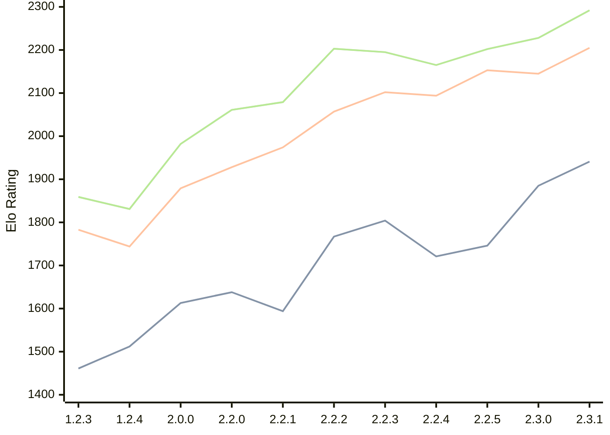

# Engine: Kreveta

Author: Daniel Michna

Home: https://github.com/ZlomenyMesic/Kreveta

## Elo Ratings

| Version | Published | STC 8.0+0.08s  | LTC 60.0+0.60s | VLTC 2m24s+1.12s | Comment |
| --- | --- | --- | --- | --- | --- |
| 2.3.1 | 2026-05-12 | 1941(+56) | 2205(+60) | 2292(+64) |  |
| 2.3.0 | 2026-04-20 | 1885(+139) | 2145(-8) | 2228(+26) |  |
| 2.2.5 | 2026-03-15 | 1746(+25) | 2153(+59) | 2202(+37) |  |
| 2.2.4 | 2026-03-05 | 1721(-83) | 2094(-8) | 2165(-30) |  |
| 2.2.3 | 2026-02-05 | 1804(+37) | 2102(+45) | 2195(-8) |  |
| 2.2.2 | 2026-01-13 | 1767(+173) | 2057(+83) | 2203(+124) |  |
| 2.2.1 | 2025-12-25 | 1594(-44) | 1974(+46) | 2079(+18) |  |
| 2.2.0 | 2025-12-23 | 1638(+25) | 1928(+49) | 2061(+79) |  |
| 2.0.0 | 2025-12-01 | 1613(+101) | 1879(+135) | 1982(+151) |  |
| 1.2.4 | 2025-11-17 | 1512(+51) | 1744(-39) | 1831(-28) |  |
| 1.2.3 | 2025-10-31 | 1461(+new) | 1783(+new) | 1859(+new) |  |
| 1.1.3 | 2025-10-26 |  |  |  |  |
| 1.0 | 2025-09-10 |  |  |  |  |
 | | | cElo (∆ prev) | cElo (∆ prev) | cElo (∆ prev) | 

<a href="https://github.com/computer-chess-index/cci/issues/new?template=submit-version.yml&title=[VERSION]+Kreveta+<version>&body=###%20Engine%20name%0AKreveta%0A%0A###%20Version%0A2.3.1" target="_blank">Submit new version</a>

 Test Conditions:

GUI/CLI: <a href=https://github.com/cutechess/cutechess target="_blank">Cute-Chess</a> 
Elo Calculation: <a href=https://www.remi-coulom.fr/Bayesian-Elo/ target="_blank">Bayesian-Elo</a> 
CPU: Intel(R) Core(TM) i5-7500T 2.70GHz 
Opening book: 8_moves_v3 
\* STC: 8.0+0.08s, LTC: 60.0+0.60s, VLTC: 2m24s+1.12s

 Lists:
Ratings: <a href=https://github.com/computer-chess-index/cci/blob/main/lists/CCIRatings.csv target="_blank">Complete list</a>

Generated: 2026-07-16 06:25:49

## Ratings Verlauf

## Ratings Verlauf

⬛ STC (8.0+0.08s) &nbsp;&nbsp; 🟧 LTC (60.0+0.60s) &nbsp;&nbsp; 🟩 VLTC (2m24s+1.12s)

dark mode: 🟩STC (8.0+0.08s) 🟧LTC (60.0+0.60s) ⬜VLTC (2m24s+1.12s)

## Detailed Evaluation Results

| Version | Time Control | Elo  | Range +/- | Matches | Score | Average Opponent Elo | Draws |
| --- | --- | --- | --- | --- | --- | --- | --- |
| 2.3.1 | VLTC (2m24s+1.12s) | 2292 | 31 | 352 | 50% | 2280 | 26% |
| 2.3.1 | LTC (60.0+0.60s) | 2205 | 31 | 352 | 48% | 2226 | 28% |
| 2.3.1 | STC (8.0+0.08s) | 1941 | 31 | 378 | 47% | 1959 | 24% |
| --- | --- | --- | --- | --- | --- | --- | --- |
| 2.3.0 | VLTC (2m24s+1.12s) | 2228 | 35 | 272 | 51% | 2215 | 28% |
| 2.3.0 | LTC (60.0+0.60s) | 2145 | 37 | 254 | 48% | 2161 | 23% |
| 2.3.0 | STC (8.0+0.08s) | 1885 | 33 | 328 | 49% | 1883 | 22% |
| --- | --- | --- | --- | --- | --- | --- | --- |
| 2.2.5 | VLTC (2m24s+1.12s) | 2202 | 32 | 346 | 50% | 2205 | 18% |
| 2.2.5 | LTC (60.0+0.60s) | 2153 | 32 | 340 | 48% | 2167 | 25% |
| 2.2.5 | STC (8.0+0.08s) | 1746 | 32 | 352 | 52% | 1712 | 21% |
| --- | --- | --- | --- | --- | --- | --- | --- |
| 2.2.4 | VLTC (2m24s+1.12s) | 2165 | 38 | 230 | 49% | 2176 | 29% |
| 2.2.4 | LTC (60.0+0.60s) | 2094 | 37 | 248 | 54% | 2055 | 25% |
| 2.2.4 | STC (8.0+0.08s) | 1721 | 42 | 204 | 51% | 1716 | 22% |
| --- | --- | --- | --- | --- | --- | --- | --- |
| 2.2.3 | VLTC (2m24s+1.12s) | 2195 | 35 | 288 | 48% | 2214 | 26% |
| 2.2.3 | LTC (60.0+0.60s) | 2102 | 36 | 260 | 48% | 2124 | 24% |
| 2.2.3 | STC (8.0+0.08s) | 1804 | 37 | 252 | 48% | 1821 | 22% |
| --- | --- | --- | --- | --- | --- | --- | --- |
| 2.2.2 | VLTC (2m24s+1.12s) | 2203 | 37 | 256 | 52% | 2183 | 25% |
| 2.2.2 | LTC (60.0+0.60s) | 2057 | 40 | 216 | 49% | 2066 | 21% |
| 2.2.2 | STC (8.0+0.08s) | 1767 | 41 | 212 | 54% | 1733 | 19% |
| --- | --- | --- | --- | --- | --- | --- | --- |
| 2.2.1 | VLTC (2m24s+1.12s) | 2079 | 48 | 148 | 50% | 2074 | 22% |
| 2.2.1 | LTC (60.0+0.60s) | 1974 | 44 | 180 | 49% | 1986 | 21% |
| 2.2.1 | STC (8.0+0.08s) | 1594 | 56 | 110 | 52% | 1577 | 22% |
| --- | --- | --- | --- | --- | --- | --- | --- |
| 2.2.0 | VLTC (2m24s+1.12s) | 2061 | 52 | 124 | 52% | 2047 | 26% |
| 2.2.0 | LTC (60.0+0.60s) | 1928 | 64 | 84 | 55% | 1882 | 21% |
| 2.2.0 | STC (8.0+0.08s) | 1638 | 50 | 148 | 55% | 1588 | 18% |
| --- | --- | --- | --- | --- | --- | --- | --- |
| 2.0.0 | VLTC (2m24s+1.12s) | 1982 | 51 | 136 | 52% | 1963 | 24% |
| 2.0.0 | LTC (60.0+0.60s) | 1879 | 52 | 132 | 52% | 1862 | 17% |
| 2.0.0 | STC (8.0+0.08s) | 1613 | 46 | 172 | 48% | 1636 | 16% |
| --- | --- | --- | --- | --- | --- | --- | --- |
| 1.2.4 | VLTC (2m24s+1.12s) | 1831 | 52 | 158 | 42% | 1970 | 9% |
| 1.2.4 | LTC (60.0+0.60s) | 1744 | 60 | 110 | 48% | 1778 | 12% |
| 1.2.4 | STC (8.0+0.08s) | 1512 | 61 | 108 | 48% | 1539 | 9% |
| --- | --- | --- | --- | --- | --- | --- | --- |
| 1.2.3 | VLTC (2m24s+1.12s) | 1859 | 34 | 324 | 52% | 1844 | 19% |
| 1.2.3 | LTC (60.0+0.60s) | 1783 | 34 | 316 | 52% | 1771 | 19% |
| 1.2.3 | STC (8.0+0.08s) | 1461 | 34 | 316 | 50% | 1451 | 22% |
| --- | --- | --- | --- | --- | --- | --- | --- |