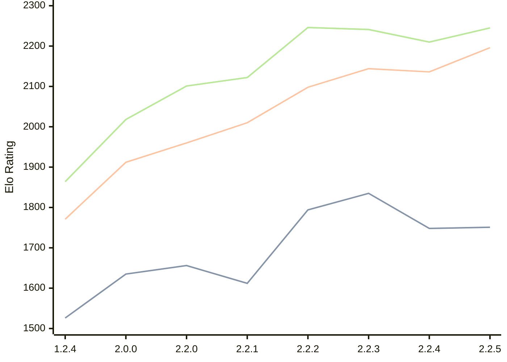

# Engine: Kreveta

Author: Daniel Michna

Home: https://github.com/ZlomenyMesic/Kreveta

## Ratings nach Version

| Version | Published | STC 8.0+0.08s  | LTC 60.0+0.60s | VLTC 2m24s+1.12s | Comment |
| --- | --- | --- | --- | --- | --- |
| 2.2.5 | 2026-03-15 | 1751(+3) | 2196(+60) | 2245(+35) |  |
| 2.2.4 | 2026-03-05 | 1748(-87) | 2136(-8) | 2210(-31) |  |
| 2.2.3 | 2026-02-05 | 1835(+41) | 2144(+46) | 2241(-5) |  |
| 2.2.2 | 2026-01-13 | 1794(+182) | 2098(+88) | 2246(+124) |  |
| 2.2.1 | 2025-12-25 | 1612(-44) | 2010(+50) | 2122(+21) |  |
| 2.2.0 | 2025-12-23 | 1656(+21) | 1960(+48) | 2101(+83) |  |
| 2.0.0 | 2025-12-01 | 1635(+109) | 1912(+141) | 2018(+154) |  |
| 1.2.4 | 2025-11-17 | 1526(+new) | 1771(+new) | 1864(+new) |  |
| 1.2.3 | 2025-10-31 |  |  |  |  |
| 1.1.3 | 2025-10-26 |  |  |  |  |
| 1.0 | 2025-09-10 |  |  |  |  |
 | | | cElo (∆ prev) | cElo (∆ prev) | cElo (∆ prev) | 

<a href="https://github.com/computer-chess-index/cci/issues/new?template=submit-version.yml&title=[VERSION]+Kreveta+<version>&body=###%20Engine%20name%0AKreveta%0A%0A###%20Version%0A2.2.5" target="_blank">Submit new version</a>

 Test Conditions:

GUI/CLI: <a href=https://github.com/cutechess/cutechess target="_blank">Cute-Chess</a> 
Elo Calculation: <a href=https://www.remi-coulom.fr/Bayesian-Elo/ target="_blank">Bayesian-Elo</a> 
CPU: Intel(R) Core(TM) i5-7500T 2.70GHz 
Opening book: 8_moves_v3 
\* STC: 8.0+0.08s, LTC: 60.0+0.60s, VLTC: 2m24s+1.12s

 Lists:
Ratings: <a href=https://github.com/computer-chess-index/cci/blob/main/lists/CCIRatings.csv target="_blank">Complete list</a>

Generated: 2026-03-31 06:24:43

## Ratings Verlauf

⬛ STC (8.0+0.08s) &nbsp;&nbsp; 🟧 LTC (60.0+0.60s) &nbsp;&nbsp; 🟩 VLTC (2m24s+1.12s)

dark mode: 🟩STC (8.0+0.08s) 🟧LTC (60.0+0.60s) ⬜VLTC (2m24s+1.12s)

