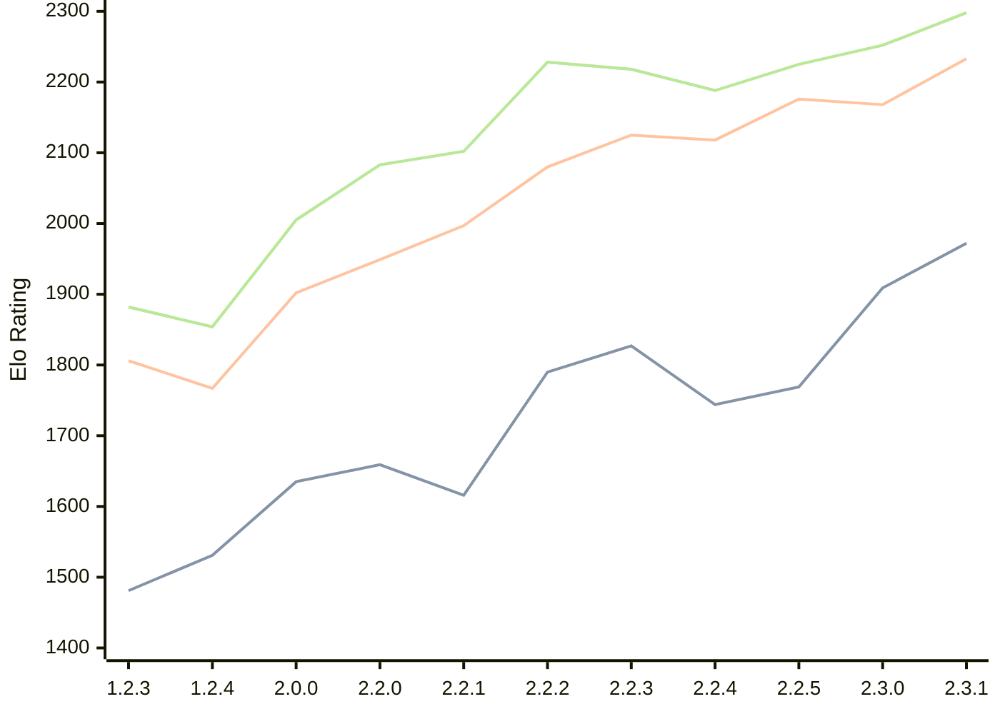

# Engine: Kreveta

Author: Daniel Michna

Home: https://github.com/ZlomenyMesic/Kreveta

## Elo Ratings

| Version | Published | STC 8.0+0.08s  | LTC 60.0+0.60s | VLTC 2m24s+1.12s | Comment |
| --- | --- | --- | --- | --- | --- |
| 2.3.1 | 2026-05-12 | 1972(+63) | 2233(+65) | 2298(+46) |  |
| 2.3.0 | 2026-04-20 | 1909(+140) | 2168(-8) | 2252(+27) |  |
| 2.2.5 | 2026-03-15 | 1769(+25) | 2176(+58) | 2225(+37) |  |
| 2.2.4 | 2026-03-05 | 1744(-83) | 2118(-7) | 2188(-30) |  |
| 2.2.3 | 2026-02-05 | 1827(+37) | 2125(+45) | 2218(-10) |  |
| 2.2.2 | 2026-01-13 | 1790(+174) | 2080(+83) | 2228(+126) |  |
| 2.2.1 | 2025-12-25 | 1616(-43) | 1997(+48) | 2102(+19) |  |
| 2.2.0 | 2025-12-23 | 1659(+24) | 1949(+47) | 2083(+78) |  |
| 2.0.0 | 2025-12-01 | 1635(+104) | 1902(+135) | 2005(+151) |  |
| 1.2.4 | 2025-11-17 | 1531(+50) | 1767(-39) | 1854(-28) |  |
| 1.2.3 | 2025-10-31 | 1481(+new) | 1806(+new) | 1882(+new) |  |
| 1.1.3 | 2025-10-26 |  |  |  |  |
| 1.0 | 2025-09-10 |  |  |  |  |
 | | | cElo (∆ prev) | cElo (∆ prev) | cElo (∆ prev) | 

<a href="https://github.com/computer-chess-index/cci/issues/new?template=submit-version.yml&title=[VERSION]+Kreveta+<version>&body=###%20Engine%20name%0AKreveta%0A%0A###%20Version%0A2.3.1" target="_blank">Submit new version</a>

 Test Conditions:

GUI/CLI: <a href=https://github.com/cutechess/cutechess target="_blank">Cute-Chess</a> 
Elo Calculation: <a href=https://www.remi-coulom.fr/Bayesian-Elo/ target="_blank">Bayesian-Elo</a> 
CPU: Intel(R) Core(TM) i5-7500T 2.70GHz 
Opening book: 8_moves_v3 
\* STC: 8.0+0.08s, LTC: 60.0+0.60s, VLTC: 2m24s+1.12s

 Lists:
Ratings: <a href=https://github.com/computer-chess-index/cci/blob/main/lists/CCIRatings.csv target="_blank">Complete list</a>

Generated: 2026-05-19 06:25:55

## Ratings Verlauf

⬛ STC (8.0+0.08s) &nbsp;&nbsp; 🟧 LTC (60.0+0.60s) &nbsp;&nbsp; 🟩 VLTC (2m24s+1.12s)

dark mode: 🟩STC (8.0+0.08s) 🟧LTC (60.0+0.60s) ⬜VLTC (2m24s+1.12s)

## Detailed Evaluation Results

| Version | Time Control | Elo  | Range +/- | Matches | Score | Average Opponent Elo | Draws |
| --- | --- | --- | --- | --- | --- | --- | --- |
| 2.3.1 | VLTC (2m24s+1.12s) | 2298 | 35 | 292 | 48% | 2306 | 25% |
| 2.3.1 | LTC (60.0+0.60s) | 2233 | 36 | 266 | 48% | 2253 | 28% |
| 2.3.1 | STC (8.0+0.08s) | 1972 | 34 | 310 | 48% | 1980 | 24% |
| --- | --- | --- | --- | --- | --- | --- | --- |
| 2.3.0 | VLTC (2m24s+1.12s) | 2252 | 35 | 272 | 51% | 2240 | 28% |
| 2.3.0 | LTC (60.0+0.60s) | 2168 | 37 | 254 | 48% | 2184 | 23% |
| 2.3.0 | STC (8.0+0.08s) | 1909 | 33 | 328 | 49% | 1908 | 22% |
| --- | --- | --- | --- | --- | --- | --- | --- |
| 2.2.5 | VLTC (2m24s+1.12s) | 2225 | 32 | 346 | 50% | 2228 | 18% |
| 2.2.5 | LTC (60.0+0.60s) | 2176 | 32 | 340 | 48% | 2190 | 25% |
| 2.2.5 | STC (8.0+0.08s) | 1769 | 32 | 352 | 52% | 1733 | 21% |
| --- | --- | --- | --- | --- | --- | --- | --- |
| 2.2.4 | VLTC (2m24s+1.12s) | 2188 | 38 | 230 | 49% | 2201 | 29% |
| 2.2.4 | LTC (60.0+0.60s) | 2118 | 37 | 248 | 54% | 2078 | 25% |
| 2.2.4 | STC (8.0+0.08s) | 1744 | 42 | 204 | 51% | 1739 | 22% |
| --- | --- | --- | --- | --- | --- | --- | --- |
| 2.2.3 | VLTC (2m24s+1.12s) | 2218 | 35 | 288 | 48% | 2237 | 26% |
| 2.2.3 | LTC (60.0+0.60s) | 2125 | 36 | 260 | 48% | 2145 | 24% |
| 2.2.3 | STC (8.0+0.08s) | 1827 | 37 | 252 | 48% | 1844 | 22% |
| --- | --- | --- | --- | --- | --- | --- | --- |
| 2.2.2 | VLTC (2m24s+1.12s) | 2228 | 37 | 256 | 52% | 2206 | 25% |
| 2.2.2 | LTC (60.0+0.60s) | 2080 | 40 | 216 | 49% | 2088 | 21% |
| 2.2.2 | STC (8.0+0.08s) | 1790 | 41 | 212 | 54% | 1756 | 19% |
| --- | --- | --- | --- | --- | --- | --- | --- |
| 2.2.1 | VLTC (2m24s+1.12s) | 2102 | 48 | 148 | 50% | 2097 | 22% |
| 2.2.1 | LTC (60.0+0.60s) | 1997 | 44 | 180 | 49% | 2009 | 21% |
| 2.2.1 | STC (8.0+0.08s) | 1616 | 56 | 110 | 52% | 1598 | 22% |
| --- | --- | --- | --- | --- | --- | --- | --- |
| 2.2.0 | VLTC (2m24s+1.12s) | 2083 | 52 | 124 | 52% | 2070 | 26% |
| 2.2.0 | LTC (60.0+0.60s) | 1949 | 64 | 84 | 55% | 1904 | 21% |
| 2.2.0 | STC (8.0+0.08s) | 1659 | 50 | 148 | 55% | 1609 | 18% |
| --- | --- | --- | --- | --- | --- | --- | --- |
| 2.0.0 | VLTC (2m24s+1.12s) | 2005 | 51 | 136 | 52% | 1986 | 24% |
| 2.0.0 | LTC (60.0+0.60s) | 1902 | 52 | 132 | 52% | 1885 | 17% |
| 2.0.0 | STC (8.0+0.08s) | 1635 | 46 | 172 | 48% | 1658 | 16% |
| --- | --- | --- | --- | --- | --- | --- | --- |
| 1.2.4 | VLTC (2m24s+1.12s) | 1854 | 52 | 158 | 42% | 1993 | 9% |
| 1.2.4 | LTC (60.0+0.60s) | 1767 | 60 | 110 | 48% | 1801 | 12% |
| 1.2.4 | STC (8.0+0.08s) | 1531 | 61 | 108 | 48% | 1559 | 9% |
| --- | --- | --- | --- | --- | --- | --- | --- |
| 1.2.3 | VLTC (2m24s+1.12s) | 1882 | 34 | 324 | 52% | 1868 | 19% |
| 1.2.3 | LTC (60.0+0.60s) | 1806 | 34 | 316 | 52% | 1793 | 19% |
| 1.2.3 | STC (8.0+0.08s) | 1481 | 34 | 316 | 50% | 1472 | 22% |
| --- | --- | --- | --- | --- | --- | --- | --- |