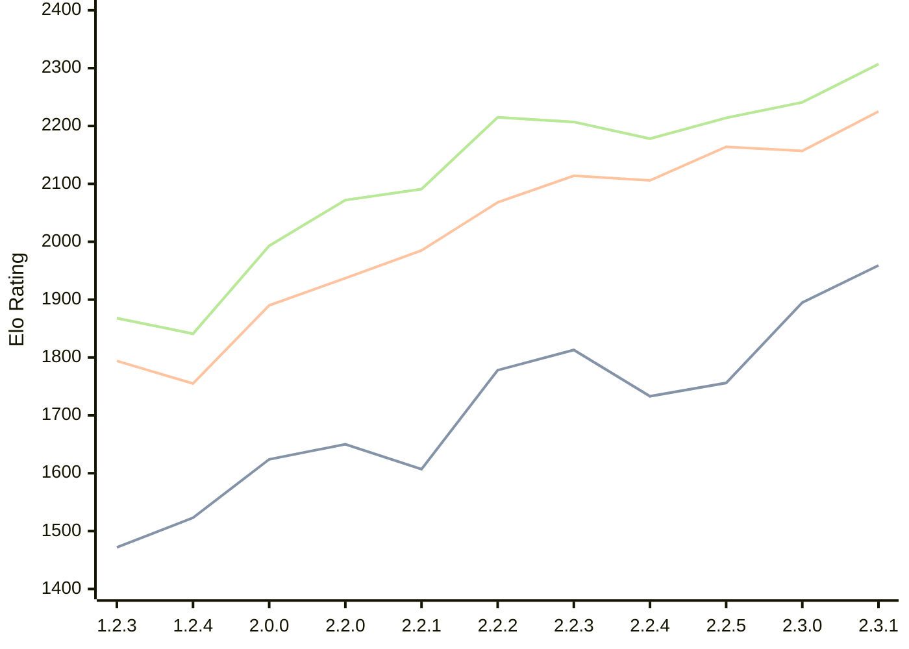

# Engine: Kreveta

Author: Daniel Michna

Home: https://github.com/ZlomenyMesic/Kreveta

## Elo Ratings

| Version | Published | STC 8.0+0.08s  | LTC 60.0+0.60s | VLTC 2m24s+1.12s | Comment |
| --- | --- | --- | --- | --- | --- |
| 2.3.1 | 2026-05-12 | 1959(+64) | 2225(+68) | 2307(+66) |  |
| 2.3.0 | 2026-04-20 | 1895(+139) | 2157(-7) | 2241(+27) |  |
| 2.2.5 | 2026-03-15 | 1756(+23) | 2164(+58) | 2214(+36) |  |
| 2.2.4 | 2026-03-05 | 1733(-80) | 2106(-8) | 2178(-29) |  |
| 2.2.3 | 2026-02-05 | 1813(+35) | 2114(+46) | 2207(-8) |  |
| 2.2.2 | 2026-01-13 | 1778(+171) | 2068(+83) | 2215(+124) |  |
| 2.2.1 | 2025-12-25 | 1607(-43) | 1985(+48) | 2091(+19) |  |
| 2.2.0 | 2025-12-23 | 1650(+26) | 1937(+47) | 2072(+79) |  |
| 2.0.0 | 2025-12-01 | 1624(+101) | 1890(+135) | 1993(+152) |  |
| 1.2.4 | 2025-11-17 | 1523(+51) | 1755(-39) | 1841(-27) |  |
| 1.2.3 | 2025-10-31 | 1472(+new) | 1794(+new) | 1868(+new) |  |
| 1.1.3 | 2025-10-26 |  |  |  |  |
| 1.0 | 2025-09-10 |  |  |  |  |
 | | | cElo (∆ prev) | cElo (∆ prev) | cElo (∆ prev) | 

<a href="https://github.com/computer-chess-index/cci/issues/new?template=submit-version.yml&title=[VERSION]+Kreveta+<version>&body=###%20Engine%20name%0AKreveta%0A%0A###%20Version%0A2.3.1" target="_blank">Submit new version</a>

 Test Conditions:

GUI/CLI: <a href=https://github.com/cutechess/cutechess target="_blank">Cute-Chess</a> 
Elo Calculation: <a href=https://www.remi-coulom.fr/Bayesian-Elo/ target="_blank">Bayesian-Elo</a> 
CPU: Intel(R) Core(TM) i5-7500T 2.70GHz 
Opening book: 8_moves_v3 
\* STC: 8.0+0.08s, LTC: 60.0+0.60s, VLTC: 2m24s+1.12s

 Lists:
Ratings: <a href=https://github.com/computer-chess-index/cci/blob/main/lists/CCIRatings.csv target="_blank">Complete list</a>

Generated: 2026-08-28 06:26:22

## Ratings Verlauf

## Detailed Evaluation Results

| Version | Time Control | Elo  | Range +/- | Matches | Score | Average Opponent Elo | Draws |
| --- | --- | --- | --- | --- | --- | --- | --- |
| 2.3.1 | VLTC (2m24s+1.12s) | 2307 | 30 | 388 | 51% | 2292 | 28% |
| 2.3.1 | LTC (60.0+0.60s) | 2225 | 30 | 392 | 48% | 2242 | 27% |
| 2.3.1 | STC (8.0+0.08s) | 1959 | 28 | 458 | 49% | 1963 | 24% |
| --- | --- | --- | --- | --- | --- | --- | --- |
| 2.3.0 | VLTC (2m24s+1.12s) | 2241 | 35 | 272 | 51% | 2229 | 28% |
| 2.3.0 | LTC (60.0+0.60s) | 2157 | 37 | 254 | 48% | 2174 | 23% |
| 2.3.0 | STC (8.0+0.08s) | 1895 | 33 | 328 | 49% | 1894 | 22% |
| --- | --- | --- | --- | --- | --- | --- | --- |
| 2.2.5 | VLTC (2m24s+1.12s) | 2214 | 32 | 346 | 50% | 2217 | 18% |
| 2.2.5 | LTC (60.0+0.60s) | 2164 | 32 | 340 | 48% | 2179 | 25% |
| 2.2.5 | STC (8.0+0.08s) | 1756 | 32 | 352 | 52% | 1721 | 21% |
| --- | --- | --- | --- | --- | --- | --- | --- |
| 2.2.4 | VLTC (2m24s+1.12s) | 2178 | 38 | 230 | 49% | 2188 | 29% |
| 2.2.4 | LTC (60.0+0.60s) | 2106 | 37 | 248 | 54% | 2067 | 25% |
| 2.2.4 | STC (8.0+0.08s) | 1733 | 42 | 204 | 51% | 1727 | 22% |
| --- | --- | --- | --- | --- | --- | --- | --- |
| 2.2.3 | VLTC (2m24s+1.12s) | 2207 | 35 | 288 | 48% | 2226 | 26% |
| 2.2.3 | LTC (60.0+0.60s) | 2114 | 36 | 260 | 48% | 2134 | 24% |
| 2.2.3 | STC (8.0+0.08s) | 1813 | 37 | 252 | 48% | 1832 | 22% |
| --- | --- | --- | --- | --- | --- | --- | --- |
| 2.2.2 | VLTC (2m24s+1.12s) | 2215 | 37 | 256 | 52% | 2195 | 25% |
| 2.2.2 | LTC (60.0+0.60s) | 2068 | 40 | 216 | 49% | 2076 | 21% |
| 2.2.2 | STC (8.0+0.08s) | 1778 | 41 | 212 | 54% | 1744 | 19% |
| --- | --- | --- | --- | --- | --- | --- | --- |
| 2.2.1 | VLTC (2m24s+1.12s) | 2091 | 48 | 148 | 50% | 2086 | 22% |
| 2.2.1 | LTC (60.0+0.60s) | 1985 | 44 | 180 | 49% | 1997 | 21% |
| 2.2.1 | STC (8.0+0.08s) | 1607 | 56 | 110 | 52% | 1589 | 22% |
| --- | --- | --- | --- | --- | --- | --- | --- |
| 2.2.0 | VLTC (2m24s+1.12s) | 2072 | 52 | 124 | 52% | 2059 | 26% |
| 2.2.0 | LTC (60.0+0.60s) | 1937 | 64 | 84 | 55% | 1891 | 21% |
| 2.2.0 | STC (8.0+0.08s) | 1650 | 50 | 148 | 55% | 1600 | 18% |
| --- | --- | --- | --- | --- | --- | --- | --- |
| 2.0.0 | VLTC (2m24s+1.12s) | 1993 | 51 | 136 | 52% | 1974 | 24% |
| 2.0.0 | LTC (60.0+0.60s) | 1890 | 52 | 132 | 52% | 1871 | 17% |
| 2.0.0 | STC (8.0+0.08s) | 1624 | 46 | 172 | 48% | 1648 | 16% |
| --- | --- | --- | --- | --- | --- | --- | --- |
| 1.2.4 | VLTC (2m24s+1.12s) | 1841 | 52 | 158 | 42% | 1980 | 9% |
| 1.2.4 | LTC (60.0+0.60s) | 1755 | 60 | 110 | 48% | 1789 | 12% |
| 1.2.4 | STC (8.0+0.08s) | 1523 | 61 | 108 | 48% | 1551 | 9% |
| --- | --- | --- | --- | --- | --- | --- | --- |
| 1.2.3 | VLTC (2m24s+1.12s) | 1868 | 34 | 324 | 52% | 1854 | 19% |
| 1.2.3 | LTC (60.0+0.60s) | 1794 | 34 | 316 | 52% | 1781 | 19% |
| 1.2.3 | STC (8.0+0.08s) | 1472 | 34 | 316 | 50% | 1462 | 22% |
| --- | --- | --- | --- | --- | --- | --- | --- |