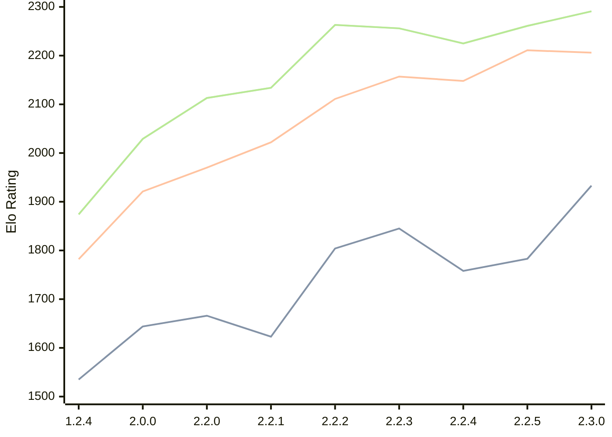

# Engine: Kreveta

Author: Daniel Michna

Home: https://github.com/ZlomenyMesic/Kreveta

## Ratings nach Version

| Version | Published | STC 8.0+0.08s  | LTC 60.0+0.60s | VLTC 2m24s+1.12s | Comment |
| --- | --- | --- | --- | --- | --- |
| 2.3.0 | 2026-04-20 | 1933(+150) | 2206(-5) | 2291(+30) |  |
| 2.2.5 | 2026-03-15 | 1783(+25) | 2211(+63) | 2261(+36) |  |
| 2.2.4 | 2026-03-05 | 1758(-87) | 2148(-9) | 2225(-31) |  |
| 2.2.3 | 2026-02-05 | 1845(+41) | 2157(+46) | 2256(-7) |  |
| 2.2.2 | 2026-01-13 | 1804(+181) | 2111(+89) | 2263(+129) |  |
| 2.2.1 | 2025-12-25 | 1623(-43) | 2022(+52) | 2134(+21) |  |
| 2.2.0 | 2025-12-23 | 1666(+22) | 1970(+49) | 2113(+84) |  |
| 2.0.0 | 2025-12-01 | 1644(+109) | 1921(+139) | 2029(+155) |  |
| 1.2.4 | 2025-11-17 | 1535(+new) | 1782(+new) | 1874(+new) |  |
| 1.2.3 | 2025-10-31 |  |  |  |  |
| 1.1.3 | 2025-10-26 |  |  |  |  |
| 1.0 | 2025-09-10 |  |  |  |  |
 | | | cElo (∆ prev) | cElo (∆ prev) | cElo (∆ prev) | 

<a href="https://github.com/computer-chess-index/cci/issues/new?template=submit-version.yml&title=[VERSION]+Kreveta+<version>&body=###%20Engine%20name%0AKreveta%0A%0A###%20Version%0A2.3.0" target="_blank">Submit new version</a>

 Test Conditions:

GUI/CLI: <a href=https://github.com/cutechess/cutechess target="_blank">Cute-Chess</a> 
Elo Calculation: <a href=https://www.remi-coulom.fr/Bayesian-Elo/ target="_blank">Bayesian-Elo</a> 
CPU: Intel(R) Core(TM) i5-7500T 2.70GHz 
Opening book: 8_moves_v3 
\* STC: 8.0+0.08s, LTC: 60.0+0.60s, VLTC: 2m24s+1.12s

 Lists:
Ratings: <a href=https://github.com/computer-chess-index/cci/blob/main/lists/CCIRatings.csv target="_blank">Complete list</a>

Generated: 2026-05-03 06:53:29

## Ratings Verlauf

⬛ STC (8.0+0.08s) &nbsp;&nbsp; 🟧 LTC (60.0+0.60s) &nbsp;&nbsp; 🟩 VLTC (2m24s+1.12s)

dark mode: 🟩STC (8.0+0.08s) 🟧LTC (60.0+0.60s) ⬜VLTC (2m24s+1.12s)

## Detailed Evaluation Results

| Version | Time Control | Elo  | Range +/- | Matches | Score | Average Opponent Elo | Draws |
| --- | --- | --- | --- | --- | --- | --- | --- |
| 2.3.0 | STC 
(8.0+0.08s)
 | 1933 | 33 | 328 | 49% | 1931 | 22% |
| 2.3.0 | LTC 
(60.0+0.60s)
 | 2206 | 37 | 254 | 48% | 2222 | 23% |
| 2.3.0 | VLTC 
(2m24s+1.12s)
 | 2291 | 35 | 272 | 51% | 2279 | 28% |
| 2.2.5 | LTC 
(60.0+0.60s)
 | 2211 | 32 | 340 | 48% | 2226 | 25% |
| 2.2.5 | VLTC 
(2m24s+1.12s)
 | 2261 | 32 | 346 | 50% | 2264 | 18% |
| 2.2.5 | STC 
(8.0+0.08s)
 | 1783 | 32 | 352 | 52% | 1748 | 21% |
| 2.2.4 | VLTC 
(2m24s+1.12s)
 | 2225 | 38 | 230 | 49% | 2237 | 29% |
| 2.2.4 | STC 
(8.0+0.08s)
 | 1758 | 42 | 204 | 51% | 1752 | 22% |
| 2.2.4 | LTC 
(60.0+0.60s)
 | 2148 | 37 | 248 | 54% | 2107 | 25% |
| 2.2.3 | STC 
(8.0+0.08s)
 | 1845 | 37 | 252 | 48% | 1863 | 22% |
| 2.2.3 | LTC 
(60.0+0.60s)
 | 2157 | 36 | 260 | 48% | 2179 | 24% |
| 2.2.3 | VLTC 
(2m24s+1.12s)
 | 2256 | 35 | 288 | 48% | 2273 | 26% |
| 2.2.2 | STC 
(8.0+0.08s)
 | 1804 | 41 | 212 | 54% | 1770 | 19% |
| 2.2.2 | LTC 
(60.0+0.60s)
 | 2111 | 41 | 216 | 49% | 2120 | 21% |
| 2.2.2 | VLTC 
(2m24s+1.12s)
 | 2263 | 37 | 256 | 52% | 2242 | 25% |
| 2.2.1 | LTC 
(60.0+0.60s)
 | 2022 | 44 | 180 | 49% | 2036 | 21% |
| 2.2.1 | VLTC 
(2m24s+1.12s)
 | 2134 | 48 | 148 | 50% | 2129 | 22% |
| 2.2.1 | STC 
(8.0+0.08s)
 | 1623 | 56 | 110 | 52% | 1605 | 22% |
| 2.2.0 | VLTC 
(2m24s+1.12s)
 | 2113 | 52 | 124 | 52% | 2099 | 26% |
| 2.2.0 | STC 
(8.0+0.08s)
 | 1666 | 50 | 148 | 55% | 1616 | 18% |
| 2.2.0 | LTC 
(60.0+0.60s)
 | 1970 | 64 | 84 | 55% | 1924 | 21% |
| 2.0.0 | STC 
(8.0+0.08s)
 | 1644 | 46 | 172 | 48% | 1667 | 16% |
| 2.0.0 | LTC 
(60.0+0.60s)
 | 1921 | 53 | 132 | 52% | 1904 | 17% |
| 2.0.0 | VLTC 
(2m24s+1.12s)
 | 2029 | 51 | 136 | 52% | 2010 | 24% |
| 1.2.4 | STC 
(8.0+0.08s)
 | 1535 | 61 | 108 | 48% | 1563 | 9% |
| 1.2.4 | LTC 
(60.0+0.60s)
 | 1782 | 60 | 110 | 48% | 1816 | 12% |
| 1.2.4 | VLTC 
(2m24s+1.12s)
 | 1874 | 52 | 158 | 42% | 2016 | 9% |
| 1.2.3 |  |  |  |  |  |  |  |
| 1.1.3 |  |  |  |  |  |  |  |
| 1.0 |  |  |  |  |  |  |  |