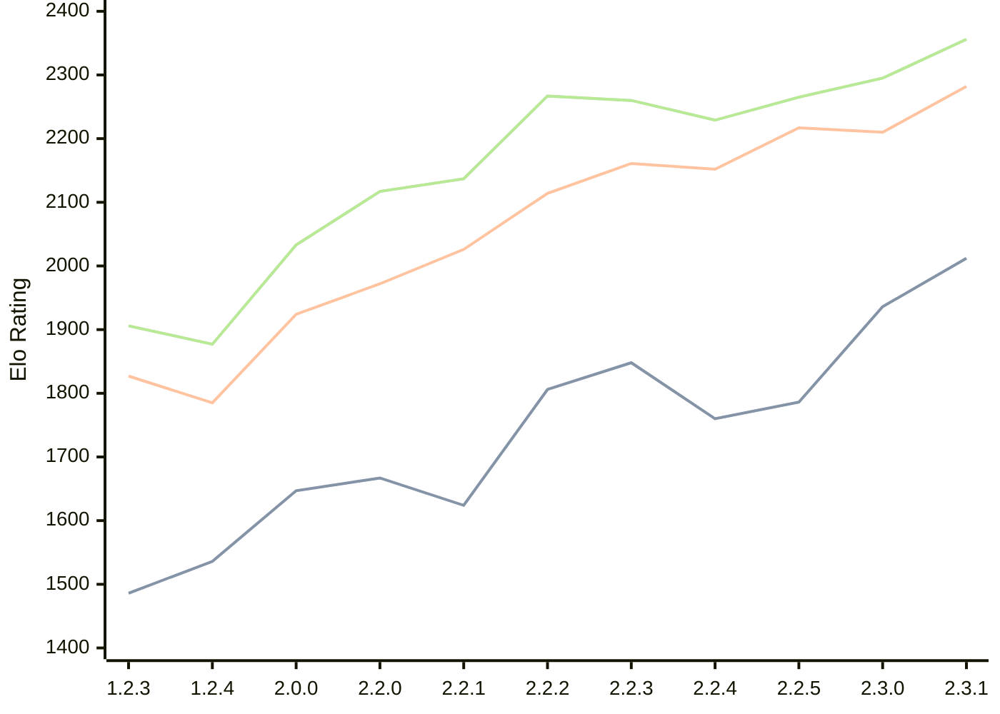

# Engine: Kreveta

Author: Daniel Michna

Home: https://github.com/ZlomenyMesic/Kreveta

## Elo Ratings

| Version | Published | STC 8.0+0.08s  | LTC 60.0+0.60s | VLTC 2m24s+1.12s | Comment |
| --- | --- | --- | --- | --- | --- |
| 2.3.1 | 2026-05-12 | 2012(+76) | 2282(+72) | 2356(+61) |  |
| 2.3.0 | 2026-04-20 | 1936(+150) | 2210(-7) | 2295(+30) |  |
| 2.2.5 | 2026-03-15 | 1786(+26) | 2217(+65) | 2265(+36) |  |
| 2.2.4 | 2026-03-05 | 1760(-88) | 2152(-9) | 2229(-31) |  |
| 2.2.3 | 2026-02-05 | 1848(+42) | 2161(+47) | 2260(-7) |  |
| 2.2.2 | 2026-01-13 | 1806(+182) | 2114(+88) | 2267(+130) |  |
| 2.2.1 | 2025-12-25 | 1624(-43) | 2026(+54) | 2137(+20) |  |
| 2.2.0 | 2025-12-23 | 1667(+20) | 1972(+48) | 2117(+84) |  |
| 2.0.0 | 2025-12-01 | 1647(+111) | 1924(+139) | 2033(+156) |  |
| 1.2.4 | 2025-11-17 | 1536(+50) | 1785(-42) | 1877(-29) |  |
| 1.2.3 | 2025-10-31 | 1486(+new) | 1827(+new) | 1906(+new) |  |
| 1.1.3 | 2025-10-26 |  |  |  |  |
| 1.0 | 2025-09-10 |  |  |  |  |
 | | | cElo (∆ prev) | cElo (∆ prev) | cElo (∆ prev) | 

<a href="https://github.com/computer-chess-index/cci/issues/new?template=submit-version.yml&title=[VERSION]+Kreveta+<version>&body=###%20Engine%20name%0AKreveta%0A%0A###%20Version%0A2.3.1" target="_blank">Submit new version</a>

 Test Conditions:

GUI/CLI: <a href=https://github.com/cutechess/cutechess target="_blank">Cute-Chess</a> 
Elo Calculation: <a href=https://www.remi-coulom.fr/Bayesian-Elo/ target="_blank">Bayesian-Elo</a> 
CPU: Intel(R) Core(TM) i5-7500T 2.70GHz 
Opening book: 8_moves_v3 
\* STC: 8.0+0.08s, LTC: 60.0+0.60s, VLTC: 2m24s+1.12s

 Lists:
Ratings: <a href=https://github.com/computer-chess-index/cci/blob/main/lists/CCIRatings.csv target="_blank">Complete list</a>

Generated: 2026-05-16 06:25:21

## Ratings Verlauf

⬛ STC (8.0+0.08s) &nbsp;&nbsp; 🟧 LTC (60.0+0.60s) &nbsp;&nbsp; 🟩 VLTC (2m24s+1.12s)

dark mode: 🟩STC (8.0+0.08s) 🟧LTC (60.0+0.60s) ⬜VLTC (2m24s+1.12s)

## Detailed Evaluation Results

| Version | Time Control | Elo  | Range +/- | Matches | Score | Average Opponent Elo | Draws |
| --- | --- | --- | --- | --- | --- | --- | --- |
| 2.3.1 | VLTC (2m24s+1.12s) | 2356 | 36 | 260 | 49% | 2368 | 26% |
| 2.3.1 | LTC (60.0+0.60s) | 2282 | 37 | 250 | 48% | 2300 | 28% |
| 2.3.1 | STC (8.0+0.08s) | 2012 | 35 | 284 | 49% | 2021 | 24% |
| --- | --- | --- | --- | --- | --- | --- | --- |
| 2.3.0 | VLTC (2m24s+1.12s) | 2295 | 35 | 272 | 51% | 2283 | 28% |
| 2.3.0 | LTC (60.0+0.60s) | 2210 | 37 | 254 | 48% | 2226 | 23% |
| 2.3.0 | STC (8.0+0.08s) | 1936 | 33 | 328 | 49% | 1935 | 22% |
| --- | --- | --- | --- | --- | --- | --- | --- |
| 2.2.5 | VLTC (2m24s+1.12s) | 2265 | 32 | 346 | 50% | 2268 | 18% |
| 2.2.5 | LTC (60.0+0.60s) | 2217 | 32 | 340 | 48% | 2230 | 25% |
| 2.2.5 | STC (8.0+0.08s) | 1786 | 32 | 352 | 52% | 1751 | 21% |
| --- | --- | --- | --- | --- | --- | --- | --- |
| 2.2.4 | VLTC (2m24s+1.12s) | 2229 | 38 | 230 | 49% | 2240 | 29% |
| 2.2.4 | LTC (60.0+0.60s) | 2152 | 37 | 248 | 54% | 2111 | 25% |
| 2.2.4 | STC (8.0+0.08s) | 1760 | 42 | 204 | 51% | 1755 | 22% |
| --- | --- | --- | --- | --- | --- | --- | --- |
| 2.2.3 | VLTC (2m24s+1.12s) | 2260 | 35 | 288 | 48% | 2277 | 26% |
| 2.2.3 | LTC (60.0+0.60s) | 2161 | 36 | 260 | 48% | 2183 | 24% |
| 2.2.3 | STC (8.0+0.08s) | 1848 | 37 | 252 | 48% | 1866 | 22% |
| --- | --- | --- | --- | --- | --- | --- | --- |
| 2.2.2 | VLTC (2m24s+1.12s) | 2267 | 37 | 256 | 52% | 2246 | 25% |
| 2.2.2 | LTC (60.0+0.60s) | 2114 | 41 | 216 | 49% | 2124 | 21% |
| 2.2.2 | STC (8.0+0.08s) | 1806 | 41 | 212 | 54% | 1774 | 19% |
| --- | --- | --- | --- | --- | --- | --- | --- |
| 2.2.1 | VLTC (2m24s+1.12s) | 2137 | 48 | 148 | 50% | 2132 | 22% |
| 2.2.1 | LTC (60.0+0.60s) | 2026 | 44 | 180 | 49% | 2039 | 21% |
| 2.2.1 | STC (8.0+0.08s) | 1624 | 56 | 110 | 52% | 1607 | 22% |
| --- | --- | --- | --- | --- | --- | --- | --- |
| 2.2.0 | VLTC (2m24s+1.12s) | 2117 | 52 | 124 | 52% | 2102 | 26% |
| 2.2.0 | LTC (60.0+0.60s) | 1972 | 64 | 84 | 55% | 1926 | 21% |
| 2.2.0 | STC (8.0+0.08s) | 1667 | 50 | 148 | 55% | 1617 | 18% |
| --- | --- | --- | --- | --- | --- | --- | --- |
| 2.0.0 | VLTC (2m24s+1.12s) | 2033 | 51 | 136 | 52% | 2013 | 24% |
| 2.0.0 | LTC (60.0+0.60s) | 1924 | 52 | 132 | 52% | 1906 | 17% |
| 2.0.0 | STC (8.0+0.08s) | 1647 | 46 | 172 | 48% | 1670 | 16% |
| --- | --- | --- | --- | --- | --- | --- | --- |
| 1.2.4 | VLTC (2m24s+1.12s) | 1877 | 52 | 158 | 42% | 2018 | 9% |
| 1.2.4 | LTC (60.0+0.60s) | 1785 | 60 | 110 | 48% | 1818 | 12% |
| 1.2.4 | STC (8.0+0.08s) | 1536 | 61 | 108 | 48% | 1565 | 9% |
| --- | --- | --- | --- | --- | --- | --- | --- |
| 1.2.3 | VLTC (2m24s+1.12s) | 1906 | 34 | 324 | 52% | 1891 | 19% |
| 1.2.3 | LTC (60.0+0.60s) | 1827 | 34 | 316 | 52% | 1813 | 19% |
| 1.2.3 | STC (8.0+0.08s) | 1486 | 34 | 316 | 50% | 1477 | 22% |
| --- | --- | --- | --- | --- | --- | --- | --- |