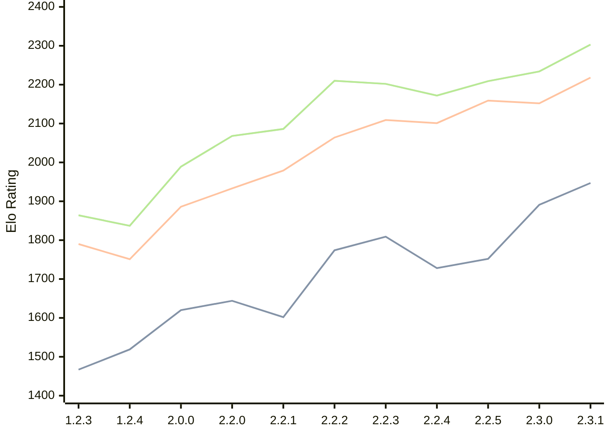

# Engine: Kreveta

Author: Daniel Michna

Home: https://github.com/ZlomenyMesic/Kreveta

## Elo Ratings

| Version | Published | STC 8.0+0.08s  | LTC 60.0+0.60s | VLTC 2m24s+1.12s | Comment |
| --- | --- | --- | --- | --- | --- |
| 2.3.1 | 2026-05-12 | 1947(+56) | 2218(+66) | 2303(+69) |  |
| 2.3.0 | 2026-04-20 | 1891(+139) | 2152(-7) | 2234(+25) |  |
| 2.2.5 | 2026-03-15 | 1752(+24) | 2159(+58) | 2209(+37) |  |
| 2.2.4 | 2026-03-05 | 1728(-81) | 2101(-8) | 2172(-30) |  |
| 2.2.3 | 2026-02-05 | 1809(+35) | 2109(+45) | 2202(-8) |  |
| 2.2.2 | 2026-01-13 | 1774(+172) | 2064(+85) | 2210(+124) |  |
| 2.2.1 | 2025-12-25 | 1602(-42) | 1979(+46) | 2086(+18) |  |
| 2.2.0 | 2025-12-23 | 1644(+24) | 1933(+47) | 2068(+79) |  |
| 2.0.0 | 2025-12-01 | 1620(+101) | 1886(+135) | 1989(+152) |  |
| 1.2.4 | 2025-11-17 | 1519(+52) | 1751(-39) | 1837(-27) |  |
| 1.2.3 | 2025-10-31 | 1467(+new) | 1790(+new) | 1864(+new) |  |
| 1.1.3 | 2025-10-26 |  |  |  |  |
| 1.0 | 2025-09-10 |  |  |  |  |
 | | | cElo (∆ prev) | cElo (∆ prev) | cElo (∆ prev) | 

<a href="https://github.com/computer-chess-index/cci/issues/new?template=submit-version.yml&title=[VERSION]+Kreveta+<version>&body=###%20Engine%20name%0AKreveta%0A%0A###%20Version%0A2.3.1" target="_blank">Submit new version</a>

 Test Conditions:

GUI/CLI: <a href=https://github.com/cutechess/cutechess target="_blank">Cute-Chess</a> 
Elo Calculation: <a href=https://www.remi-coulom.fr/Bayesian-Elo/ target="_blank">Bayesian-Elo</a> 
CPU: Intel(R) Core(TM) i5-7500T 2.70GHz 
Opening book: 8_moves_v3 
\* STC: 8.0+0.08s, LTC: 60.0+0.60s, VLTC: 2m24s+1.12s

 Lists:
Ratings: <a href=https://github.com/computer-chess-index/cci/blob/main/lists/CCIRatings.csv target="_blank">Complete list</a>

Generated: 2026-08-18 06:26:20

## Ratings Verlauf

⬛ STC (8.0+0.08s) &nbsp;&nbsp; 🟧 LTC (60.0+0.60s) &nbsp;&nbsp; 🟩 VLTC (2m24s+1.12s)

dark mode: 🟩STC (8.0+0.08s) 🟧LTC (60.0+0.60s) ⬜VLTC (2m24s+1.12s)

## Detailed Evaluation Results

| Version | Time Control | Elo  | Range +/- | Matches | Score | Average Opponent Elo | Draws |
| --- | --- | --- | --- | --- | --- | --- | --- |
| 2.3.1 | VLTC (2m24s+1.12s) | 2303 | 30 | 376 | 51% | 2287 | 27% |
| 2.3.1 | LTC (60.0+0.60s) | 2218 | 30 | 380 | 48% | 2237 | 27% |
| 2.3.1 | STC (8.0+0.08s) | 1947 | 29 | 426 | 48% | 1963 | 24% |
| --- | --- | --- | --- | --- | --- | --- | --- |
| 2.3.0 | VLTC (2m24s+1.12s) | 2234 | 35 | 272 | 51% | 2223 | 28% |
| 2.3.0 | LTC (60.0+0.60s) | 2152 | 37 | 254 | 48% | 2168 | 23% |
| 2.3.0 | STC (8.0+0.08s) | 1891 | 33 | 328 | 49% | 1890 | 22% |
| --- | --- | --- | --- | --- | --- | --- | --- |
| 2.2.5 | VLTC (2m24s+1.12s) | 2209 | 32 | 346 | 50% | 2211 | 18% |
| 2.2.5 | LTC (60.0+0.60s) | 2159 | 32 | 340 | 48% | 2174 | 25% |
| 2.2.5 | STC (8.0+0.08s) | 1752 | 32 | 352 | 52% | 1717 | 21% |
| --- | --- | --- | --- | --- | --- | --- | --- |
| 2.2.4 | VLTC (2m24s+1.12s) | 2172 | 38 | 230 | 49% | 2183 | 29% |
| 2.2.4 | LTC (60.0+0.60s) | 2101 | 37 | 248 | 54% | 2061 | 25% |
| 2.2.4 | STC (8.0+0.08s) | 1728 | 42 | 204 | 51% | 1723 | 22% |
| --- | --- | --- | --- | --- | --- | --- | --- |
| 2.2.3 | VLTC (2m24s+1.12s) | 2202 | 35 | 288 | 48% | 2221 | 26% |
| 2.2.3 | LTC (60.0+0.60s) | 2109 | 36 | 260 | 48% | 2130 | 24% |
| 2.2.3 | STC (8.0+0.08s) | 1809 | 37 | 252 | 48% | 1828 | 22% |
| --- | --- | --- | --- | --- | --- | --- | --- |
| 2.2.2 | VLTC (2m24s+1.12s) | 2210 | 37 | 256 | 52% | 2190 | 25% |
| 2.2.2 | LTC (60.0+0.60s) | 2064 | 40 | 216 | 49% | 2072 | 21% |
| 2.2.2 | STC (8.0+0.08s) | 1774 | 41 | 212 | 54% | 1740 | 19% |
| --- | --- | --- | --- | --- | --- | --- | --- |
| 2.2.1 | VLTC (2m24s+1.12s) | 2086 | 48 | 148 | 50% | 2080 | 22% |
| 2.2.1 | LTC (60.0+0.60s) | 1979 | 44 | 180 | 49% | 1993 | 21% |
| 2.2.1 | STC (8.0+0.08s) | 1602 | 56 | 110 | 52% | 1585 | 22% |
| --- | --- | --- | --- | --- | --- | --- | --- |
| 2.2.0 | VLTC (2m24s+1.12s) | 2068 | 52 | 124 | 52% | 2053 | 26% |
| 2.2.0 | LTC (60.0+0.60s) | 1933 | 64 | 84 | 55% | 1887 | 21% |
| 2.2.0 | STC (8.0+0.08s) | 1644 | 50 | 148 | 55% | 1596 | 18% |
| --- | --- | --- | --- | --- | --- | --- | --- |
| 2.0.0 | VLTC (2m24s+1.12s) | 1989 | 51 | 136 | 52% | 1968 | 24% |
| 2.0.0 | LTC (60.0+0.60s) | 1886 | 52 | 132 | 52% | 1867 | 17% |
| 2.0.0 | STC (8.0+0.08s) | 1620 | 46 | 172 | 48% | 1643 | 16% |
| --- | --- | --- | --- | --- | --- | --- | --- |
| 1.2.4 | VLTC (2m24s+1.12s) | 1837 | 52 | 158 | 42% | 1976 | 9% |
| 1.2.4 | LTC (60.0+0.60s) | 1751 | 60 | 110 | 48% | 1785 | 12% |
| 1.2.4 | STC (8.0+0.08s) | 1519 | 61 | 108 | 48% | 1547 | 9% |
| --- | --- | --- | --- | --- | --- | --- | --- |
| 1.2.3 | VLTC (2m24s+1.12s) | 1864 | 34 | 324 | 52% | 1850 | 19% |
| 1.2.3 | LTC (60.0+0.60s) | 1790 | 34 | 316 | 52% | 1777 | 19% |
| 1.2.3 | STC (8.0+0.08s) | 1467 | 34 | 316 | 50% | 1458 | 22% |
| --- | --- | --- | --- | --- | --- | --- | --- |