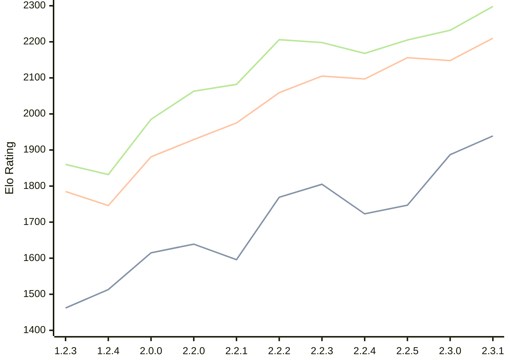

# Engine: Kreveta

Author: Daniel Michna

Home: https://github.com/ZlomenyMesic/Kreveta

## Elo Ratings

| Version | Published | STC 8.0+0.08s  | LTC 60.0+0.60s | VLTC 2m24s+1.12s | Comment |
| --- | --- | --- | --- | --- | --- |
| 2.3.1 | 2026-05-12 | 1939(+52) | 2210(+62) | 2298(+66) |  |
| 2.3.0 | 2026-04-20 | 1887(+140) | 2148(-8) | 2232(+27) |  |
| 2.2.5 | 2026-03-15 | 1747(+24) | 2156(+59) | 2205(+37) |  |
| 2.2.4 | 2026-03-05 | 1723(-82) | 2097(-8) | 2168(-30) |  |
| 2.2.3 | 2026-02-05 | 1805(+36) | 2105(+46) | 2198(-8) |  |
| 2.2.2 | 2026-01-13 | 1769(+173) | 2059(+84) | 2206(+124) |  |
| 2.2.1 | 2025-12-25 | 1596(-43) | 1975(+46) | 2082(+19) |  |
| 2.2.0 | 2025-12-23 | 1639(+24) | 1929(+48) | 2063(+78) |  |
| 2.0.0 | 2025-12-01 | 1615(+102) | 1881(+135) | 1985(+153) |  |
| 1.2.4 | 2025-11-17 | 1513(+51) | 1746(-39) | 1832(-28) |  |
| 1.2.3 | 2025-10-31 | 1462(+new) | 1785(+new) | 1860(+new) |  |
| 1.1.3 | 2025-10-26 |  |  |  |  |
| 1.0 | 2025-09-10 |  |  |  |  |
 | | | cElo (∆ prev) | cElo (∆ prev) | cElo (∆ prev) | 

<a href="https://github.com/computer-chess-index/cci/issues/new?template=submit-version.yml&title=[VERSION]+Kreveta+<version>&body=###%20Engine%20name%0AKreveta%0A%0A###%20Version%0A2.3.1" target="_blank">Submit new version</a>

 Test Conditions:

GUI/CLI: <a href=https://github.com/cutechess/cutechess target="_blank">Cute-Chess</a> 
Elo Calculation: <a href=https://www.remi-coulom.fr/Bayesian-Elo/ target="_blank">Bayesian-Elo</a> 
CPU: Intel(R) Core(TM) i5-7500T 2.70GHz 
Opening book: 8_moves_v3 
\* STC: 8.0+0.08s, LTC: 60.0+0.60s, VLTC: 2m24s+1.12s

 Lists:
Ratings: <a href=https://github.com/computer-chess-index/cci/blob/main/lists/CCIRatings.csv target="_blank">Complete list</a>

Generated: 2026-07-26 06:25:59

## Ratings Verlauf

⬛ STC (8.0+0.08s) &nbsp;&nbsp; 🟧 LTC (60.0+0.60s) &nbsp;&nbsp; 🟩 VLTC (2m24s+1.12s)

dark mode: 🟩STC (8.0+0.08s) 🟧LTC (60.0+0.60s) ⬜VLTC (2m24s+1.12s)

## Detailed Evaluation Results

| Version | Time Control | Elo  | Range +/- | Matches | Score | Average Opponent Elo | Draws |
| --- | --- | --- | --- | --- | --- | --- | --- |
| 2.3.1 | VLTC (2m24s+1.12s) | 2298 | 30 | 368 | 50% | 2284 | 27% |
| 2.3.1 | LTC (60.0+0.60s) | 2210 | 30 | 368 | 48% | 2228 | 27% |
| 2.3.1 | STC (8.0+0.08s) | 1939 | 30 | 394 | 47% | 1960 | 24% |
| --- | --- | --- | --- | --- | --- | --- | --- |
| 2.3.0 | VLTC (2m24s+1.12s) | 2232 | 35 | 272 | 51% | 2219 | 28% |
| 2.3.0 | LTC (60.0+0.60s) | 2148 | 37 | 254 | 48% | 2164 | 23% |
| 2.3.0 | STC (8.0+0.08s) | 1887 | 33 | 328 | 49% | 1885 | 22% |
| --- | --- | --- | --- | --- | --- | --- | --- |
| 2.2.5 | VLTC (2m24s+1.12s) | 2205 | 32 | 346 | 50% | 2207 | 18% |
| 2.2.5 | LTC (60.0+0.60s) | 2156 | 32 | 340 | 48% | 2169 | 25% |
| 2.2.5 | STC (8.0+0.08s) | 1747 | 32 | 352 | 52% | 1713 | 21% |
| --- | --- | --- | --- | --- | --- | --- | --- |
| 2.2.4 | VLTC (2m24s+1.12s) | 2168 | 38 | 230 | 49% | 2179 | 29% |
| 2.2.4 | LTC (60.0+0.60s) | 2097 | 37 | 248 | 54% | 2057 | 25% |
| 2.2.4 | STC (8.0+0.08s) | 1723 | 42 | 204 | 51% | 1717 | 22% |
| --- | --- | --- | --- | --- | --- | --- | --- |
| 2.2.3 | VLTC (2m24s+1.12s) | 2198 | 35 | 288 | 48% | 2217 | 26% |
| 2.2.3 | LTC (60.0+0.60s) | 2105 | 36 | 260 | 48% | 2126 | 24% |
| 2.2.3 | STC (8.0+0.08s) | 1805 | 37 | 252 | 48% | 1823 | 22% |
| --- | --- | --- | --- | --- | --- | --- | --- |
| 2.2.2 | VLTC (2m24s+1.12s) | 2206 | 37 | 256 | 52% | 2186 | 25% |
| 2.2.2 | LTC (60.0+0.60s) | 2059 | 40 | 216 | 49% | 2067 | 21% |
| 2.2.2 | STC (8.0+0.08s) | 1769 | 41 | 212 | 54% | 1736 | 19% |
| --- | --- | --- | --- | --- | --- | --- | --- |
| 2.2.1 | VLTC (2m24s+1.12s) | 2082 | 48 | 148 | 50% | 2076 | 22% |
| 2.2.1 | LTC (60.0+0.60s) | 1975 | 44 | 180 | 49% | 1987 | 21% |
| 2.2.1 | STC (8.0+0.08s) | 1596 | 56 | 110 | 52% | 1580 | 22% |
| --- | --- | --- | --- | --- | --- | --- | --- |
| 2.2.0 | VLTC (2m24s+1.12s) | 2063 | 52 | 124 | 52% | 2049 | 26% |
| 2.2.0 | LTC (60.0+0.60s) | 1929 | 64 | 84 | 55% | 1883 | 21% |
| 2.2.0 | STC (8.0+0.08s) | 1639 | 50 | 148 | 55% | 1589 | 18% |
| --- | --- | --- | --- | --- | --- | --- | --- |
| 2.0.0 | VLTC (2m24s+1.12s) | 1985 | 51 | 136 | 52% | 1964 | 24% |
| 2.0.0 | LTC (60.0+0.60s) | 1881 | 52 | 132 | 52% | 1863 | 17% |
| 2.0.0 | STC (8.0+0.08s) | 1615 | 46 | 172 | 48% | 1638 | 16% |
| --- | --- | --- | --- | --- | --- | --- | --- |
| 1.2.4 | VLTC (2m24s+1.12s) | 1832 | 52 | 158 | 42% | 1972 | 9% |
| 1.2.4 | LTC (60.0+0.60s) | 1746 | 60 | 110 | 48% | 1779 | 12% |
| 1.2.4 | STC (8.0+0.08s) | 1513 | 61 | 108 | 48% | 1540 | 9% |
| --- | --- | --- | --- | --- | --- | --- | --- |
| 1.2.3 | VLTC (2m24s+1.12s) | 1860 | 34 | 324 | 52% | 1845 | 19% |
| 1.2.3 | LTC (60.0+0.60s) | 1785 | 34 | 316 | 52% | 1771 | 19% |
| 1.2.3 | STC (8.0+0.08s) | 1462 | 34 | 316 | 50% | 1453 | 22% |
| --- | --- | --- | --- | --- | --- | --- | --- |